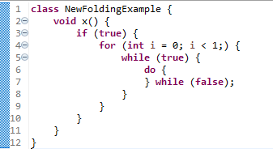

# Java Development Tools - 4.36

<!--
---
## Java&trade; XX Support 
-->

<!--
---
## JUnit
-->

---
## Java Editor

### Custom Folding Regions

It is now possible to create custom folding regions by specifying a comment at the start and end of the region.
You can enable and configure this feature under `Window > Preferences > Java > Editor > Folding > Custom folding regions`.

on that preference page, you can specify the text that should be used to start and end a custom folding region.
When this is enabled,
writing a comment starting with the specified region start followed by another comment starting with the specified region end creates a folding region.

					
Custom folding regions can be collapsed like any other folding regions.

					
### Project Properties Page for Folding
				
Preferences for folding can now be configured on a per-project basis in addition to configuring folding for the workspace.
This page is available under `Project > Properties > Java Editor > Folding`.

			
### New folding mechanism as Default

In the previous release, a preference to enable different kinds of folding was introduced,
see the news for [4.35](../4.35/jdt.html#new-folding).
The feature has been further improved since then and is now **enabled by default**.

This feature enhances the code folding mechanism in Eclipse JDT by enabling folding for control statements 
such as **if**, **while**, **switch**, and **for**.
It improves code readability and navigation by allowing developers to collapse and expand structured blocks.

The feature can be disabled in the settings under `Java > Editor > Folding`.

### Unnecessary SuppressWarnings Clean-up

A new clean-up has been added to remove unnecessary @SuppressWarnings tokens.  To access the new clean-up, go to <b>Source -> Cleanups... -> Configure</b> and on the <b>Unnecessary Code</b> tab, select: <b>Remove unnecessary suppresswarnings tokens</b>.

For example:

is changed to:

### Improved Pattern instanceof to Switch Clean-up

The Pattern instanceof to switch clean-up for Java 21 and up has been improved and a number of errors have been fixed from the initial version released in 4.35.  The Pattern instanceof clean-up is available via the <b>Java Feature</b> tab of the clean-up configuration dialog under the <b>Java 21</b> group.

The first improvement is that the clean-up now recognizes checks for <b>null</b> and will use any statements to generate the <b>case null</b> in the switch. A <b>default</b> clause will still be generated based on any else clause (possibly empty if no else clause exists).

The second improvement is that in the case of a Pattern instanceof if statement that has no else clause, but is followed by a <b>return</b> or <b>throws</b> statement, these statements will be considered if a <b>switch expression</b> is possible.

A third improvement is that if a pattern variable is not used by the code in the if statement and the Java version is 22 or higher, then the unnamed variable: "_" will be substituted in the case.

For example:

gets converted to:

### Inliner Improvements for Lambdas

The inline refactoring has been improved with regards to lambda expressions.  In the past, only a simple return statement could be used to inline a method call inside a lambda expression body.  This is now enhanced to include an empty method or multiple statement methods.  Additionally, a lambda method reference is now recognized as a site for inlining a method.  This is important in the case where the original method is being deleted.

For example, if we inline b in the following:

We get:

<!--
---
## Java Views and Dialogs
-->

<!--
---
## Java Compiler
-->

<!--
---
## Java Formatter
-->
			
---
## Debug

### Collapsing Stack Frames

Navigating in deep stack frames can be challenging during debuging, due to the high number of stack frames that are not relevant most of the time,
for example because they are provided by either the JDK, by a testing framework, or by a library.
This feature tries to help focus on the stack frames that are coming from the user-created projects,
drastically reducing the unnecessary noise in the Debug View.

The feature can be enabled from the Debug toolbar in `Debug > Java > Collapse Stack Frames`.

After enabling it, the view becomes much simpler and less intimidating:

### Navigate to Variable Declaration

Users can now navigate to a variable’s declaration directly from the Variables view during a debug session,
making it easier to locate a variable, especially in methods with numerous local variables.

Choose `Navigate to Declaration` from context menu of a variable.

The editor will jump and highlight its declaration.

### Auto-Resuming Trigger Points

Trigger points can now be configured to automatically resume execution when hit,
allowing breakpoints after the trigger point to be activated while skipping those before it,
thereby enabling a more focused and efficient debugging workflow.

Upon enabling a trigger point, a new option will be shown to `Continue execution on hit` or not.

Once `Continue execution on hit` is toggled, the breakpoint label will update to `[Resume on hit]` meaning it won't suspend on hit.

Resume trigger also supports conditions, meaning if condition is true it will resume the execution otherwise it will suspend.

Now when you run in debug mode, the trigger point won't hit, allowing you to skip previous breakpoints, and stop on the actual breakpoint on which you need to focus.

For example, here `Resume trigger` was set on line number 7 and during debugging it hit on line number 8 by skipping all the previous breakpoints.

<!--
### JDT Developers
-->
					
