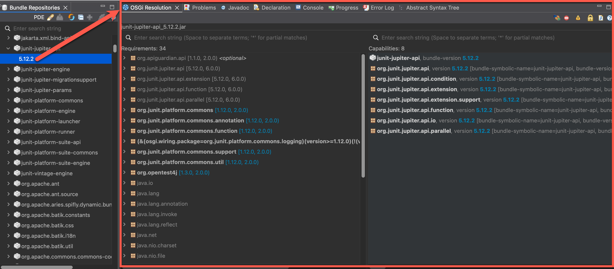

# Plug-in Development Environment - 4.36

A special thanks to everyone who [contributed to PDE](acknowledgements.md#plug-in-development-environment) in this release!

<!--
## Editors
-->

<!--
## API Tools
-->

<!--
---
## PDE Compiler 
-->

## New OSGi Resolution View

The upcoming Eclipse 4.36 release brings improvements to OSGi development, notably through the integration of a new `OSGi Resolution` view.
This feature, [migrated from the Bndtools](https://bndtools.org/manual/resolution-view.html) plugin, offers developers a powerful tool for analyzing and resolving bundle dependencies within their Eclipse IDE.

### 🔍 What Is the OSGi Resolution View?

The `OSGi Resolution` view is a tool designed to visualize the requirements and capabilities of OSGi bundles.
It allows developers to inspect the dependencies of a selected bundle or a group of bundles, providing insights into what each bundle requires and what it offers.
This is particularly useful for identifying and resolving issues related to unsatisfied requirements or conflicting capabilities.

Key features of the Resolution View include the following:

* **Side-by-Side Comparison**: Displays the requirements and capabilities of selected bundles, facilitating a clear understanding of their dependencies.

* **Search Filters**: Enables filtering of requirements and capabilities using wildcards and multiple search terms, streamlining the process of locating specific dependencies.

* **Optional Requirements Toggle**: Allows developers to hide or display optional requirements, focusing on critical dependencies.

* **Split Package Detection**: Identifies capabilities exported by multiple bundles with differing package content, helping to avoid potential conflicts.

* **Clipboard Copying**: Facilitates easy sharing and documentation by allowing copying of requirements and capabilities to the clipboard.

These features collectively enhance the developer's ability to manage complex OSGi dependencies, leading to more robust and maintainable applications.

### Migration from Bndtools

Previously, the `OSGi Resolution` view was a core component of the [Bndtools Eclipse plugin](https://bndtools.org/index.html), an Eclipse-based toolset for OSGi development.
With Eclipse 4.36, this functionality has been integrated directly into the Eclipse platform, streamlining the development process and reducing the need for external plugins. 
