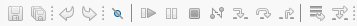
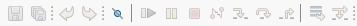
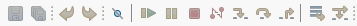

# Platform and Equinox - 4.36 

<!--
---
## Views, Dialogs and Toolbar
-->

<!--
---
## Text Editors
-->

<!--
---
## Preferences
-->

---
## Themes and Styling

### Improved Disabled Icons Generation <!-- https://github.com/eclipse-platform/eclipse.platform.swt/pull/1936 -->
Up to now, disabled versions of icons usually were and had to be provided as explicit, separate image files.
In case no such icon was provided, an algorithm in SWT was used to generate a disabled icon. However, that
algorithm was very limited and produced hardly usable results.

The algorithm in SWT was now improved such that results are by default equal to the disabled version of the
icons that have explicitly been provided for the Eclipse Platform bundles. The pre-generated disabled icons
have been replaced with the usage of on-the-fly generated disabled versions of the icons via the SWT algorithm.
This particularly includes the removal of `disabledIcon` in `plugin.xml` files and programmatically setting the
`disabledImageDescriptor` for `Actions`.

In addition, the algorithm for the calculation of disabled versions of icons became exchangeable. The
algorithm can be changed via the system property `org.eclipse.swt.image.disablement` with the
following options:
- `grayed` (default): produces a gray-scaled version of the icon, which is aligned with the
  existing, pre-generated disabled versions of icons for Eclipse bundles
- `desaturated` (preview): produces a desaturated version of the icon, comparable to the
  `grayed` version but still keeping some color in it; the configuration of this option may be
  subject to change in future releases of Eclipse
- `gtk`: produces an icon version that conforms with the default disablement algorithm of GTK

The following screenshots demonstrate the different options.

| Option | Example |
| --- | --- |
| `grayed` |  |
| `desaturated` |  |
| `gtk` |  |

<!--
---
## Views, Dialogs and Toolbar
-->

---
## General Updates

### Monitor-Specific UI Scaling as Default (Windows only)

In the previous releases, a preference to enable an improved, monitor- and resolution-specific UI scaling on Windows was introduced,
see the news for [4.34](../4.34/platform.html#rescale-on-runtime-preference)
and [4.35](../4.35/platform.html#rescaleOnRuntimePreference) for details.
The feature has been further improved since then and is now **enabled by default**.

The feature makes each window adapt its scaling to the monitor it is currently placed on in a sharp, resolution-specific way
and without requiring the application to restart.
When using multiple windows, each of them will adapt its scaling to the monitor it is placed on.
When enabled, this new feature replaces the current, limited scaling support for high-resolution monitors,
which initializes the application's window according to the scaling of the primary monitor at application startup
and produces blurry scaling when moving the window to another monitor unless the application is restarted.

To disable this feature, uncheck the _Monitor-specific UI scaling_ box on the **Appearance** preference page
(`Window > Preferences > General > Appearance`),
as shown in the image below.
The feature is still under further development. We encourage users to **share their feedback** to help us improve the functionality.

The images below demonstrate the scaling behavior in an extract of an Eclipse application when moving the window
from a primary monitor with 100% scaling to another monitor with 200% scaling, first having the feature disabled
and second having it enabled.

On a 200% monitor with the feature being **disabled**:

On a 200% monitor with the feature being **enabled**:

