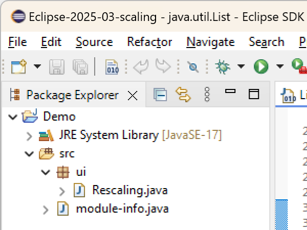

# Platform and Equinox - 4.36 

A special thanks to everyone who [contributed to Eclipse-Platform](acknowledgements.md#eclipse-platform) or [contributed to Equinox](acknowledgements.md#equinox) in this release!

<!--
---
## Views, Dialogs and Toolbar
-->

<!--
---
## Text Editors
-->

<!--
---
## Preferences
-->

---
## Themes and Styling

<!-- https://github.com/eclipse-platform/eclipse.platform.swt/pull/1936 -->
### Improved Disabled Icons Generation

Contributors

- [Manuel Killinger](https://github.com/killingerm)
- [Heiko Klare](https://github.com/HeikoKlare)
- [Hannes Wellmann](https://github.com/hanneswell)

Up to now, disabled versions of icons usually were and had to be provided as explicit, separate image files.
In case no such icon was provided, an algorithm in SWT was used to generate a disabled icon.
However, that algorithm was very limited and produced poor results.

The algorithm in SWT was now improved such that results are by default equal to the disabled version of the icons that have explicitly been provided for the Eclipse Platform bundles in the past.
The pre-generated disabled icons have been replaced with the usage of on-the-fly generated disabled versions of the icons via the SWT algorithm.
This includes in particular the removal of `disabledIcon` in `plugin.xml` files and programmatically setting the `disabledImageDescriptor` for `Actions`.

In addition, the algorithm for the calculation of disabled versions of icons became configurable.
The algorithm can be changed via the system property `org.eclipse.swt.image.disablement` with the following options:
- `grayed` (default): produces a gray-scaled version of the icon, which is aligned with the
  existing, pre-generated disabled versions of icons for Eclipse bundles
- `desaturated` (preview): produces a desaturated version of the icon, comparable to the
  `grayed` version but still keeping some color in it; the configuration of this option may be
  subject to change in future releases of Eclipse
- `gtk`: produces an icon version that conforms with the default disablement algorithm of GTK

The following screenshots demonstrate the different options.

| Option | Example |
| --- | --- |
| `grayed` |  |
| `desaturated` |  |
| `gtk` |  |

<!--
---
## Views, Dialogs and Toolbar
-->
---
## Debug

<!-- https://github.com/eclipse-platform/eclipse.platform/pull/1803 -->
### Custom Labels for Breakpoints

Managing breakpoints in large codebases just got easier. You can now assign `custom labels` to breakpoints in the `Breakpoints view`.
When debugging complex applications, it's common to set numerous breakpoints. Identifying the important ones quickly can be 
time-consuming and error-prone. 

This new feature allows you to add meaningful labels to breakpoints so that you can locate, categorize, and prioritize them more effectively.

To label a breakpoint, simply right-click on a breakpoint in the `Breakpoints view` and choose `Label`.

Now provide appropriate label of your choice or leave blank to show default label

Once a label is assigned, the labeled breakpoint is visually highlighted for easier identification

This improves clarity when navigating through breakpoints during complex debugging sessions, and enhances overall productivity—especially
in projects with dozens of breakpoints.

---
## General Updates

<!-- https://github.com/eclipse-platform/eclipse.platform.swt/pull/2054 -->
### Explicit Minimum Windows Version

Currently, Eclipse officially supports Windows 10 and 11. By now, this was not validated explicitly but only defined as an implicit requirement.
When using an unsupported Windows version, it could happen that startup of an Eclipse or plain SWT application failed with a linkage error because unavailable functions of more recent operating system versions are linked.

SWT now validates the supported Windows version during application startup and fails with an according error message if the version is not supported.
It is supposed to improve comprehensibility of the reason for initialization to fail by logging a better error message.

The minimum Windows version is set to build 14393, which conforms to the original Window 10 and Windows Server 2016 releases.
In case you are facing issues with the version check, it can be disabled with the system property `swt.disableWindowsVersionCheck`.
Note that you may then face linkage errors instead.

**Note:** This validation is not part of the Eclipse update process, i.e., it will not prevent an existing Eclipse installation from being updated on an unsupported Windows version.

### Monitor-Specific UI Scaling as Default (Windows only)

Contributors

- [Shahzaib Ibrahim](https://github.com/ShahzaibIbrahim)
- [Federico Jeanne](https://github.com/fedejeanne)
- [Heiko Klare](https://github.com/HeikoKlare)
- [Andreas Koch](https://github.com/akoch-yatta)
- [Amartya Parijat](https://github.com/amartya4256)

In the previous releases, a preference to enable an improved, monitor- and resolution-specific UI scaling on Windows was introduced,
see the news for [4.34](../4.34/platform.html#rescale-on-runtime-preference)
and [4.35](../4.35/platform.html#rescaleOnRuntimePreference) for details.
The feature has been further improved since then and is now **enabled by default**.

The feature makes each window adapt its scaling to the monitor it is currently placed on in a sharp, resolution-specific way
and without requiring the application to restart.
When using multiple windows, each of them will adapt its scaling to the monitor it is placed on.
When enabled, this new feature replaces the current, limited scaling support for high-resolution monitors,
which initializes the application's window according to the scaling of the primary monitor at application startup
and produces blurry scaling when moving the window to another monitor unless the application is restarted.

To disable this feature, uncheck the _Monitor-specific UI scaling_ box on the **Appearance** preference page
(`Window > Preferences > General > Appearance`),
as shown in the image below.
The feature is still under further development. We encourage users to **share their feedback** to help us improve the functionality.

The images below demonstrate the scaling behavior in an extract of an Eclipse application when moving the window
from a primary monitor with 100% scaling to another monitor with 200% scaling, first having the feature disabled
and second having it enabled.

On a 200% monitor with the feature being **disabled**:

On a 200% monitor with the feature being **enabled**:

<!-- https://github.com/eclipse-platform/eclipse.platform.swt/pull/1638 -->
### Support for SVG Images

Contributors

- [Michael Bangas](https://github.com/michael5601)
- [Heiko Klare](https://github.com/HeikoKlare)
- [Hannes Wellmann](https://github.com/hanneswell)

Until now, Eclipse only supported loading of raster graphics.
This limited the ability to scale icons without quality loss and required manual rasterization of SVG files outside to generate icons in different sizes that can be embedded in Eclipse products,
leading to additional effort and many separate icon files.

Support for vector graphics (SVG) has now been added.
Instead of providing multiple rasterized images for different sizes, a single SVG file can be referenced.
The SVG is rasterized on-the-fly at the required size when the image is retrieved at runtime.
This ensures optimal image quality for arbitrary scaling factors without manual preprocessing.
Support for loading raster graphics remains available.
Together with the [on-the-fly generation of disabled versions of icons](#improved-disabled-icons-generation),
only one source file per icon needs to be managed for all required zoom levels as well as their visualization in enabled and disabled state.

As part of this change, most icons across all Eclipse SDK bundles have been added as SVGs, and the corresponding paths
(e.g., in `plugin.xml` files) have been updated accordingly.

This improvement is especially beneficial for High-DPI displays, where crisp, scalable icons enhance the visual appearance and usability of the user interface.
It also ensures better adaptation to different display settings and dynamic scaling scenarios.

**DEPRECATION NOTE:** The obsolete PNG files are now considered deprecated. They may be *removed with Eclipse 2027-06*.

The following screenshots compare the use of raster graphics and vector graphics when loading icons with 125% monitor scaling.

| Image Source | Example at 125% |
| --- | --- |
| PNG with scaling mode `nearest` |  |
| SVG |  |
