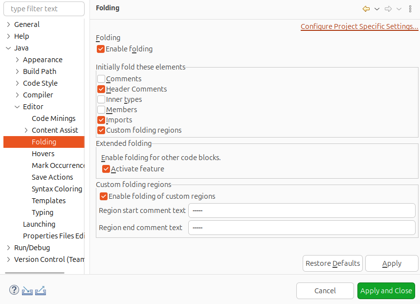
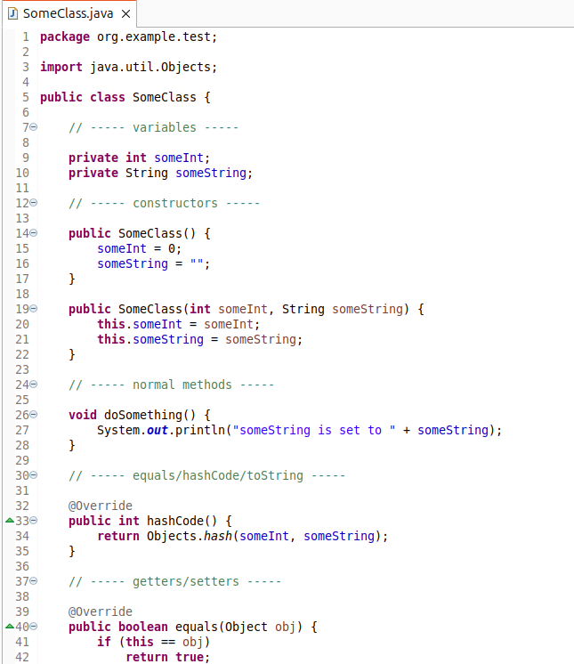
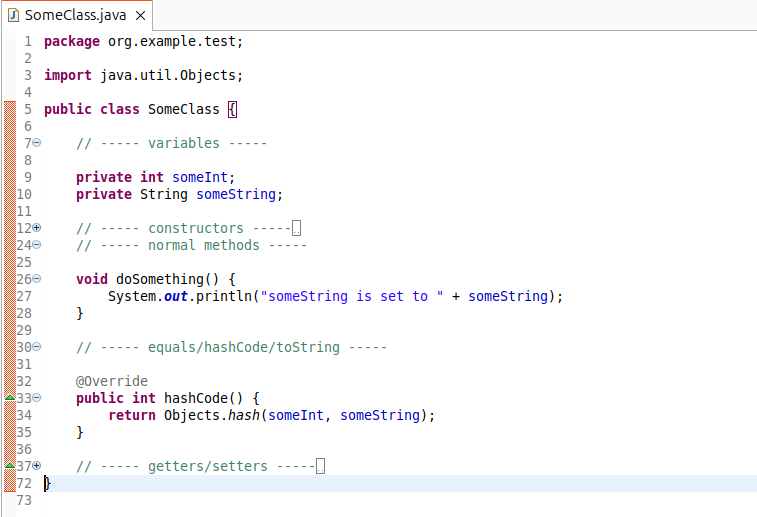
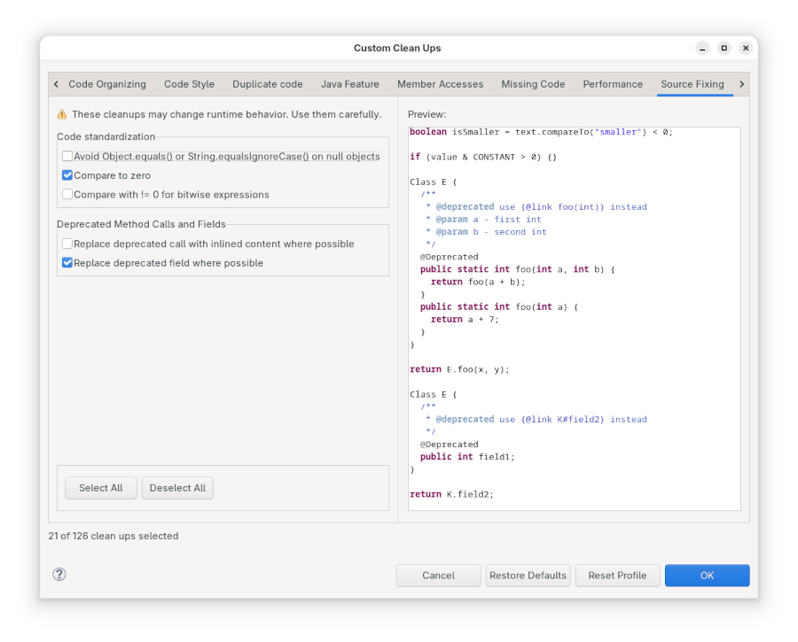
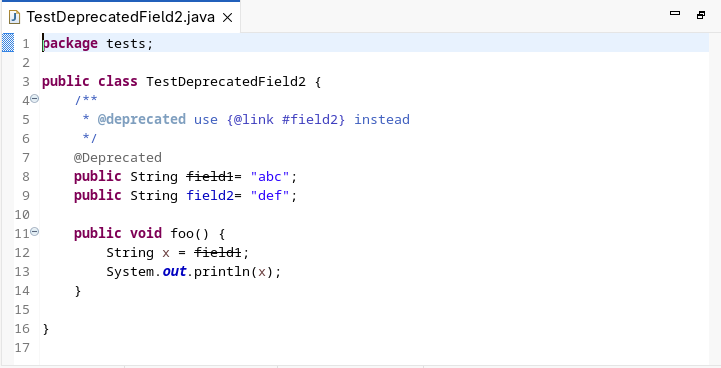
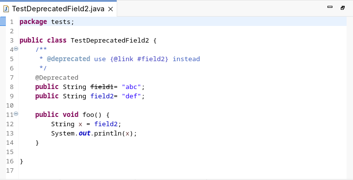
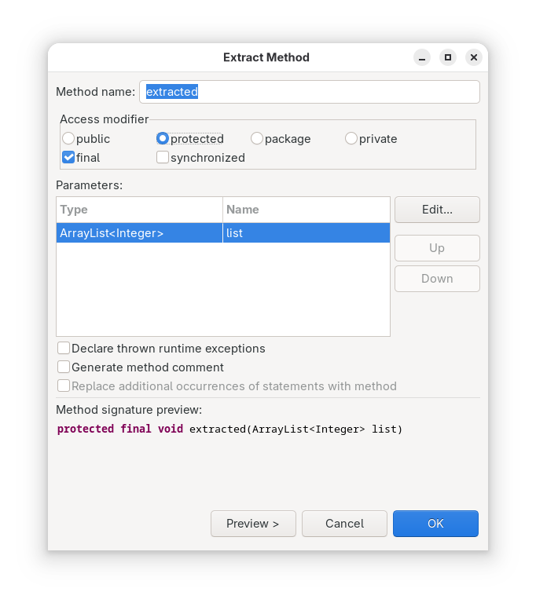
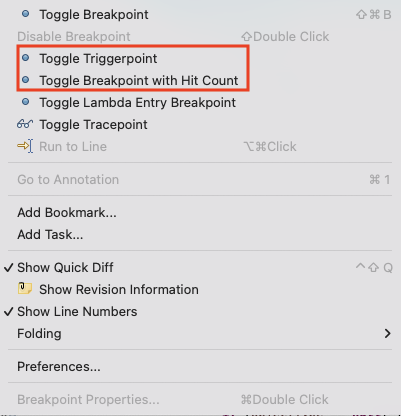

# Java Development Tools - 4.37

A special thanks to everyone who [contributed to JDT](acknowledgements.md#java-development-tools) in this release!

<!--
---
## Java&trade; XX Support 
-->

<!--
---
## JUnit
-->

---
## Java Editor

### Support Overlapping Start and End Markers for Custom Folding Regions

Contributors

- [Daniel Schmid](https://github.com/danthe1st)

Custom Folding Regions have been enhanced to allow using the same text for both the start and end region comment.
If the start and end region markers are the same, the same comment can be used to end a folding region and start a new one.
The last section automatically ends when the last block is closed or at the end of the file.

This is useful if a class (or other Java file) contains multiple sections that are seperated with some comment.
To use this functionality, check "Enable folding of custom regions" in `Window > Preferences > Java > Editor > Folding` and enter the same text in "Region start comment text" and "Region end comment text".

This marker can then be used in comments to separate start and end regions.

### New quick-fix/clean-up to replace deprecated fields

Contributors

- [Jeff Johnston](https://github.com/jjohnstn)

In a previous release, support was added to replace deprecated method calls with a suggested replacement found in Javadoc.  With this release, it is now possible to also replace fields with suggested replacements.

The new clean-up is found by going to the `Source Fixing` tab of the Clean-up Configuration dialog and selecting: `Replace deprecated field where possible`.  The quick-fix is accessible by clicking CTRL+space on the deprecated field reference.

To make the field replaceable, the Javadoc should specify the alternate field or constant to use.  For example, for the following code:

results in:

after applying the clean-up.

### Access modifier specification added to Extract Method

Contributors

- [Jeff Johnston](https://github.com/jjohnstn)

When extracting code to a method, a user can now specify access modifiers for the new method including: `public`, `protected`, `package-private`, `private`, `final`, and `synchronized`.

## Debugger

### Toggle Triggerpoint and Breakpoint with Hit Count

Contributors

- [Andrey Loskutov](https://github.com/iloveeclipse)
- [Suby S Surendran](https://github.com/subyssurendran666)

The ruler context menu in the editor has been enhanced to make debugging setup more efficient. You can now directly toggle a breakpoint with hit count or a triggerpoint by `right-clicking on the vertical ruler` (left margin), where the context menu includes the options Toggle Breakpoint with Hit Count and Toggle Triggerpoint.

<!--
---
## Java Views and Dialogs
-->

<!--
---
## Java Compiler
-->

<!--
---
## Java Formatter
-->

<!--
---
## Debug
-->

<!--
### JDT Developers
--> 
