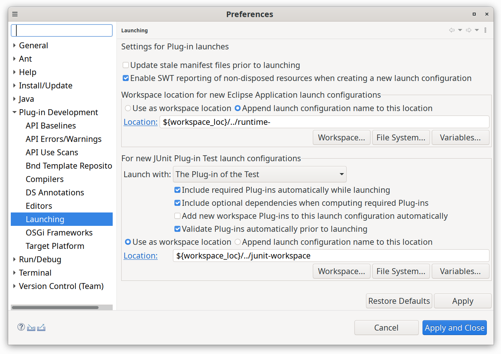
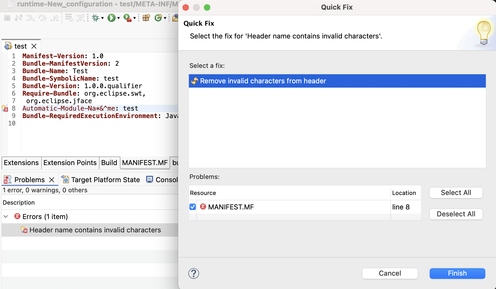
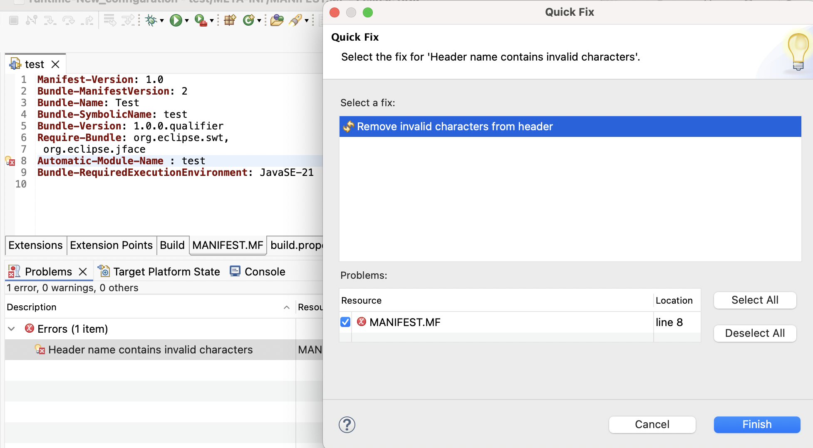

# Plug-in Development Environment - 4.37

A special thanks to everyone who [contributed to PDE](acknowledgements.md#plug-in-development-environment) in this release!

## General Updates

### JUnit Plugin-Test Launches

Contributors

- [Christoph Läubrich ](https://github.com/laeubi)

PDE previously has created JUnit Plugin-test launches with some broad inclusion settings and defaults that do not always fit different project setups well.
Now it uses a more minimal approach when creating new JUnit Plugin-test launches that only selects the test-plugin
and leverages the option to include all required dependencies automatically.

This results in much smaller launches that start up faster and do not pull in everything in your workspace by default
which is especially a problematic when many independent components in a workspace are to be tested.

In addition, it is now possible to configure the default settings for new launches to adapt to individual needs.
As a result, we **highly recommend** you review these settings to ensure they fit your needs after upgrading.

As this only affects new launches, you either need to adapt existing launches or delete older ones so they are created with fresh settings on the next run.
If you encounter any issues or difficulties using this feature don't hesitate to let us know by opening an [issue](https://github.com/eclipse-pde/eclipse.pde/issues)
or starting a [discussion](https://github.com/eclipse-pde/eclipse.pde/discussions).

### OSGi Test Framework Support

Contributors

- [Christoph Läubrich ](https://github.com/laeubi)

The [OSGi Testing Support](https://github.com/eclipse-osgi-technology/osgi-test#osgi-testing-support) is a great library for testing OSGi applications,
and PDE now adds first-class support as it already did for OSGi Annotations.

Enable this as follows:

1. Make sure your target platform contains the necessary OSGi test dependencies.
   To make this easier, PDE provides a feature named `org.eclipse.pde.osgitest.dependencies.feature`.
2. Go to the [Build Path Settings](https://help.eclipse.org/latest/topic/org.eclipse.jdt.doc.user/reference/ref-properties-build-path.htm)
   and add the Junit Library under the [Libraries Tab](https://help.eclipse.org/latest/topic/org.eclipse.jdt.doc.user/reference/ref-properties-build-path.htm#libraries)
   but do not add any JUnit or OSGi Testing imports/requirements to your manifest!
3. Place your Tests into a source folder marked as test source

PDE will then automatically add required dependencies for OSGi Testing Support and you can use all the standard annotations.

After that just run your tests as the usual plugin test.
You can find an example [here](examples/osgitest-example.zip).
If you encounter issues or have suggestions don't hesitate to let us know by opening an [issue](https://github.com/eclipse-pde/eclipse.pde/issues).

<!--
## Editors
-->

<!--
## API Tools
-->

## PDE Compiler

### Auto-Correction of Malformed Bundle Header Names

Contributors

- [Gireesh Punathil ](https://github.com/gireeshpunathil)
- [Neha Burnwal ](https://github.com/nburnwal09)

A quick fix was added for correcting invalid header names in the `MANIFEST.MF` file. 
It automatically sanitizes header names by removing any characters other than alphanumeric `(A–Z, a–z, 0–9)`, hyphen `(-)`, and underscore `(_)`.

Additionally, the quick fix ensures proper formatting by removing a space between the header name and the colon `(:)` if one is found.

The quick fix is labeled as `Remove invalid characters from header`. 
Once the user clicks on `Finish`, it updates the header. 
This quick fix is added to enhance user experience.
