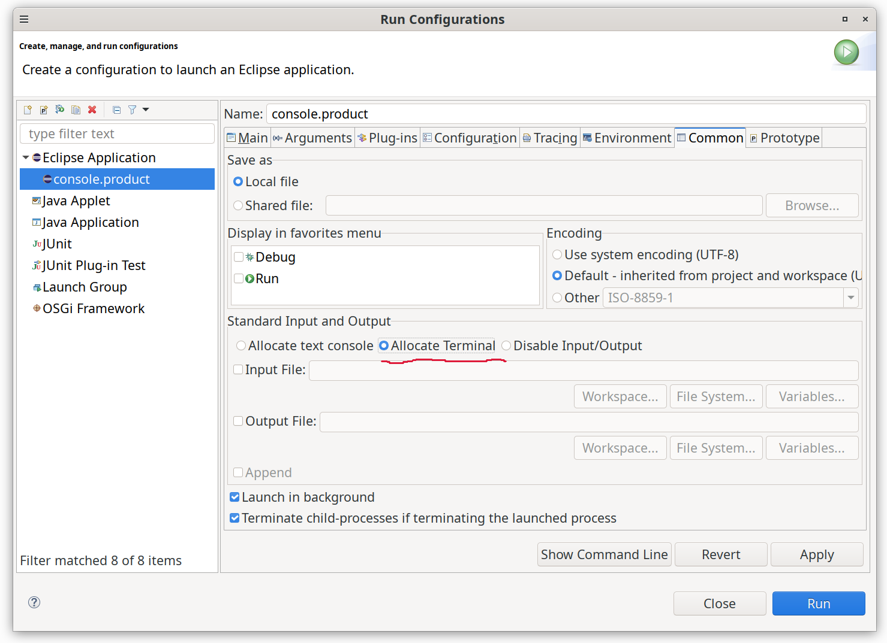

# Platform and Equinox - 4.37 

A special thanks to everyone who [contributed to Eclipse-Platform](acknowledgements.md#eclipse-platform) or [contributed to Equinox](acknowledgements.md#equinox) in this release!

<!--
---
## Views, Dialogs and Toolbar
-->

<!--
---
## Text Editors
-->

<!--
---
## Preferences
-->

<!--
---
## Themes and Styling
-->

<!--
---
## Views, Dialogs and Toolbar
-->

---
## General Updates

### Support for launching a run inside a Terminal session

When launching a run in Eclipse one can currently choose to allocate a console for input/output
and since a while we also support ANSI color codes there what makes integration of console applications
that use color output possible.

But for the input side and more advanced features like text base user interfaces this still does not work
well as these applications require a so called [pseudo terminal](https://en.wikipedia.org/wiki/Pseudoterminal)
together with a [terminal emulator](https://en.wikipedia.org/wiki/Terminal_emulator) to behave as if it was
executed on native command prompt.

While the [VT100 terminal emulator](https://en.wikipedia.org/wiki/VT100) was already added the in the last release,
there was still the need to start the application in a terminal session what is now available when launching a run from
inside Eclipse as well!

This is currently preliminary support and we would like to get feedback, so don't hesitate to [open a bug report](https://github.com/eclipse-platform/eclipse.platform/issues)
if something is missing or not working as expected, this can be enabled in the following way:

- Download the latest integration build SDK [here](https://download.eclipse.org/eclipse/downloads/)
- Go to "Install new Software" and add the site https://download.eclipse.org/tools/cdt/releases/12.1/cdt-12.1.0/ then select 'Terminal (Console) View' and 'TM Terminal Local Connector Extension'
- Now in the toolbar choose the 'Open a Terminal' icon and make sure the Terminal View works for your platform
- Go to "Install new Software" and add the site https://download.eclipse.org/eclipse/updates/4.37-I-builds/ then select '...'

Now the terminal console support is installed and you can use it. You can install m2e PDE support from https://download.eclipse.org/technology/m2e/releases/latest/ and
then use this [example project](images/test.terminal.zip):

- open the console.target and set it as active target platform
- open the console.product and start it, you will see a warning and some garbled characters
- go to the launch configuration and then open the tab 'common' and choose 'Allocate Terminal'
- run it again and you will get colors and autocompletion using `<tab>`

