# Java Development Tools - 4.38

A special thanks to everyone who [contributed to JDT](acknowledgements.md#java-development-tools) in this release!

<!--
---
## Java&trade; XX Support 
-->

---
## JUnit

### Eclipse support for JUnit 6.0.1
<!-- https://github.com/eclipse-jdt/eclipse.jdt/issues/147 -->

Contributors

- [Andrey Loskutov](https://github.com/iloveeclipse)
- [Christoph Laeubrich](https://github.com/laeubi)
- [Ed Merks](https://github.com/merks)
- [Hannes Wellmann](https://github.com/HannesWell)
- [Simeon Andreev](https://github.com/trancexpress)

**JUnit 6 requires Java 17+**

#### Create a new JUnit Jupiter test via **New JUnit Test Case** wizard:

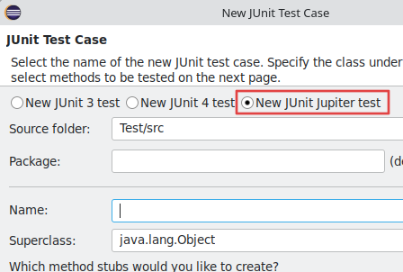

#### Add JUnit 6 library to the build path:

The JUnit Test Case wizard offers to add it while creating a new JUnit Jupiter test:

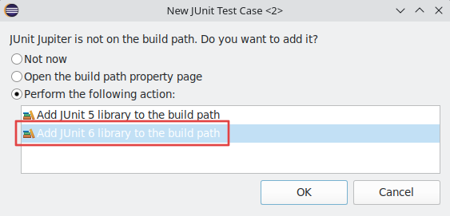

Quick Fix **(Ctrl+1)** proposal on `@Test`, `@TestFactory`, `@ParameterizedTest` and `@RepeatedTest` annotations:

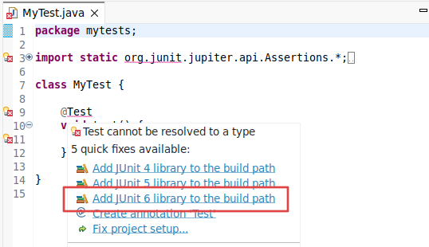

Add JUnit library in Java Build Path dialog:

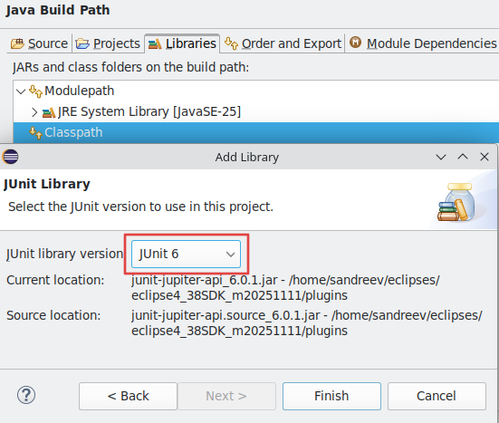

See also:

[JUnit 6 Changelog](https://docs.junit.org/6.0.0/release-notes/)

[JUnit 5 New & Noteworthy in Eclipse 4.8](https://eclipse.dev/eclipse/news/4.8/jdt.html#JUnit)

---
## Java Editor

### Java 25 Import Module Support

Contributors

- [Jeff Johnston](https://github.com/jjohnstn)

Java 25 has added the ability to use `import module` to specify access to all
classes of packages exported directly or via a transitive required module
statement for the specified module name.  For the newly offered implicitly
declared class, an `import module java.base;` statement is already implied.
To use an `import module` statement, the module must either be specified
as a required module in `module-info.java` or else be `java.base`.

#### Organize Imports

The organize imports operation has been enhanced to support recognizing an
`import module` statement and to remove extraneous imports for classes
already included by the module.  It will leave imports that are required either
because they are not part of the exported module classes or they are found 
in more than one package for the modules imported or they are static imports.

For example:

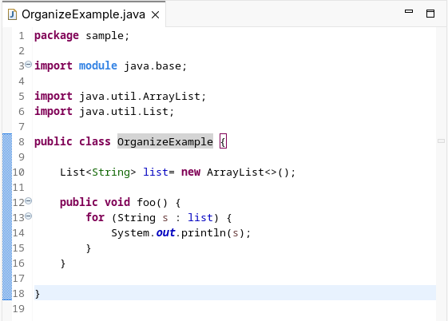

becomes:

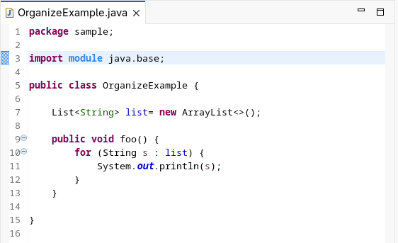

#### New Use Import Module Clean-up

A new clean-up has been added for Java 25 to convert an existing Java class
to use `import module` to replace various import statements.  The modules
chosen are from the list of required modules in the `module-info.java` file
or the default `java.base`.  This differs from <b>Organize Imports</b> in that 
the organize imports operation does not add `import module` statements
if they weren't present before.

To use the new clean-up, go to <b>Source → Clean Up... → Configure</b> and 
on the <b>Java Features tab</b> choose <b>Java 25 → Use Import Module</b>.

For example:

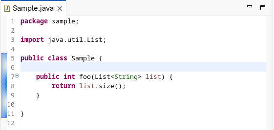

is changed to:

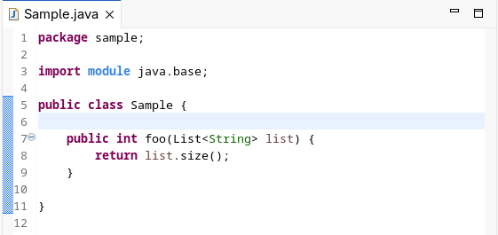

### Markdown Comment Templates

Contributors

- [Jeff Johnston](https://github.com/jjohnstn)

As of Java 23, Javadoc comments can be specified in markdown format.  There
are various clean-ups, quick-assists, and code actions where a Javadoc
comment is added on behalf of the end-user and these are created using
the templates found in the <b>Code Templates</b> dialog in <b>Preferences</b>.
For example, adding new getters/setters has an option to add comments and
this will add Javadoc comments to the new methods.

A new category: <b>Markdown Comments</b> has been added to the dialog as well
as a new option: <b>Use markdown comments where available</b>.  When the option
is enabled and the level of Java is 23 or above, then new Javadoc comments
added on behalf of the end-user will use the new markdown templates.  As with
regular comment templates, these can be edited in the dialog and saved.

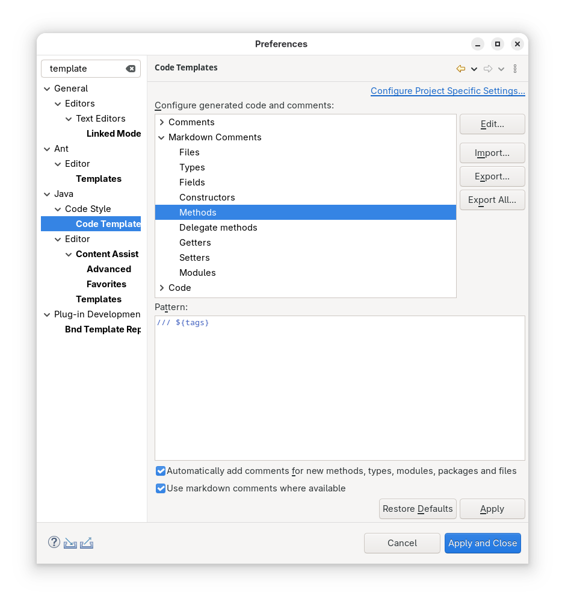

---
## Java Views and Dialogs

### Open Type Dialog Enhancement

Contributors

- [Jeff Johnston](https://github.com/jjohnstn)

The Open Type dialog has been enhanced to default wild-card characters between
camel-case segments.  If the string is entirely upper-case such as `OOME`, no
wild-cards will be defaulted and the prior camel-case search logic will occur.
The new logic will prioritize class names in the sort that start with the
most characters of the original string.

For example, specifying `OutMemory` will find `OutOfMemoryError` whereas
it did not before.  If there is a class called `OutMemoryAdapter`, it
will appear ahead of `OutOfMemoryError` in the result list.

---
## Java Compiler

### Changed Handling of Access Restriction for Inherited Methods
<!-- https://github.com/eclipse-jdt/eclipse.jdt.core/pull/4293 -->

Contributors

- [Christoph Laeubrich](https://github.com/laeubi)
- [Stephan Herrmann](https://github.com/stephan-herrmann)

The Java compiler now handles access restriction warnings different than before when calling inherited methods.
Previously, calling a public method on an accessible type would trigger an access restriction warning if that method was inherited from a restricted (non-API) parent class.

With this change, the compiler recognizes that inherited public methods accessed through an accessible type are legal and do not require access to the restricted parent class.
This behavior now more aligns with JPMS and OSGi semantics, where inherited public methods are accessible through the public subclass without requiring visibility to the parent class's package.

Implementers of `IClasspathConainer` are advised to revisit their usage of access restrictions to see if this new concepts still meets their expectations or possibly need adaption.

### Changes concerning Deprecation Warnings
<!-- https://github.com/eclipse-jdt/eclipse.jdt.core/issues/4572 -->

Contributors

- [Stephan Herrmann](https://github.com/stephan-herrmann)

It was discovered that the Eclipse Compiler for Java (ECJ) was not conforming to JLS in several matters of deprecation warnings.

Therefore a significant overhaul in this area was performed. As a result you may experience fewer or more deprecation warnings in your code, depending on how `@Deprecated` and `@SuppressWarnings("deprecation")` are used in your code (in these regards the old javadoc tag `@deprecated` has the same effect as the annotation).

#### Changes in problem reporting
* Previously, ECJ regarded all **members** (fields, methods, member types) of a deprecated type as **"implicitly deprecated"**. This concept is not backed by JLS and has been corrected, such that ECJ now reports fewer warnings.
    * In this situation deprecation warnings will only be raised against references to the deprecated type, not at locations where only its members are referenced.
        * Invocations of a default constructor count as a reference to the type, i.e., those get a warning, too.
    * If previously such warnings were suppressed in the code, then this `@SuppressWarnings` annotation may be flagged as unnecessary.
    * If a deprecated type is extended or implemented by a non-deprecated type, clients of the subtype may now freely use its inherited members without triggering a warning. In this situation the `extends` or `implements` clauses are now the only location where deprecation will cause a warning (unless suppressed there).
* Previously, ECJ did not raise any deprecation warnings when using deprecated elements from **within the same compilation unit** (file). JLS specifies this slightly different: not a compilation unit is the point of reference, but declaration and use must be located within the same **top-level type** in order to be exempted from deprecation warnings.
    * This will bring about more warnings in situations where you may have assumed that code within the same compilation unit is **"friendly"** and thus privileged to use deprecated elements.
* New warnings are also raised against usage of a deprecated **annotation element**.
    * This is relevant when an annotation type itself is not deprecated, but the way how annotation details are specified is changing and deprecation is used for guiding users during migration.

#### New support for reacting to the above changes

You may have gotten used to warnings regarding "implicitly deprecated" members, and thus feel the correction of ECJ to be a loss in visibility of pending migration issues. 

For this situation a new configurable warning (severity is `info` by default) has been implemented that will alert you when a deprecated type contains members that are not marked as deprecated (private members are exempted).

Along with the new warning a quickfix is provided that allows to mechanically add `@Deprecated` to all affected members, thus restoring warnings regarding the use of any of these members.

#### Example

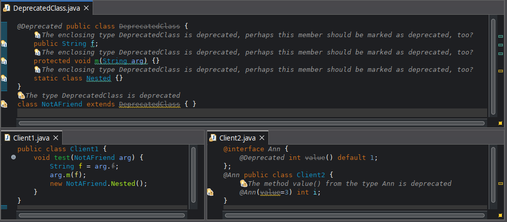

**Explanations:**
* DeprecatedClass.java
    * Members of this class are no longer considered as deprecated. See Client1.java.
    * Members, however, raise the new info warning: "The enclosing type DeprecatedClass is deprecated, perhaps this member should be marked as deprecated, too?"
    * Class `NotAFriend` gets a deprecation warning against its superclass, despite being stored in the same compilation unit.
* Client1.java
    * This class no longer gets any deprecation warnings, as none of the referenced elements are deprecated.
* Client2.java
    * This class shows two applications of the annotation `Ann`.
        * At class level the annotation is used without detail and hence does not raise a warning.
       * At method level the annotation detail `value` triggers the deprecation warning.
       
**Quick fixes are offered for the new info warning:**

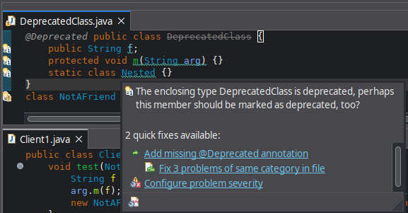

* You may add `@Deprecated` annotations to individual members.
    * This fix can also be applied to several members together (via this hover or when invoked from the Problems view)
* The link `Configure problem severity` will take you to the exact location in compiler preferences, where you can select the severity of this warning among "error", "warning", "info" or "ignore". Obviously, "ignore" will turn it of for the scope of that project or workspace.

Adding `@Deprecated` as suggested by the quickfix will bring back the warnings in Client1.java that previous versions of ECJ reported.

### Multi-Release JAR Compilation Support
<!-- https://github.com/eclipse-jdt/eclipse.jdt.core/pull/3900 -->
<!-- https://github.com/eclipse-jdt/eclipse.jdt.ui/pull/2260 -->
<!-- https://github.com/eclipse-jdt/eclipse.jdt.debug/pull/753 -->
<!-- https://github.com/eclipse-m2e/m2e-core/pull/2058 -->

Contributors

- [Christoph Laeubrich](https://github.com/laeubi)
- [Stephan Herrmann](https://github.com/stephan-herrmann)

JDT now supports native compilation of Multi-Release JARs.
[Multi-Release JARs](https://openjdk.org/jeps/238) are a feature introduced in Java 9 that allows a single JAR file to contain multiple versions of the same class,
each compiled for a specific Java release.
This enables libraries to take advantage of newer Java features while maintaining backward compatibility with older Java versions.

With this new feature, you can now compile Multi-Release Types directly within Eclipse.
Multi-Release Types are classes that exist in different variants with the same name across different source folders,
where each variant is automatically compiled with the appropriate Java release settings and placed in the correct output folder.

This implementation follows the "Pattern 3: Single Project" approach described in the [Maven Compiler Plugin documentation](https://maven.apache.org/plugins/maven-compiler-plugin/multirelease.html).
Previously, this pattern had limited IDE support, but Eclipse now provides a simple and elegant solution by compiling individual class files with the corresponding release option.

To enable Multi-Release compilation for a source folder, open the source folder properties in the Build Path configuration and specify the target Java release:

Once configured, you can:
- Edit and compile Multi-Release Types simultaneously across different Java versions
- Run Multi-Release compiled projects directly from the Eclipse IDE
- Use m2eclipse's built-in support to automatically map `maven-compiler-plugin` executions for Multi-Release JARs into JDT configuration

This feature significantly simplifies the development workflow for libraries that need to support multiple Java versions.
We welcome your feedback and testing of this new capability.
For known issues and to report problems, please visit the [JDT Core issue tracker](https://github.com/eclipse-jdt/eclipse.jdt.core/issues/4275).

For more details on m2eclipse integration, see the [m2e-core release notes](https://github.com/eclipse-m2e/m2e-core/blob/main/RELEASE_NOTES.md#multi-release-jar-support).

<!--
---
## Java Formatter
-->

## Debugger

### Compare Variable Value with Clipboard

Contributors

- [Sougandh S ](https://github.com/SougandhS)

The Variables view now provides an option to compare a selected variable’s `toString()` value directly with the current clipboard content. 
The values open in a comparison viewer where differences are clearly highlighted, making it easier to verify actual values against expected results quickly and accurately.

To use this, select a variable from `Variables View` and choose `Compare With Clipboard` from its content menu

For `objects`, the clipboard content is compared to their `toString()` value.

Comparison also works with `Arrays` and `Primitives` too.

### Breakpoint Support for In-line Chained Lambdas

Contributors

- [Sougandh S ](https://github.com/SougandhS)
- [Andrey Loskutov ](https://github.com/iloveeclipse)

The Java debugger now supports setting breakpoints on individual lambdas defined within single-line chained lambda expressions. When toggling a `Lambda Entry Breakpoint` on such an expression,
a dialog appears showing all lambdas defined on that line in their order of appearance. As you move the selection over a lambda in the list, the corresponding lambda in the source is highlighted, 
helping you easily identify which one you’re about to select.

The dialog also includes a `filter field` to quickly narrow down the list when multiple lambdas are present

Once confirmed, the `breakpoint` is added specifically to that lambda, giving precise control when debugging complex chained expressions.
The selected lambda’s name is also displayed clearly in the `Breakpoints view` for better traceability.

<!--
### JDT Developers
--> 
