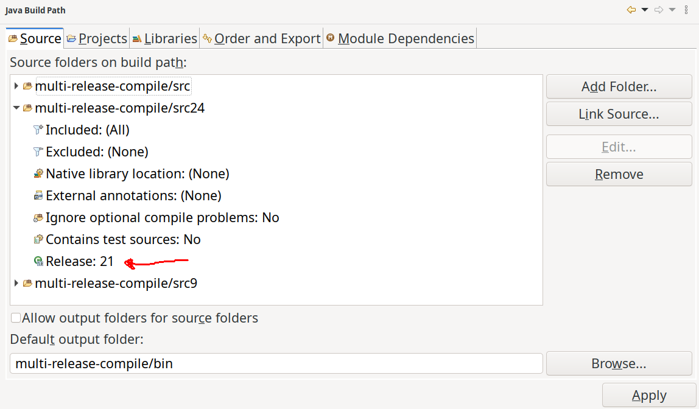
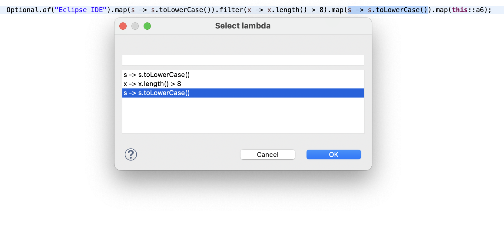
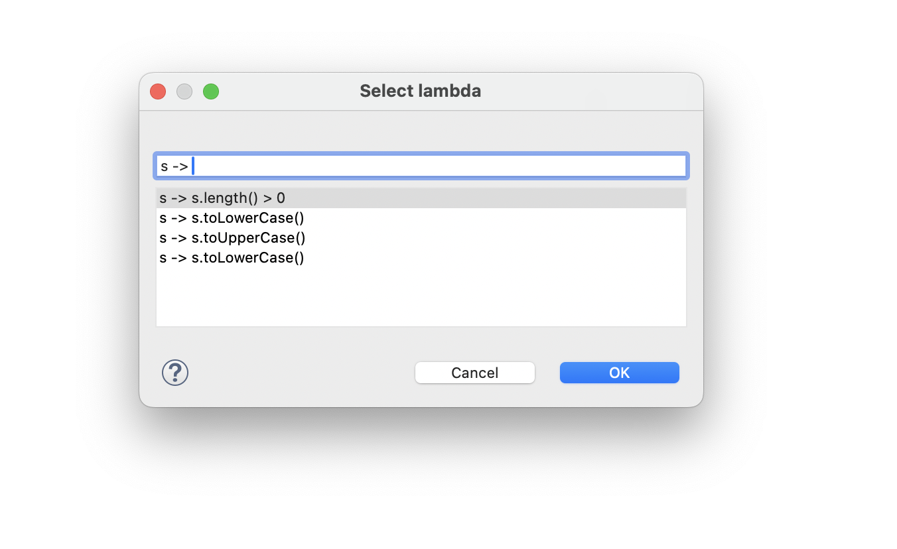
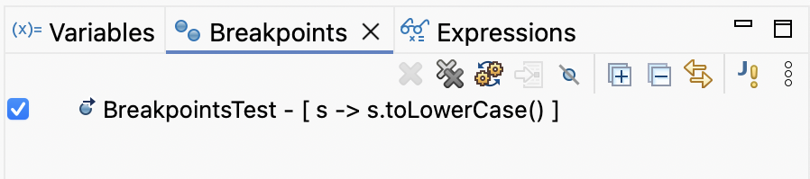

# Java Development Tools - 4.38

A special thanks to everyone who [contributed to JDT](acknowledgements.md#java-development-tools) in this release!

<!--
---
## Java&trade; XX Support 
-->

<!--
---
## JUnit
-->

<!--
---
## Java Editor
-->

<!--
---
## Java Views and Dialogs
-->

---
## Java Compiler

### Changed Handling of Access Restriction for Inherited Methods
<!-- https://github.com/eclipse-jdt/eclipse.jdt.core/pull/4293 -->

Contributors

- [Christoph Laeubrich](https://github.com/laeubi)
- [Stephan Herrmann](https://github.com/stephan-herrmann)

The Java compiler now handles access restriction warnings different than before when calling inherited methods.
Previously, calling a public method on an accessible type would trigger an access restriction warning if that method was inherited from a restricted (non-API) parent class.

With this change, the compiler recognizes that inherited public methods accessed through an accessible type are legal and do not require access to the restricted parent class.
This behavior now more aligns with JPMS and OSGi semantics, where inherited public methods are accessible through the public subclass without requiring visibility to the parent class's package.

Implementers of `IClasspathConainer` are advised to revisit their usage of access restrictions to see if this new concepts still meets their expectations or possibly need adaption.

### Multi-Release JAR Compilation Support
<!-- https://github.com/eclipse-jdt/eclipse.jdt.core/pull/3900 -->
<!-- https://github.com/eclipse-jdt/eclipse.jdt.ui/pull/2260 -->
<!-- https://github.com/eclipse-jdt/eclipse.jdt.debug/pull/753 -->
<!-- https://github.com/eclipse-m2e/m2e-core/pull/2058 -->

Contributors

- [Christoph Laeubrich](https://github.com/laeubi)
- [Stephan Herrmann](https://github.com/stephan-herrmann)

JDT now supports native compilation of Multi-Release JARs.
[Multi-Release JARs](https://openjdk.org/jeps/238) are a feature introduced in Java 9 that allows a single JAR file to contain multiple versions of the same class,
each compiled for a specific Java release.
This enables libraries to take advantage of newer Java features while maintaining backward compatibility with older Java versions.

With this new feature, you can now compile Multi-Release Types directly within Eclipse.
Multi-Release Types are classes that exist in different variants with the same name across different source folders,
where each variant is automatically compiled with the appropriate Java release settings and placed in the correct output folder.

This implementation follows the "Pattern 3: Single Project" approach described in the [Maven Compiler Plugin documentation](https://maven.apache.org/plugins/maven-compiler-plugin/multirelease.html).
Previously, this pattern had limited IDE support, but Eclipse now provides a simple and elegant solution by compiling individual class files with the corresponding release option.

To enable Multi-Release compilation for a source folder, open the source folder properties in the Build Path configuration and specify the target Java release:

Once configured, you can:
- Edit and compile Multi-Release Types simultaneously across different Java versions
- Run Multi-Release compiled projects directly from the Eclipse IDE
- Use m2eclipse's built-in support to automatically map `maven-compiler-plugin` executions for Multi-Release JARs into JDT configuration

This feature significantly simplifies the development workflow for libraries that need to support multiple Java versions.
We welcome your feedback and testing of this new capability.
For known issues and to report problems, please visit the [JDT Core issue tracker](https://github.com/eclipse-jdt/eclipse.jdt.core/issues/4275).

For more details on m2eclipse integration, see the [m2e-core release notes](https://github.com/eclipse-m2e/m2e-core/blob/main/RELEASE_NOTES.md#multi-release-jar-support).

<!--
---
## Java Formatter
-->

## Debugger

### Compare Variable Value with Clipboard

Contributors

- [Sougandh S ](https://github.com/SougandhS)

The Variables view now provides an option to compare a selected variable’s `toString()` value directly with the current clipboard content. 
The values open in a comparison viewer where differences are clearly highlighted, making it easier to verify actual values against expected results quickly and accurately.

To use this, select a variable from `Variables View` and choose `Compare With Clipboard` from its content menu

For `objects`, the clipboard content is compared to their `toString()` value.

Comparison also works with `Arrays` and `Primitives` too.

### Breakpoint Support for In-line Chained Lambdas

Contributors

- [Sougandh S ](https://github.com/SougandhS)
- [Andrey Loskutov ](https://github.com/iloveeclipse)

The Java debugger now supports setting breakpoints on individual lambdas defined within single-line chained lambda expressions. When toggling a `Lambda Entry Breakpoint` on such an expression,
a dialog appears showing all lambdas defined on that line in their order of appearance. As you move the selection over a lambda in the list, the corresponding lambda in the source is highlighted, 
helping you easily identify which one you’re about to select.

The dialog also includes a `filter field` to quickly narrow down the list when multiple lambdas are present

Once confirmed, the `breakpoint` is added specifically to that lambda, giving precise control when debugging complex chained expressions.
The selected lambda’s name is also displayed clearly in the `Breakpoints view` for better traceability.

<!--
### JDT Developers
--> 
