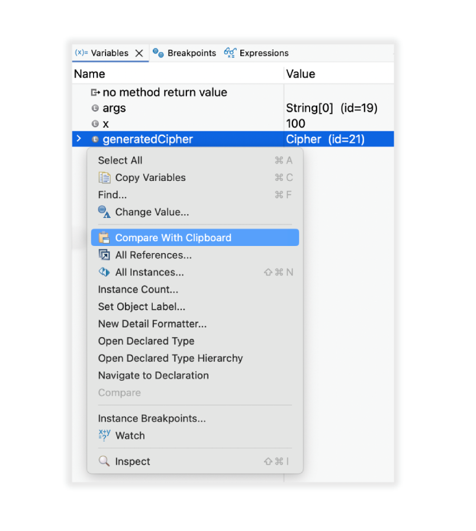
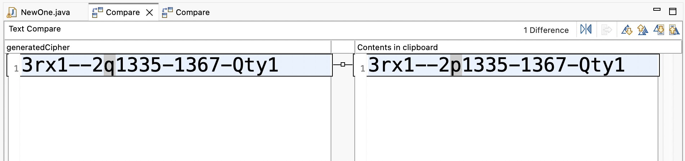
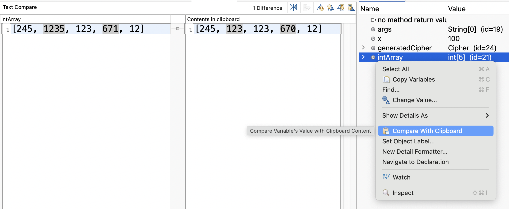
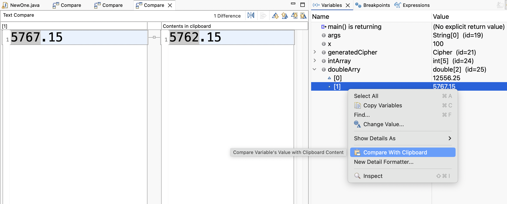

# Java Development Tools - 4.38

A special thanks to everyone who [contributed to JDT](acknowledgements.md#java-development-tools) in this release!

<!--
---
## Java&trade; XX Support 
-->

<!--
---
## JUnit
-->

<!--
---
## Java Editor
-->

<!--
---
## Java Views and Dialogs
-->

<!--
---
## Java Compiler
-->

<!--
---
## Java Formatter
-->

## Debugger

### Compare Variable Value with Clipboard

Contributors

- [Sougandh S ](https://github.com/SougandhS)

The Variables view now provides an option to compare a selected variable’s `toString()` value directly with the current clipboard content. 
The values open in a comparison viewer where differences are clearly highlighted, making it easier to verify actual values against expected results quickly and accurately.

To use this, select a variable from `Variables View` and choose `Compare With Clipboard` from its content menu

For `objects`, the clipboard content is compared to their `toString()` value.

Comparison also works with `Arrays` and `Primitives` too.

<!--
### JDT Developers
--> 
