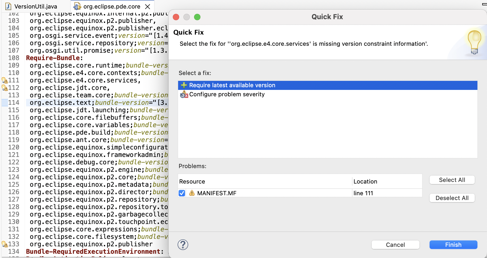

# Plug-in Development Environment - 4.38

A special thanks to everyone who [contributed to PDE](acknowledgements.md#plug-in-development-environment) in this release!

<!--
## Editors
-->

<!--
## API Tools
-->

## PDE Compiler 

### Version Mapping for Required Bundles

Contributors

- [Neha Burnwal ](https://github.com/nburnwal09)

A quick fix was provided for adding the available matching version for a required bundle in the `MANIFEST.MF` file. 

The quick fix is labeled as `Require latest available version`. 
Once the user clicks on `Finish`, it adds the version to the specific Required bundle. 
This quick fix is added to enhance user experience.
