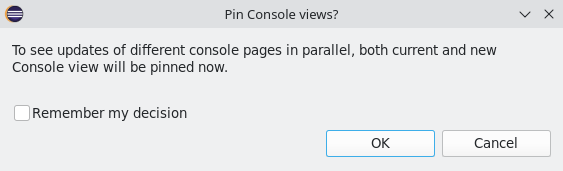
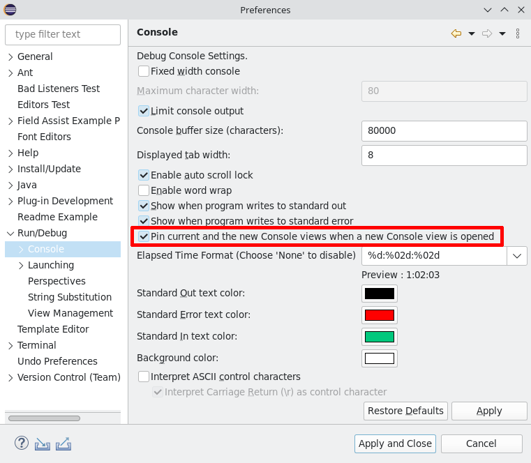
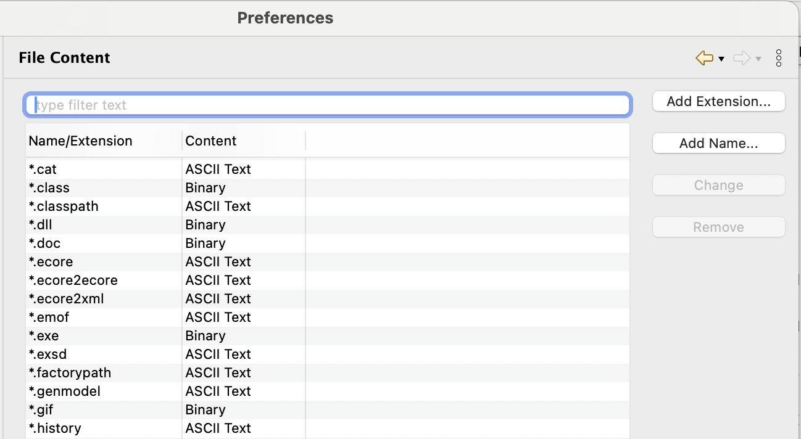
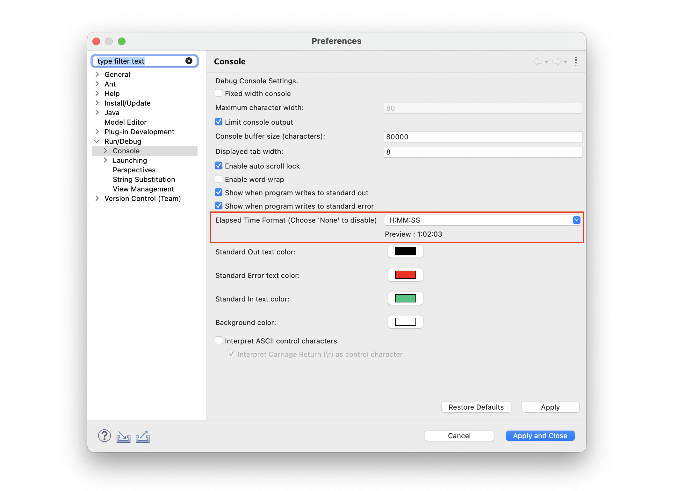
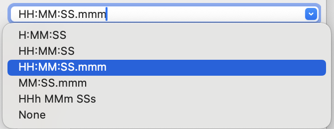
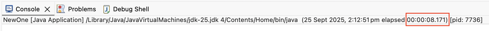
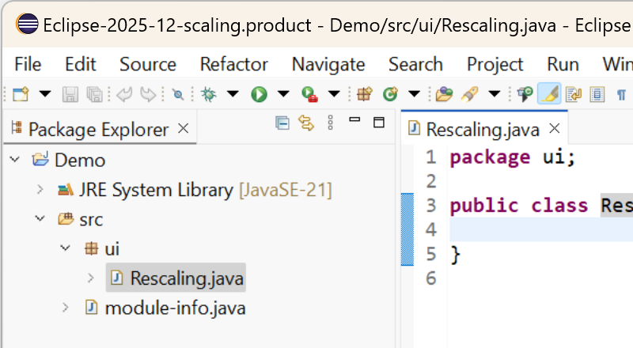
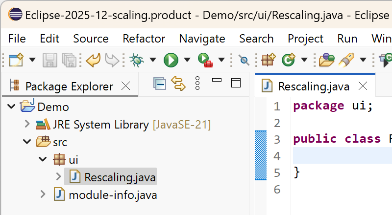
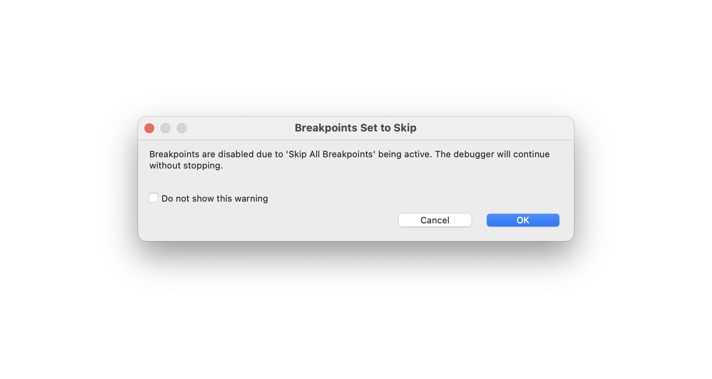

# Platform and Equinox - 4.38 

A special thanks to everyone who [contributed to Eclipse-Platform](acknowledgements.md#eclipse-platform) or [contributed to Equinox](acknowledgements.md#equinox) in this release!

---

## Views, Dialogs and Toolbar

### Pin the Console view

Contributors

- [Loskutov A](https://github.com/iloveeclipse)
- [Andreev S](https://github.com/trancexpress)
- [Karaman M](https://github.com/mehmet-karaman)

The `Open New Console View` action has been improved to pin both the active and newly opened `Console` views, ensuring their content remains visible during output processing.

A new option has been added to `Console Preferences` that allows users to enable or disable the pinning feature.

<!--
---
## Text Editors
-->

---
## Preferences

### New Filtering Options in Preference Page

Contributors

- [Elsa Zacharia](https://github.com/elsazac)
- [Sougandh S](https://github.com/SougandhS)

Filtering has been introduced in more areas of the `Preference` page to make it easier to find and manage entries.

A filtering option is now available in the `File Content` section under the `Version Control (Team)` preferences, providing quick filtering of file specific extensions.
In addition, filtering options have been added to the `Templates` sections under the `Java Editor`, `Ant Editor`, and `Template Editor`.
This has also been added to the `Add to Favorites` dialog under `Run/Debug` launches, and also to the `Export Launch Configurations` dialog. 

*Figure : Version Control (Team) Preference page showing the filtering option.*

These enhancements improve usability by making it easier to locate templates and extensions by name, filter and sort launches by type, and quickly find specific launch configurations without manually expanding or scrolling through long lists.

<!--
---
## Themes and Styling
-->

<!--
---
## Views, Dialogs and Toolbar
-->

---
## General Updates

### Configurable Elapsed Time Display in Console

Contributors

- [Sougandh S ](https://github.com/SougandhS)

The `Console` view now lets you customize or disable the elapsed time shown in its title.
A new option is available in the `Console Preferences` that provides an editable dropdown with several predefined formats.

When you select a format, a live preview in the console shows how it will appear.
You can also edit the format string to create your own custom style, and the preview will help validate whether it is correctly formatted.

Once the setting is saved, the console title updates in the chosen format

---
### Enhancements of Monitor-Specific UI Scaling on Windows

Contributors

- [Shahzaib Ibrahim](https://github.com/ShahzaibIbrahim)
- [Arun Jose](https://github.com/arunjose696)
- [Heiko Klare](https://github.com/HeikoKlare)
- [Andreas Koch](https://github.com/akoch-yatta)
- [Amartya Parijat](https://github.com/amartya4256)

In the Eclipse 2025-06 release, [monitor-specific scaling was enabled as the default mode](../4.36/platform.md#monitor-specific-ui-scaling-as-default-windows-only) for UI scaling on Windows. 
With that feature enabled, each application window adapts to the zoom of the monitor on which it is placed in a sharp, resolution-specific way.

In this release, several quality improvements for this feature have been implemented.
The feature is still under continuous development.
We encourage users to [share their feedback](https://github.com/eclipse-platform/eclipse.platform.swt/issues/1961) to help us improve the functionality.

#### Improvements

The improvements in this release include (but are not limited to) the following.

##### Performance

The performance when moving a window from one monitor to another with a different zoom has been significantly improved.
This makes moving a window to another monitor feel faster.
It is based on these two improvements:
- The general performance of the adaptation logic has been improved. 
- The adaptation of window content to the new monitor is now executed asynchronously.

##### Layouting

Several improvements regarding layouting for different monitor zooms have been implemented.
- In particular, control sizes may have been a bit too small before, which is not the case anymore.
- Non-resizable dialogs now adapt their layout better when moved to another monitor with a different zoom.
- Some spacing calculations based on fixed numbers have been improved to better incorporate the actual monitor zoom.

##### Images and Icons

Image handling has been further improved, also including a [new feature for sharp rendering](platform_isv.md#new-gc-api-for-drawing-scaled-images).
In addition, the following specific issues have been addressed:
- When using a GIF image,  the image may no longer lose its transparency, i.e, render on a black background, when moving between monitors with different zoom levels.
- An issue with some application icons (for title bar and task bar) becoming invisible has been fixed.

##### Cursors

Custom cursors may not have been properly scaled, as they did not adhere to Windows cursor size settings.
Adapting the cursor size to the Windows settings has been implemented.

#### Appearance

The images below demonstrate the scaling behavior in an extract of an Eclipse application when moving the window from a primary monitor with 150% scaling to another monitor with 200% scaling.
In the first image, the feature is disabled (possible via Eclipse preferences), and in the second it is enabled.

On a 200% monitor with the feature being **disabled**:

On a 200% monitor with the feature being **enabled**:

---
### Merging the JVM and the Operating System Trust Stores

Contributors

- [Sebastian Ratz](https://github.com/sratz)
- [Ed Merks](https://github.com/merks)
- [Christoph Läubrich](https://github.com/laeubi)

A new system property `-Declipse.platform.mergeTrust=true` was added to merge the trust store of the JVM (`lib/security/cacerts`)
and the trust store of the operating system (`Windows-ROOT` on Windows or `Apple KeychainStore` on macOS).

Previously, the Eclipse Platform was only using the JVM trust store (before Eclipse 2024-12) or only the OS trust store (starting with Eclipse 2024-12)
which could result in the common error

`javax.net.ssl.SSLHandshakeException: sun.security.validator.ValidatorException: PKIX path building failed: sun.security.provider.certpath.SunCertPathBuilderException: unable to find valid certification path to requested target`

e.g., when updating Eclipse or installing new software.

The new `-Declipse.platform.mergeTrust=true` property is added by default to the Platform SDK and Runtime Binary as well as to all the IDE packages starting with 2025-12.

The strategy of merging trust stores is also applied by browser vendors, e.g., [Microsoft Edge](https://learn.microsoft.com/en-us/deployedge/microsoft-edge-security-cert-verification).

For more background information see also:
- https://bugs.eclipse.org/bugs/show_bug.cgi?id=567504
- https://github.com/eclipse-packaging/packages/pull/224
- https://github.com/eclipse-packaging/packages/pull/224#issuecomment-2627576123
- https://github.com/eclipse-platform/eclipse.platform/issues/1690#issuecomment-3178636555
- https://github.com/eclipse-platform/eclipse.platform/pull/2241

---
## Debugger

### Prompt on Debug Launch with Skipped Breakpoints

Contributors

- [Sougandh S ](https://github.com/SougandhS)
- [Andrey Loskutov ](https://github.com/iloveeclipse)

A new safeguard has been added to help avoid confusion when debugging with breakpoints skipped.
If you start a debug session while the `Skip All Breakpoints` option enabled, a warning dialog now appears to remind you that breakpoints will be ignored. 
This prevents the common situation where developers assume the debugger is malfunctioning because no breakpoints are hit.

