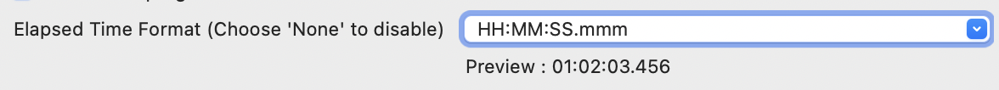

# Platform and Equinox - 4.38 

A special thanks to everyone who [contributed to Eclipse-Platform](acknowledgements.md#eclipse-platform) or [contributed to Equinox](acknowledgements.md#equinox) in this release!

<!--
---
## Views, Dialogs and Toolbar
-->

<!--
---
## Text Editors
-->

---
## Preferences

### New Filtering Options in Preference Page

Contributors

- [Elsa Zacharia](https://github.com/elsazac)
- [Sougandh S](https://github.com/SougandhS)

Filtering has now been introduced in more areas of the Preference page to make it easier to find and manage entries.

A filtering option is now available in the File Content section under the `Version Control (Team)` preferences, providing quick filtering of file specific extensions.
In addition, filtering options have been added to the Templates sections under the `Java Editor`, `Ant Editor`, and `Template Editor`.
This has also been added to the `Add to favorite` dialog under Run/Debug launches, and also to the `Export Launch Configurations` dialog. 

*Figure : Version Control (Team) Preference page showing the filtering option.*

These enhancements improves usability by making it easier to locate templates and extensions by name, filter and sort launches by type, and quickly find specific launch configurations without manually expanding or scrolling through long lists.

<!--
---
## Themes and Styling
-->

<!--
---
## Views, Dialogs and Toolbar
-->

---
## General Updates

### Configurable Elapsed Time Display in Console

Contributors

- [Sougandh S ](https://github.com/SougandhS)

The Console view now lets you customize or disable the elapsed time shown in its title. A new option is available in the `Console Preferences` that provides an editable dropdown with several predefined time formats.

When you select a format, a live preview in the console shows how it will appear. You can also edit the format string to create your own custom style, and the preview will validate whether it is correct or not.

Once the setting is saved, the console title updates in the chosen format

---
## Debugger

### Prompt on Debug Launch with Skipped Breakpoints

Contributors

- [Sougandh S ](https://github.com/SougandhS)
- [Andrey Loskutov ](https://github.com/iloveeclipse)

A new safeguard has been added to help avoid confusion when debugging with breakpoints skipped.
If you start a debug session while the `Skip All Breakpoints` option enabled, a warning dialog now appears to remind you that breakpoints will be ignored. 
This prevents the common situation where developers assume the debugger is malfunctioning because no breakpoints are hit.

