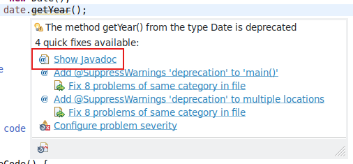
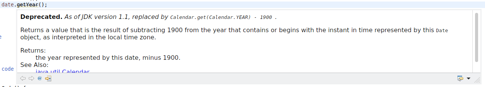
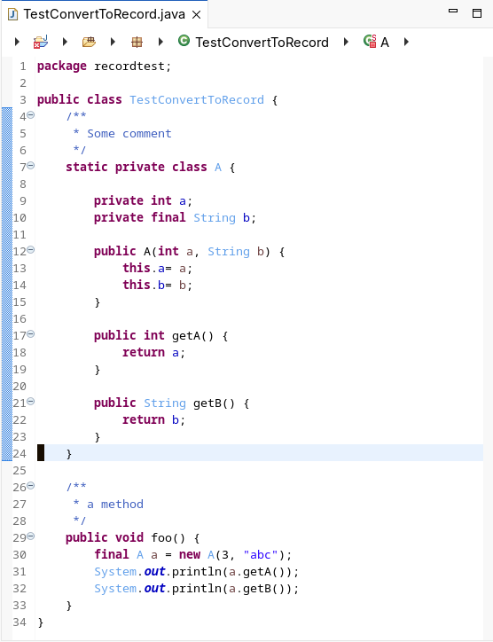
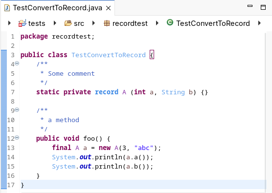
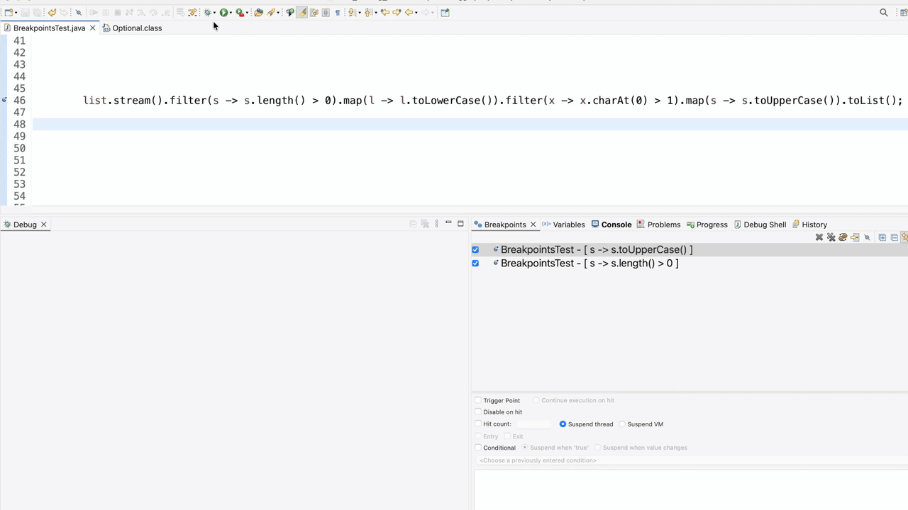
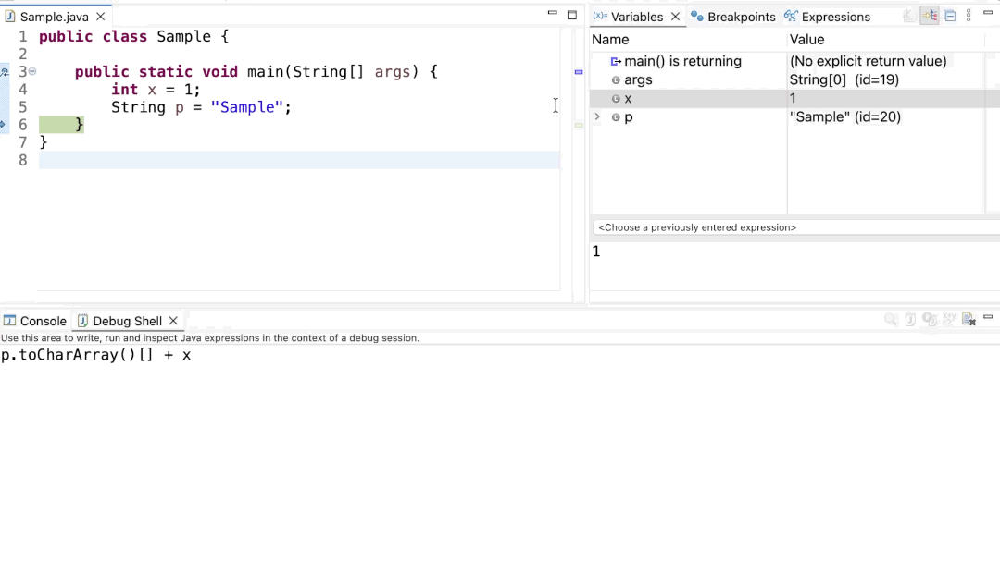
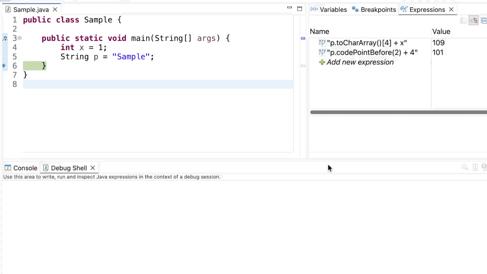

# Java Development Tools - 4.39

A special thanks to everyone who [contributed to JDT](acknowledgements.md#java-development-tools) in this release!

<!--
---
## Java&trade; XX Support 
-->

<!--
---
## JUnit
-->

---
## Java Editor

### Folding With Showing Selected Java Elements

Contributors

- [Daniel Schmid](https://github.com/danthe1st)

Folding can now be used in the Java Editor when `Window` > `Preferences` > `Java` > `Editor` > `Only show the selected Java element` is enabled.

In previous releases, this option automatically disabled code folding.

### Show Javadoc From Annotation/Quick‑Fix Hover

Contributors

- [Raghunandana M](https://github.com/raghucssit)
- [Andrey Loskutov](https://github.com/iloveeclipse)

The annotation/quick‑fix hover now includes a “Javadoc” proposal that opens the Javadoc information pop‑up for the Java element referenced by the annotation.

You can now view an element’s API documentation directly from an annotation hover without navigating to the element’s source file.

Previously annotation hover took precedence and blocked the usual Javadoc pop‑up for the element under the annotation.
To read the Javadoc you had to open or navigate to the original Java source.

The fix removes that friction.

#### Annotation Hover Javadoc Behavior
- When an annotation/quick‑fix hover is shown and the annotation refers to a Java element that has Javadoc, a “Show Javadoc” entry appears in the hover’s proposals list.
- Activating the proposal opens the standard Javadoc information control (the same browser‑based Javadoc pop‑up used elsewhere).
- The Javadoc pop‑up replaces the annotation hover for a natural, contextual display.
- The Javadoc pop‑up is closed automatically when the user clicks outside — preventing stale pop‑ups.

New Show Javadoc proposal in annotation hover

Javadoc pop‑up shown after activating the proposal

### New Convert Class To Record Quick-assist / Refactoring

Contributors

- [Jeff Johnston](https://github.com/jjohnstn)

A new refactoring has been added: `Right-click` -> `Refactoring` -> `Convert Class to Record...`, which will convert an appropriate class into a record.

1. The class must have only one or more private instance field members that are all initialized in a single constructor by simple assignment and no static members.
2. The class must have at most one getter method per instance field that simply returns the field value.
3. The class can only extend Object and cannot implement any interface.
4. The class may override `equals()`, `hashCode()`, or `toString()` from Object and these will be copied into the record but it cannot have any other methods except for the aforementioned constructor and getter methods.

The refactoring may note that the conversion is not possible or issue a warning before conversion:
for example, if there is a field that does not have a getter, a warning will be issued that the field will be exposed via an accessor and the user may choose to continue or not.

When the record is created, all references to the previous getters will be changed to call the appropriate record accessors.

A corresponding quick-assist (`CTRL-1` -> `Convert to record`) is also added to convert such a class.
The quick-assist differs from the refactoring in that any warnings will cause the assist to not be offered.

For example, the following:

will be converted to:

<!--
---
## Java Views and Dialogs
-->

<!--
---
## Java Compiler
-->

<!--
---
## Java Formatter
-->

## Debugger

### Improved Highlighting For Inline Chained Lambdas

Contributors

- [Sougandh S](https://github.com/SougandhS)

Building on the `inline lambda breakpoint` support added in **Eclipse 4.38**, the Java debugger now highlights the specific inline lambda expression when it is suspended.

Previously, selecting or focusing a lambda stack frame in a chained expression highlighted the entire line, making it difficult to identify the exact lambda.

Now only the suspended lambda is highlighted, making it much easier to follow execution in complex chained expressions.

### Drag and Drop Variables and Expressions into the Debug Shell

Contributors

- [Sougandh S](https://github.com/SougandhS)

The `Debug Shell` now supports drag and drop from the `Variables` and `Expressions` views. 
You can drag a variable or expression directly into the `Debug Shell`, where it is inserted at the caret location. 
This makes it easier to reuse existing expressions and quickly build new ones using variables during a debug session, without manual typing or copying.

#### Variable Drop

#### Expression Drop

<!--
### JDT Developers
-->
