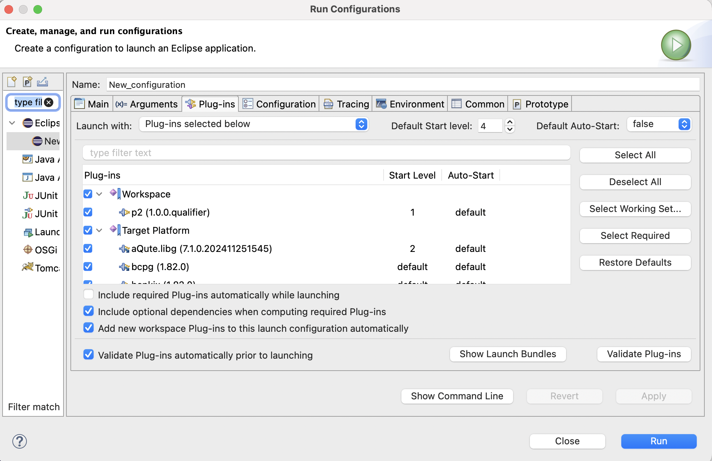
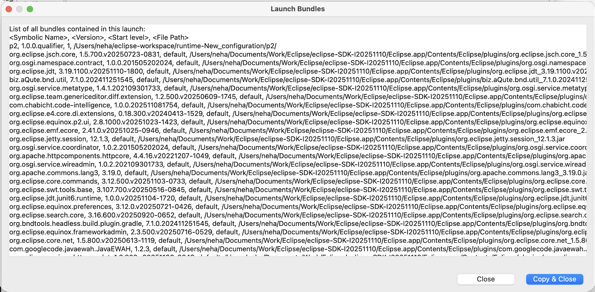

# Plug-in Development Environment - 4.39

A special thanks to everyone who [contributed to PDE](acknowledgements.md#plug-in-development-environment) in this release!

<!--
## Editors
-->

<!--
## API Tools
-->

<!--
---
## PDE Compiler 
-->

## Views and Dialogs

### Launch Bundles Dialog Added

Contributors

- [Neha Burnwal](https://github.com/nburnwal09)

A new dialog has been added to the Eclipse PDE launch configuration dialog. 
It allows users to view the list of bundles that will be included when launching an Eclipse application.
This feature is accessible via a `Show Launch Bundles` button in the launch configuration dialog in the Plug-ins tab.

It provides visibility into the resolved bundle list for both plug-in based and feature-based applications. 
It helps developers understand the runtime composition of their application during launch setup.