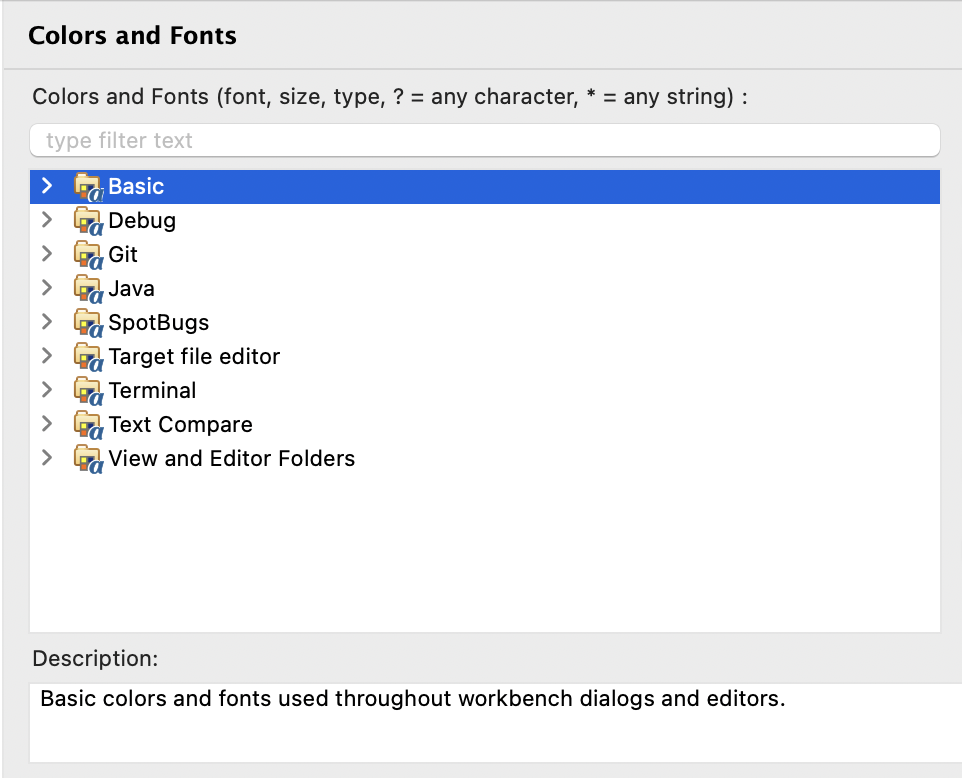
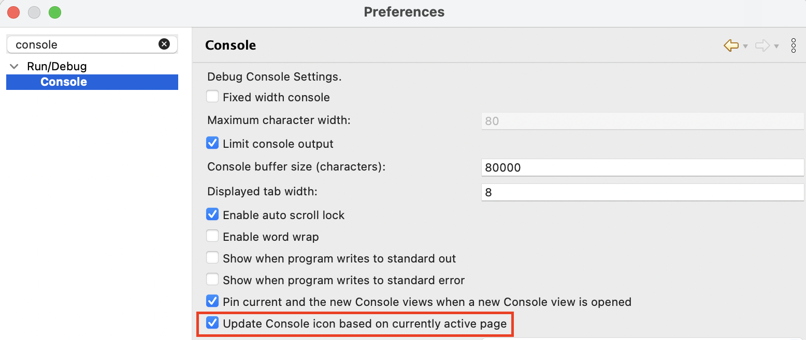

# Platform and Equinox - 4.39 

A special thanks to everyone who [contributed to Eclipse-Platform](acknowledgements.md#eclipse-platform) or [contributed to Equinox](acknowledgements.md#equinox) in this release!

<!--
---
## Views, Dialogs and Toolbar
-->

<!--
---
## Text Editors
-->

## Preferences

### Improved Theme Descriptions in Colors and Fonts Preferences

Contributors

- [Elsa Zacharia](https://github.com/elsazac)

The `Colors and Fonts` preferences page now displays descriptions for the top-level theme categories in addition to the individual subtree elements.
Previously, only child entries in the tree provided descriptive text.
With this update, parent categories such as `Java`, `Basic`, `Debug`, `Text Compare`, etc. also include descriptions, helping users better understand what each category covers and making it easier to locate relevant settings.

<!--
---
## Themes and Styling
-->

<!--
---
## Views, Dialogs and Toolbar
-->

## General Updates

### Dynamic Console View Icon

Contributors

- [Sougandh S ](https://github.com/SougandhS)
- [Andrey Loskutov](https://github.com/iloveeclipse)

The `Console` view now provides improved visual feedback by updating its icon based on the active console. 
This makes it easier to recognize which console is currently selected when multiple consoles are open.
If the selected console does not provide a specific icon, the default `Console` view icon is shown instead.

__Before__

__After__

This behavior can be turned off from the `Console` preferences if you prefer the default static console view icon.

### Equinox Launcher Scaling Defaults (Windows-only)

Contributors

- [Heiko Klare](https://github.com/HeikoKlare)

Monitor-specific scaling is used as default in RCP products on Windows [since the 4.36 release of Eclipse](../4.36/platform.md#monitor-specific-ui-scaling-as-default-windows-only).
To work properly, this requires the DPI awareness "PerMonitorV2", which is set by SWT for the UI thread automatically.
The Equinox launcher executable still contained a manifest that defines a DPI awareness of "System" for the process.

Until now, this led to the splash screen not properly being scaled and to potentially incorrect results at the handover of the splash screen to SWT and the Platform Workbench.
With this release, the Equinox launcher process defaults to DPI awareness "PerMonitorV2" and uses the same autoscale defaults as SWT again.
For information about the SWT defaults, which also have been updated and unified with this release, see [the related news](platform_isv.md#monitor-specific-scaling-by-default-windows).

Monitor-specific scaling can be disabled via `-Dswt.autoScale.updateOnRuntime=false`, which will also make the Equinox launcher use the preexisting autoscaling defaults for the splash screen.
The process will still use DPI awareness "PerMonitorV2", but this will automatically be overwritten by SWT for a Display's UI thread to be "System" again.