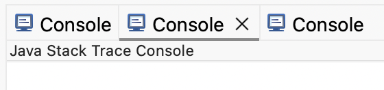
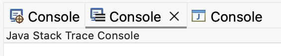

# Platform and Equinox - 4.39 

A special thanks to everyone who [contributed to Eclipse-Platform](acknowledgements.md#eclipse-platform) or [contributed to Equinox](acknowledgements.md#equinox) in this release!

<!--
---
## Views, Dialogs and Toolbar
-->

<!--
---
## Text Editors
-->

<!--
---
## Preferences
-->

<!--
---
## Themes and Styling
-->

<!--
---
## Views, Dialogs and Toolbar
-->

## General Updates

### Dynamic Console View Icon

Contributors

- [Sougandh S ](https://github.com/SougandhS)
- [Andrey Loskutov](https://github.com/iloveeclipse)

The `Console` view now provides improved visual feedback by updating its icon based on the active console. 
This makes it easier to recognize which console is currently selected when multiple consoles are open.
If the selected console does not provide a specific icon, the default `Console` view icon is shown instead.

__Before__

__After__

