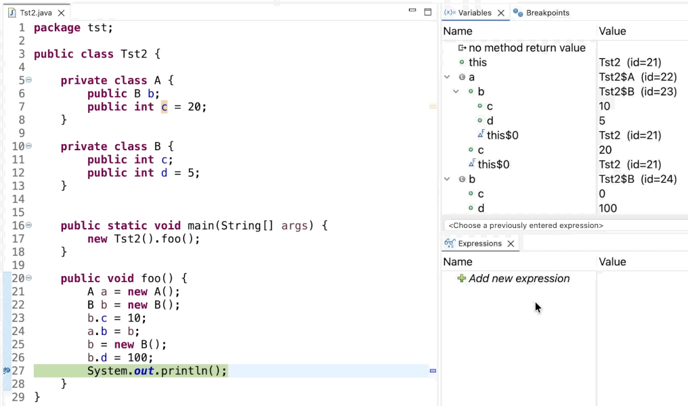

# Java Development Tools - 4.40

A special thanks to everyone who [contributed to JDT](acknowledgements.md#java-development-tools) in this release!

<!--
---
## Java&trade; XX Support 
-->

<!--
---
## JUnit
-->

## Java Editor

### Improvements for Enhanced Folding and Custom Folding Regions

Contributors

- [Federico Jeanne](https://github.com/fedejeanne)
- [Daniel Schmid](https://github.com/danthe1st)

#### Visible Improvements

Several improvements have been made to the enhanced folding and the custom folding regions features introduced in previous releases, including:
- The performance of the enhanced folding mechanism has been improved, especially for large files with many foldable elements.
- Folding regions now include the entire body of control statements, including the opening and closing braces, for a more intuitive folding experience.
- Minor glitches in the folding behavior have been fixed.
- The complete list of addressed issues can be found in the [PR #2860](https://github.com/eclipse-jdt/eclipse.jdt.ui/pull/2860)

#### API/Contract Clarifications

With these changes, custom subclasses of `DefaultJavaFoldingStructureProvider` will also contain the enhanced and the custom folding regions in their results
if the appropriate preferences have been activated.

<!--
---
## Java Views and Dialogs
-->

<!--
---
## Java Compiler
-->

<!--
---
## Java Formatter
-->

## Debugger

### Statement-Level Stepping Support

Contributors

- [Sougandh S](https://github.com/SougandhS)
- [Andrey Loskutov](https://github.com/iloveeclipse)

A new filtering option has been added to the `Step Filtering` preferences to enable __Statement-Level Stepping__. 
When enabled, the debugger skips intermediate bytecode instructions within a single statement and suspends only at the next executable source statement.

This is particularly useful for multi-line statements, where stepping would otherwise pause multiple times due to intermediate operations. 
By filtering out these intermediate steps, the debugger provides a smoother and more source-aligned stepping experience.

__Before__ (Will take 8 Step Over(s) to complete `tet()` method invocation)

__After__ (Will take only 3 Step Over(s) to complete `tet()` method invocation)

### Context-Aware Watch Expressions

Contributors

- [Sougandh S](https://github.com/SougandhS)

Watch expressions created from the `Variables View` now correctly include their evaluation context.
Previously, creating a watch expression on a field under an object generated only the field name, which led to evaluation failures.
With this improvement, both the `Watch action` and `Drag and Drop` now generate fully qualified expressions,
for example `myobj.myfield`, ensuring they evaluate correctly for the current context.

<!--
### JDT Developers
--> 
