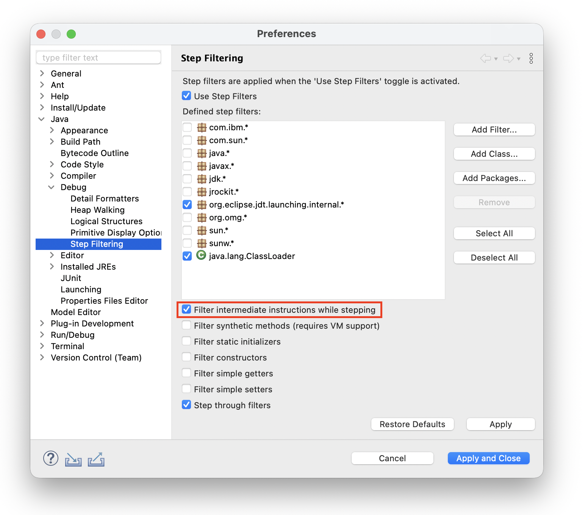
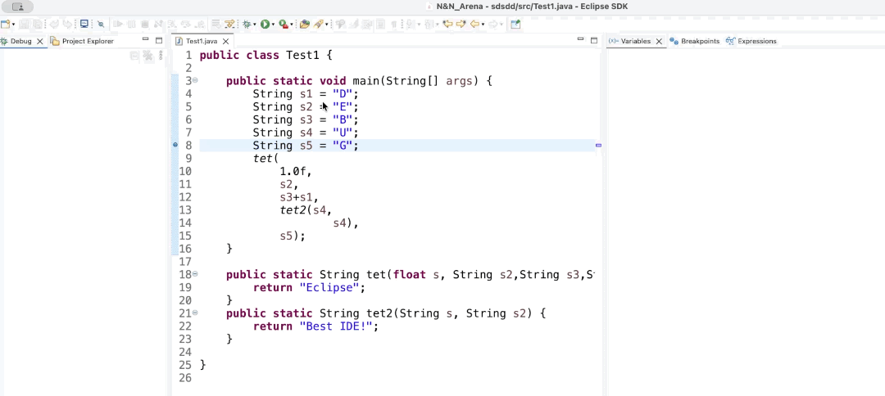
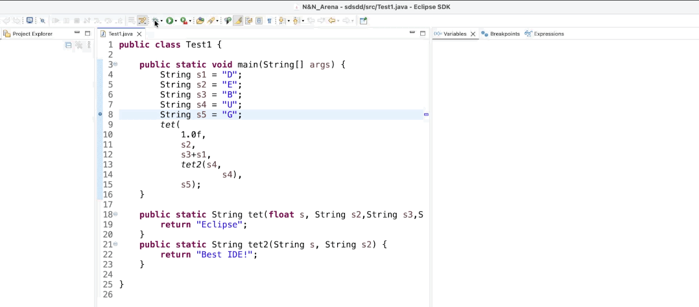

# Java Development Tools - 4.40

A special thanks to everyone who [contributed to JDT](acknowledgements.md#java-development-tools) in this release!

<!--
---
## Java&trade; XX Support 
-->

<!--
---
## JUnit
-->

<!--
---
## Java Editor
-->

<!--
---
## Java Views and Dialogs
-->

<!--
---
## Java Compiler
-->

<!--
---
## Java Formatter
-->

## Debugger

### Statement-Level Stepping Support

Contributors

- [Sougandh S](https://github.com/SougandhS)
- [Andrey Loskutov](https://github.com/iloveeclipse)

A new filtering option has been added to the `Step Filtering` preferences to enable __Statement-Level Stepping__. 
When enabled, the debugger skips intermediate bytecode instructions within a single statement and suspends only at the next executable source statement.

This is particularly useful for multi-line statements, where stepping would otherwise pause multiple times due to intermediate operations. 
By filtering out these intermediate steps, the debugger provides a smoother and more source-aligned stepping experience.

__Before__ (Will take 8 Step Over(s) to complete `tet()` method invocation)

__After__ (Will take only 3 Step Over(s) to complete `tet()` method invocation)

<!--
### JDT Developers
--> 
