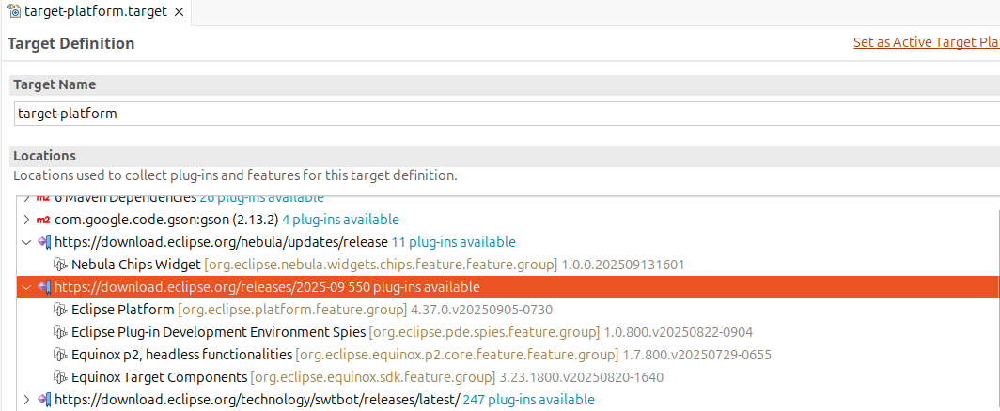
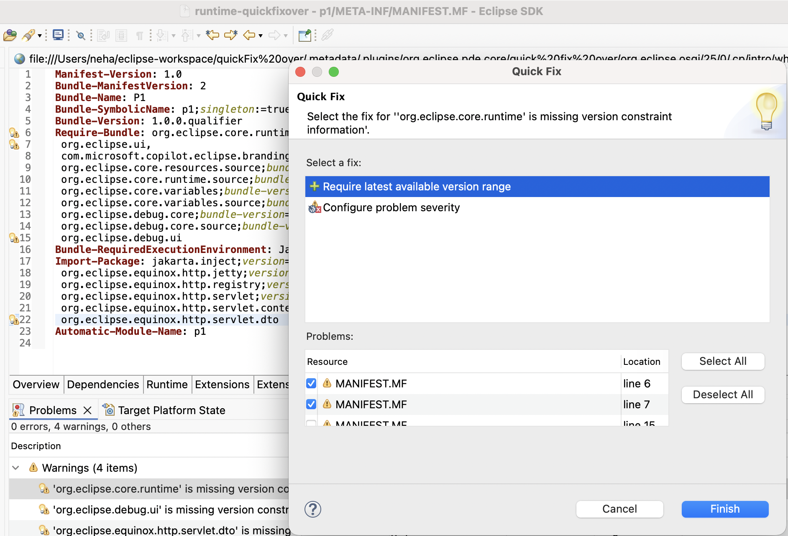

# Plug-in Development Environment - 4.40

A special thanks to everyone who [contributed to PDE](acknowledgements.md#plug-in-development-environment) in this release!

<!--
## Editors
-->

<!--
## API Tools
-->

<!--
---
## PDE Compiler 
-->

## Views and Dialogs

### CSS Spy Widget Hierarchy Export
<!-- https://github.com/eclipse-pde/eclipse.pde/pull/2237 -->
<details>
<summary>Contributors</summary>

- [Lars Vogel](https://github.com/vogella)
</details>

You can now use the `Copy widget info to clipboard` button in the `CSS Spy` 
to export the selected widget's hierarchy with detailed CSS-relevant information.
The exported information includes the CSS selector notation, 
filtered SWT style bits, 
computed versus declared values, 
and the inheritance chain.

An example of the exported information:

```text
Widget Hierarchy
================

Tree#VariablesViewer
  SWT Style: SWT.MULTI SWT.H_SCROLL SWT.V_SCROLL SWT.FULL_SELECTION SWT.LEFT_TO_RIGHT SWT.VIRTUAL
  CSS Properties:
    background-color: #2f2f2f  /* declared: rgb(47, 47, 47) */
    background-image: none
    color: #aaaaaa  /* declared: rgb(170, 170, 170) */
    font-family: "Ubuntu Sans"  /* declared: #org-eclipse-debug-ui-VariableTextFont */
    font-size: 11
    font-style: normal
    font-weight: normal
    swt-lines-visible: true
    text-transform: none
    visibility: visible
  SWT background: rgb(47,47,47)
  Bounds: x=1124 y=196 w=385 h=413
```

### Always show Installable Unit (IU) ID in target editor
<!-- https://github.com/eclipse-pde/eclipse.pde/pull/2208 -->
<details>
<summary>Contributors</summary>

- [Lars Vogel](https://github.com/vogella)
</details>

The Target Platform Editor now always displays the technical ID of Installable Units (IUs) 
in the `Definition` and `Content` tabs.
This ensures a clear mapping between the UI representation and the underlying source.
If a descriptive name exists and differs from the ID, 
both are shown in the format `Name [ID]`; 
otherwise, only the ID is displayed.




### Version Mapping for Required Bundles and Imported Packages
<details>
<summary>Contributors</summary>

- [Neha Burnwal ](https://github.com/nburnwal09)

</details>

A quick fix is provided for adding the available matching version range for required bundles and imported packages 
in the `MANIFEST.MF` file. 



The quick fix is labeled as `Require latest available version range`. 
Once the user clicks on `Finish`, it adds the version range to the specific require bundle or import package.
For example, version 7.2.3 is interpreted as the compatible range [7.2.0,8.0.0)