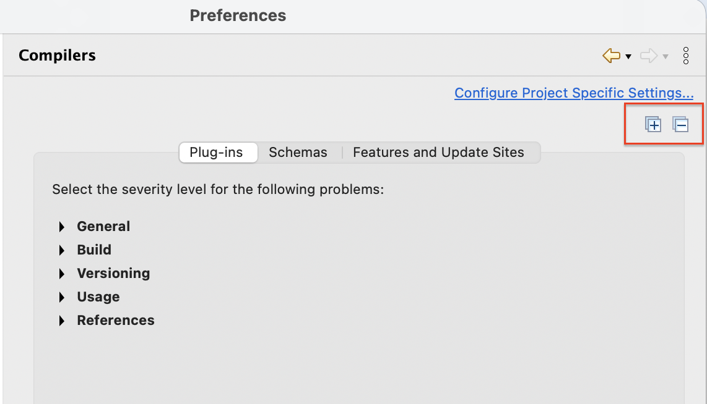
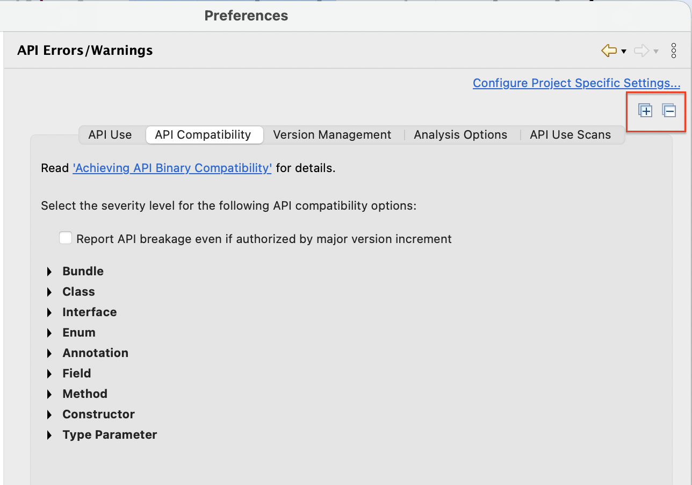

# Plug-in Development Environment - 4.40

A special thanks to everyone who [contributed to PDE](acknowledgements.md#plug-in-development-environment) in this release!

## Editors

### Copy Entries from the Target Editor Content Tab
<!-- https://github.com/eclipse-pde/eclipse.pde/pull/2302 -->
<details>
<summary>Contributors</summary>

- [Lars Vogel](https://github.com/vogella)
</details>

You can now copy entries from the `Content` tab of the `Target Editor`.
This mirrors the behavior already available on the `Locations` tab.
Copy is available from the context menu or via the platform copy keystroke.
That is `Ctrl+C` on Linux and Windows, and `Cmd+C` on macOS.
Multi-selection and expanded children are included in the copied text.
The copy action is wired through the workbench binding service.
Any user-remapped key binding for `Copy` is honored automatically.

<!--
## API Tools
-->

<!--
## PDE Compiler 
-->

## Performance

### Performance Improvements
<details>
<summary>Contributors</summary>

- [Lars Vogel](https://github.com/vogella)
</details>

This release includes several performance and reliability improvements:

- **Stable classpath order for plug-in dependencies:** The `Plug-in Dependencies` classpath container now uses a deterministic order when a target contains multiple bundles with the same symbolic name (for example two versions of `jakarta.annotation-api`), avoiding spurious **Updating plug-in dependencies** rebuilds at IDE startup.
- **Faster syntax highlighting in the target definition editor:** The presentation reconciler no longer scans content past the damaged region on every keystroke, so editing large `.target` files feels noticeably more responsive.
- **More reliable target resolution:** Resolve jobs are now serialized per target handle, preventing duplicate parallel resolves and the resulting `Cannot invoke ProfileLock.unlock()` errors when reloading the same target definition.

### Complete classpath for plug-in projects
<!-- https://github.com/eclipse-pde/eclipse.pde/pull/2253 -->
<details>
<summary>Contributors</summary>

- [Christoph Läubrich](https://github.com/laeubi)
</details>

PDE's `Plug-in Dependencies` classpath container previously included only direct dependencies.
This caused several long-standing problems:
- **Spurious compile errors** — `"The type X cannot be resolved. It is indirectly referenced from required type Y"` — appearing non-deterministically depending on which methods the code calls.
- **Broken "Remove unused dependencies" action** — removing a dependency that is unused at runtime but still required for compilation broke the build, leaving users confused about which entries to keep.
- **Inconsistencies with Tycho / Maven builds** — code compiled cleanly in the IDE but failed on CI, or vice versa, because Tycho has always used the full transitive classpath.
- **Incomplete type hierarchies** — code navigation, content assist, and call hierarchy views were silently missing types that the OSGi runtime would have available.

To fix these problems, PDE now also adds all transitive dependencies of a plug-in to its classpath container, but configures them to be inaccessible from within the project.
This makes the complete transitive hull of dependencies available for the Java compiler, fulfilling fundamental requirements of the Java type system.

Additionally, this aligns PDE's compilation model with Tycho and with what the OSGi runtime would actually have available.

#### Lean dependency tree

In setups with large dependency trees, the extended classpath may increase the initial build time, but we are continuously working on improving it.
The usual recommendation is to keep dependencies as small as possible:
- Use `Find unused dependencies` to remove manifest entries for plug-ins you no longer reference.
  This action now works reliably across the full transitive closure and has been validated against the Eclipse Platform codebase.
- Maintain a clear API/implementation separation in your plug-ins.
  API plug-ins used by many consumers should not carry heavy implementation dependencies; this limits the transitive fanout for all their consumers.
  Use `Show plug-in dependency hierarchy` and `Show dependent plug-ins and fragments` to understand the impact.
- If the extended classpath reveals _cyclic dependencies_, use `Look for cycles in the dependency graph` to trace the root cause.

#### Temporary workaround

To support the transition period, a system property is available:
```
-Dpde.addTransitiveDependenciesWithForbiddenAccess=false
```
Add this to your `eclipse.ini` to restore the previous (incomplete) classpath behavior for comparison and performance analysis.

**Important:** This property is intended solely as a temporary diagnostic aid and is planned to become a no-op in a future release without further notice.


## Views and Dialogs

### CSS Spy Widget Hierarchy Export
<!-- https://github.com/eclipse-pde/eclipse.pde/pull/2237 -->
<details>
<summary>Contributors</summary>

- [Lars Vogel](https://github.com/vogella)
</details>

You can now use the `Copy widget info to clipboard` button in the `CSS Spy` 
to export the selected widget's hierarchy with detailed CSS-relevant information.
The exported information includes the CSS selector notation, 
filtered SWT style bits, 
computed versus declared values, 
and the inheritance chain.

An example of the exported information:

```text
Widget Hierarchy
================

Tree#VariablesViewer
  SWT Style: SWT.MULTI SWT.H_SCROLL SWT.V_SCROLL SWT.FULL_SELECTION SWT.LEFT_TO_RIGHT SWT.VIRTUAL
  CSS Properties:
    background-color: #2f2f2f  /* declared: rgb(47, 47, 47) */
    background-image: none
    color: #aaaaaa  /* declared: rgb(170, 170, 170) */
    font-family: "Ubuntu Sans"  /* declared: #org-eclipse-debug-ui-VariableTextFont */
    font-size: 11
    font-style: normal
    font-weight: normal
    swt-lines-visible: true
    text-transform: none
    visibility: visible
  SWT background: rgb(47,47,47)
  Bounds: x=1124 y=196 w=385 h=413
```

### Show Installable Unit ID in Target Editor
<!-- https://github.com/eclipse-pde/eclipse.pde/pull/2208 -->
<details>
<summary>Contributors</summary>

- [Lars Vogel](https://github.com/vogella)
</details>

The `Target Editor` now always displays the technical ID of each Installable Unit (IU) 
in the `Definition` and `Content` tabs.
This ensures a clear mapping between the UI representation and the underlying source.
If a descriptive name exists and differs from the ID, 
both are shown in the format `Name [ID]`; 
otherwise, only the ID is displayed.


### Version Mapping for Required Bundles and Imported Packages
<details>
<summary>Contributors</summary>

- [Neha Burnwal ](https://github.com/nburnwal09)

</details>

A quick fix is provided for adding the available matching version range for required bundles and imported packages 
in the `MANIFEST.MF` file. 


The quick fix is labeled as `Require latest available version range`. 
Once the user clicks on `Finish`, it adds the version range to the specific require bundle or import package.
For example, version `7.2.3` is interpreted as the compatible range `[7.2.0,8.0.0)`.


### Expand-all and Collapse-all Support in Preference Pages
<details>
<summary>Contributors</summary>

- [Elsa Zacharia](https://github.com/elsazac)
</details>

A new toolbar to support expanding and collapsing all preference sections has been added to the `Compilers` and `API Errors/Warnings` pages under `Plug-in Development`.
These actions improve navigation on pages with many expandable categories by allowing all sections to be opened or closed in a single operation.



