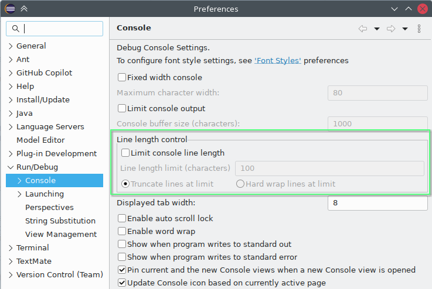
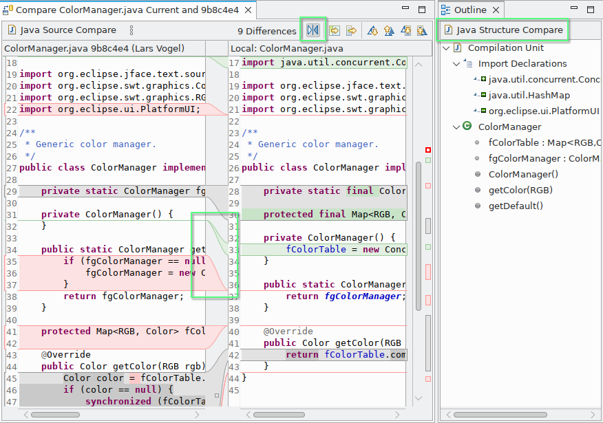
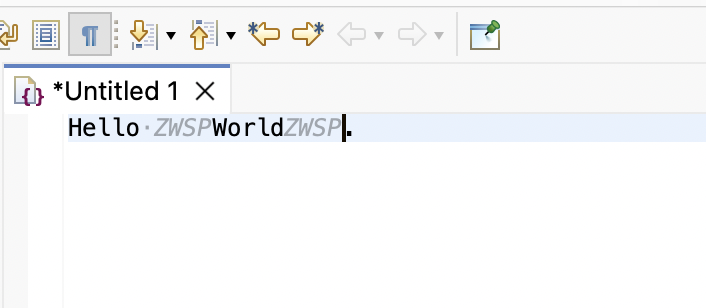
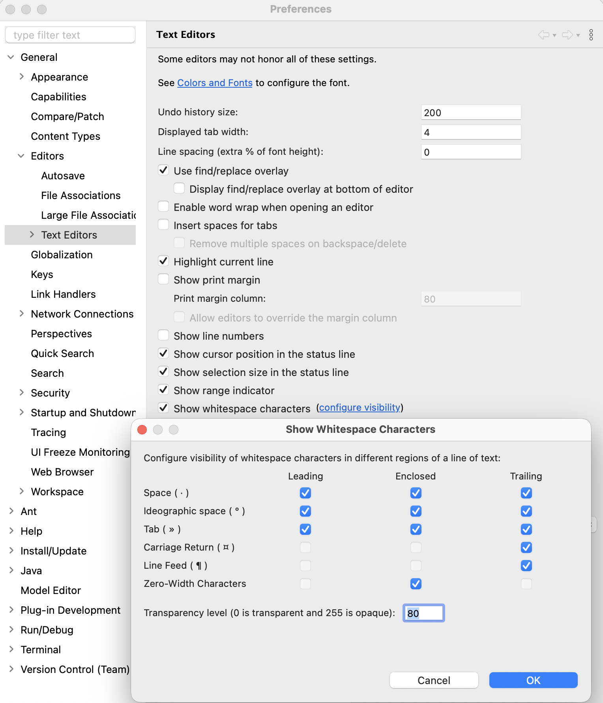
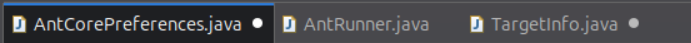
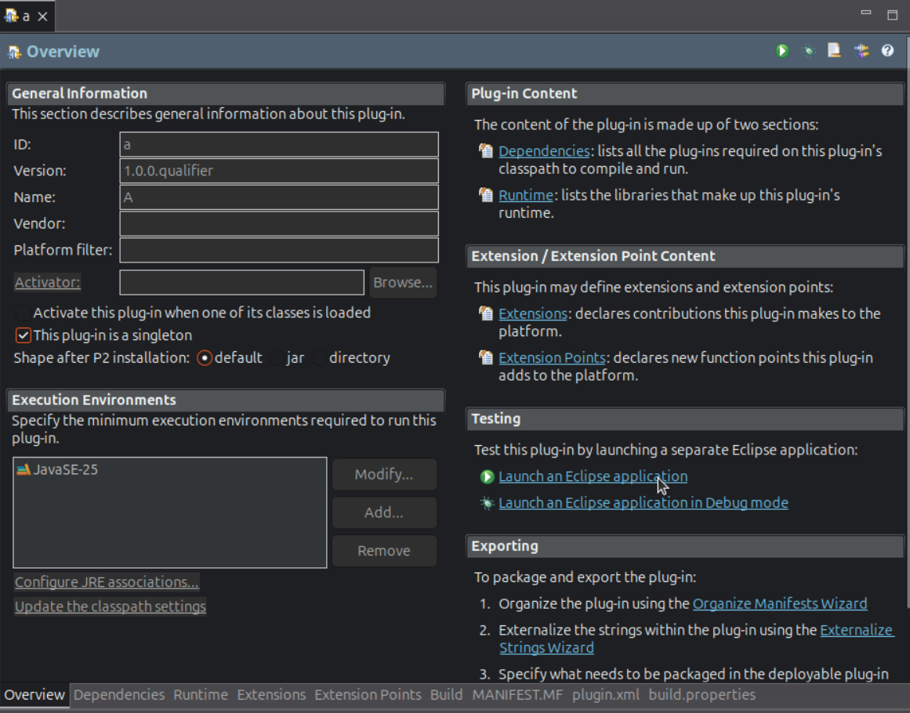
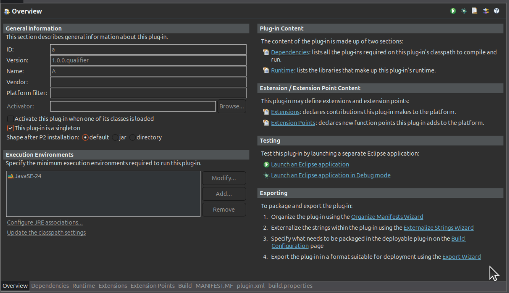
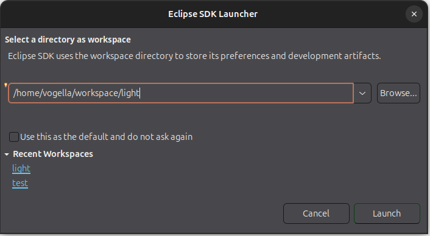

# Platform and Equinox - 4.40

A special thanks to everyone who [contributed to Eclipse-Platform](acknowledgements.md#eclipse-platform) or [contributed to Equinox](acknowledgements.md#equinox) in this release!

## Views, Dialogs and Toolbar

### Line length limit in the Console
<!-- https://github.com/eclipse-platform/eclipse.platform/pull/2494 -->

Contributors

- [Andreev Simeon](https://github.com/trancexpress)
- [Loskutov Andrey](https://github.com/iloveeclipse)

A new option has been added to `Console` view preferences that lets you control line length in the `Console`.

If a launched application produces extremely long lines, displaying them in the `Console` view can cause the entire Eclipse UI to freeze.
To prevent this, you can now enable the new line limit options for the `Console` view.

When enabled, the `Console` view enforces a strict physical maximum line length.
Lines that exceed the configured limit are either truncated or hard wrapped, depending on the selected option.

When truncation is applied, an ellipsis (...) is appended to indicate that the line has been shortened.
When wrapping is applied, the line is split into multiple lines to fit within the limit, ensuring that all content remains visible without freezing the UI.

This feature is disabled by default.

---
## Text Editors

### Improved Defaults in Compare editor
<!--
https://github.com/eclipse-platform/eclipse.platform/pull/2564
https://github.com/eclipse-platform/eclipse.platform/pull/2565
https://github.com/eclipse-platform/eclipse.platform/pull/2566
-->

Contributors

- [Loskutov Andrey](https://github.com/iloveeclipse)

The default settings of the Compare editor have been modernized to provide a more intuitive and efficient experience out of the box:

* **Structural compare shown in Outline by default** – the Outline view now shows structural differences automatically when available, making better use of available space and improving navigation.
* **Improved visualization of changes** – line ranges are now used by default to connect differences, making change flows easier to follow visually.
* **Natural diff order** – the compare panes now follow the commonly used convention with the original/base content on the left and the modified content on the right.

These changes align Eclipse with common expectations from modern development tools and reduce the need for manual preference adjustments.

The individual options can be found on the `Preferences > General > Compare/Patch > Compare editor` page:

* `General > Show structural compare in the Outline view when possible`
* `Text Compare > Connect ranges with single line`
* `Text Compare > Swap left and right` (the toggle is also available in the compare editor toolbar)

With these settings changed, the Compare editor now looks like below (changes are highlighted with green boxes):

### Show Zero-Width Spaces and Characters (ZWSP)
<!-- https://github.com/eclipse-platform/eclipse.platform.ui/pull/1437 -->

Contributors

- [Marcus Höpfner](https://github.com/marcushoepfner)

Zero-width spaces and characters (ZWSP) are invisible characters that can be used for various purposes, such as formatting.
They can, for example, appear in content copied from another application.

These spaces and characters are now visually indicated in text editors by a code mining label, `ZWSP`.

The visibility of zero-width spaces and characters can be toggled via the new `Zero-Width Characters` option in `Text Editors` `Show whitespace characters` preferences.

This option is enabled by default in the whitespace character settings, while `Show whitespace characters` is disabled by default.

<!--
---
## Preferences
-->

---
## Themes and Styling

### New Dirty Indicator for View and Editor Tabs
<!-- https://github.com/eclipse-platform/eclipse.platform.ui/pull/2568 -->

Contributors

- [Michael Schneider](https://github.com/schneidermic0)
- [Lars Vogel](https://github.com/vogella)

A new bullet-style dirty indicator is available that overlays the tab's close button when a view or editor has unsaved changes,
replacing the leading asterisk (`*`) in the tab title.
You can enable it via `Indicate unsaved changes by overlaying the close button` in `Preferences > General > Appearance`,
under `Dirty indicator for view and editor tabs`.
The setting takes effect immediately for all open stacks.

### Updated Dark Theme Styling for Form-based UIs
<!-- https://github.com/eclipse-platform/eclipse.platform.ui/pull/3949 -->

Contributors

- [Lars Vogel](https://github.com/vogella)

The dark theme styling for form-based editors (such as the `Plug-in Manifest Editor` and the `Target Definition Editor`) now matches the regular view styling.

Before:

After:

### Removed Rounded Tabs Support
<!-- https://github.com/eclipse-platform/eclipse.platform.ui/pull/3822 -->

Contributors

- [Lars Vogel](https://github.com/vogella)

Eclipse now only supports square tabs in `CTabRendering`.
The `Use round tabs` checkbox in the `General > Appearance` preference page and the `swt-corner-radius` CSS property are no longer available.
All tabs now have square corners.

### Removed Classic Theme

Contributors

- [Lars Vogel](https://github.com/vogella)

The `Classic` theme (`org.eclipse.e4.ui.css.theme.e4_classic`) has been removed.
Users who previously had the `Classic` theme selected will be automatically migrated to the `Light` theme upon the next startup.

### Manage Default Theme

Contributors

- [Lars Vogel](https://github.com/vogella)

A new `Manage default...` button has been added to the `General > Appearance` preference page, next to the theme selection.

This allows you to set the currently selected theme as the default for new workspaces or workspaces that do not have an explicit theme configured.

When switching themes, you also have the option to set the new theme as the default directly from the restart confirmation dialog.

The default theme preference is product-scoped, allowing different Eclipse-based products to maintain their own independent defaults even when sharing the same user configuration.
The workspace selection dialog will use the default theme as well.

---
## General Updates

### Skip Dot-folders When Scanning for Projects to Import

Contributors

- [Lars Vogel](https://github.com/vogella)

You can now skip directories starting with a `.` (e.g., `.git`, `.svn`, `.hg`) during recursive project scanning in the `Smart Import` and `Import Existing Projects` wizards.
This significantly improves import performance for repositories with large metadata folders.
A new `Skip folders starting with '.'` checkbox is available in both wizards and is enabled by default.

### Global Search Navigation Shortcuts

Contributors

- [Aung Nanda Oo](https://github.com/NikkiAung)
- [Shubham Waldiya](https://github.com/ShuWald)

The current search navigation commands `Ctrl+,` and `Ctrl+.` allow for navigation to the previous or next search result, respectively.
However, one limitation is that these shortcuts only work when the search view is in focus.
This feature implements global search navigation commands `Alt+,` and `Alt+.` (`Cmd+Opt+,` and `Cmd+Opt+.` on macOS) to navigate to previous/next search results even when search view is out of focus, allowing for easier and more intuitive navigation.

The GIF demonstrates navigation using the new commands despite the user switching out of the Search view.

## Debugger

### Paste Multiple Expressions from Clipboard in Expressions View

Contributors

- [Sougandh S](https://github.com/SougandhS)

The `Expressions View` now improves pasting behavior when clipboard content contains line separators (such as `\n` etc).
In such cases, a dialog prompts you to choose whether to treat the content as a single expression or split it into multiple expressions, one per line.

This also makes it easier to copy multiple expressions (for example, from the `Expressions View`) and paste them as separate expressions in another `Eclipse` instance, simplifying sharing and migration.
The selected behavior can be saved as a preference and changed later in the `Run/Debug `settings.

A context menu entry for `Expression Paste` has also been added, improving discoverability.

### Refined Copy Actions in Variables and Expressions Views

Contributors

- [Sougandh S](https://github.com/SougandhS)

Copy behavior in the `Variables` view and `Expressions` view has been refined to provide more predictable and controlled results.
Previously, copying would include the entire row (such as `Name`, `Value`, and `Types`), which could lead to unintended clipboard content.

Dedicated actions are now available to copy only the `Variable` name and `Expression` text, or the full row when needed.

This makes it easier to copy exactly what is required and ensures that variable names and expressions can be reused directly without unintended content
