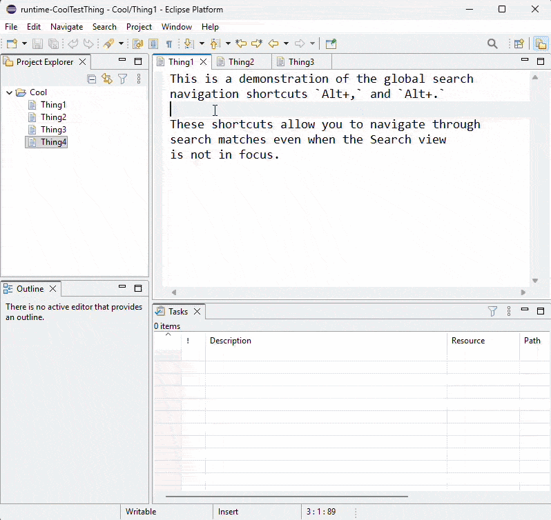

# Platform and Equinox - 4.40 

A special thanks to everyone who [contributed to Eclipse-Platform](acknowledgements.md#eclipse-platform) or [contributed to Equinox](acknowledgements.md#equinox) in this release!

<!--
---
## Views, Dialogs and Toolbar
-->

<!--
---
## Text Editors
-->

<!--
---
## Preferences
-->

---
## Themes and Styling

### Removed Rounded Tabs Support
<!-- https://github.com/eclipse-platform/eclipse.platform.ui/pull/3822 -->

Contributors

- [Lars Vogel](https://github.com/vogella)

Eclipse now only supports square tabs in `CTabRendering`.
The `Use round tabs` checkbox in the `General > Appearance` preference page and the `swt-corner-radius` CSS property are no longer available.
All tabs now have square corners.

---
## General Updates

### Global Search Navigation Shortcuts

Contributors

- [Aung Nanda Oo](https://github.com/NikkiAung)
- [Shubham Waldiya](https://github.com/ShuWald)

The current search navigation commands `Ctrl+,` and `Ctrl+.` allow for navigation to the previous or next search result, respectively. 
However, one limitation is that these shortcuts only work when the search view is in focus.
This feature implements global search navigation commands `Alt+,` and `Alt+.` (`Cmd+Opt+,` and `Cmd+Opt+.` on macOS) to navigate to previous/next search results even when search view is out of focus, allowing for easier and more intuitive navigation.

The GIF demonstrates navigation using the new commands despite the user switching out of the Search view.
