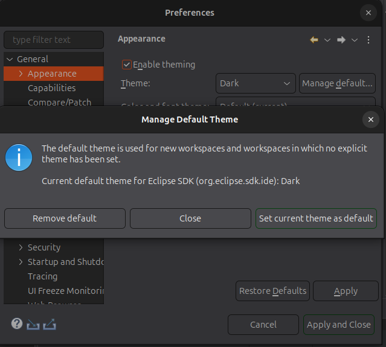
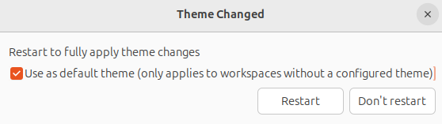
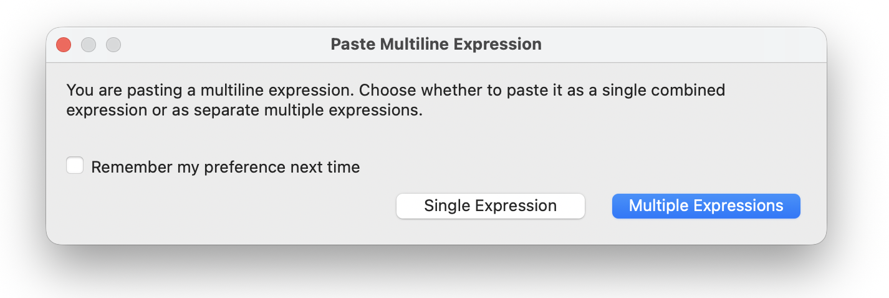
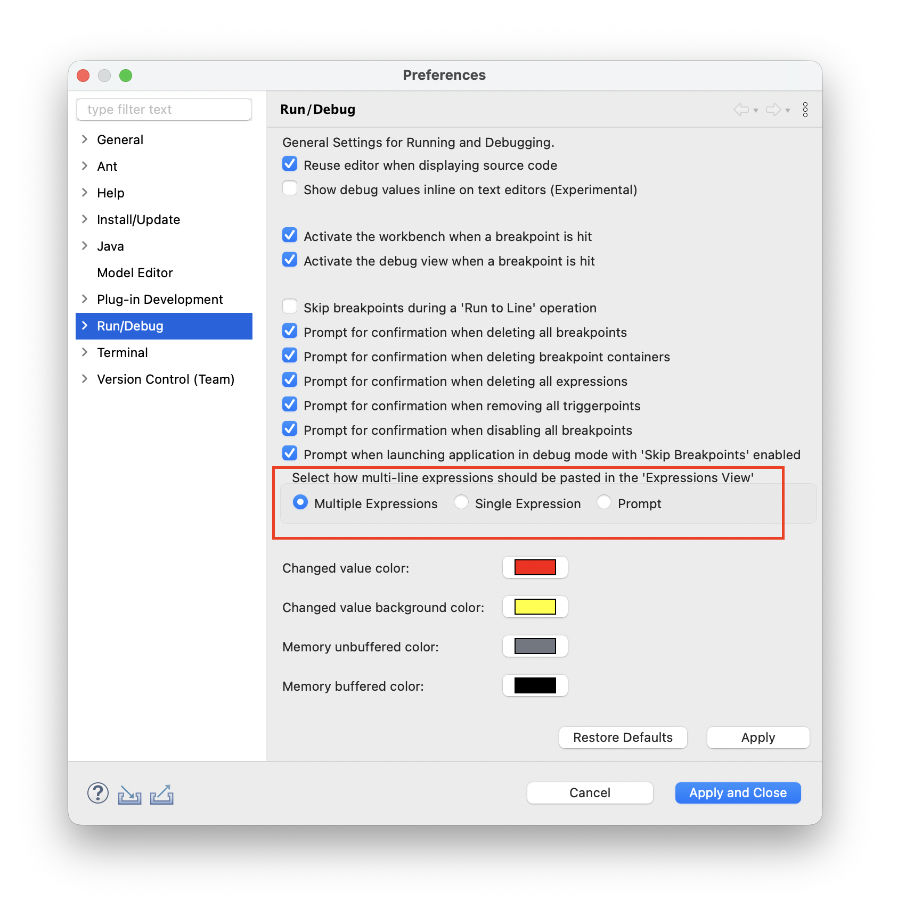
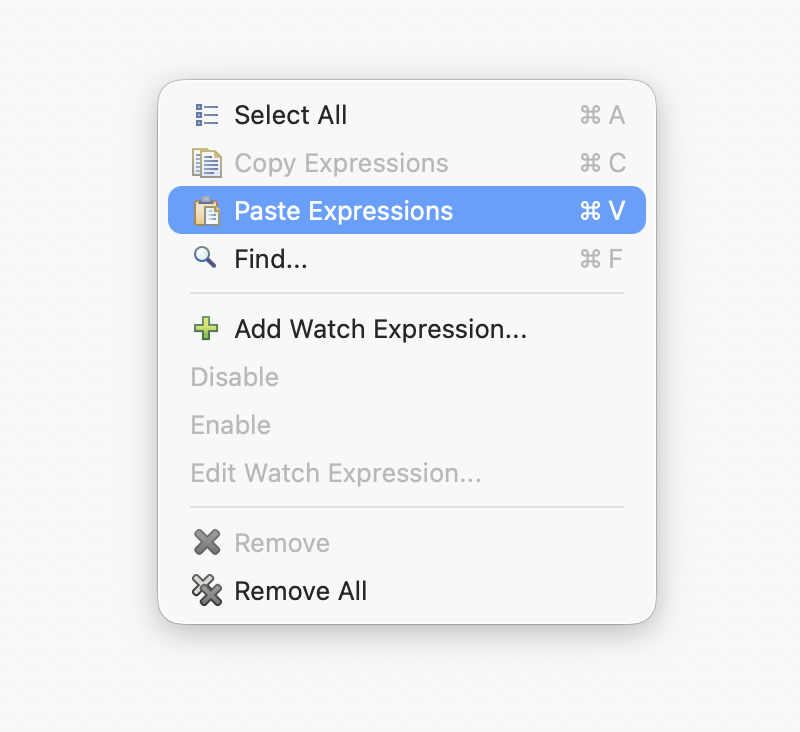
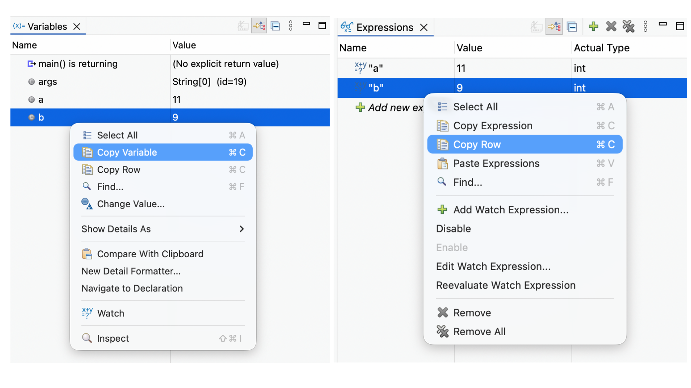

# Platform and Equinox - 4.40 

A special thanks to everyone who [contributed to Eclipse-Platform](acknowledgements.md#eclipse-platform) or [contributed to Equinox](acknowledgements.md#equinox) in this release!

<!--
---
## Views, Dialogs and Toolbar
-->

<!--
---
## Text Editors
-->

<!--
---
## Preferences
-->

---
## Themes and Styling

### Removed Rounded Tabs Support
<!-- https://github.com/eclipse-platform/eclipse.platform.ui/pull/3822 -->

Contributors

- [Lars Vogel](https://github.com/vogella)

Eclipse now only supports square tabs in `CTabRendering`.
The `Use round tabs` checkbox in the `General > Appearance` preference page and the `swt-corner-radius` CSS property are no longer available.
All tabs now have square corners.

### Removed Classic Theme

Contributors

- [Lars Vogel](https://github.com/vogella)

The `Classic` theme (`org.eclipse.e4.ui.css.theme.e4_classic`) has been removed.
Users who previously had the `Classic` theme selected will be automatically migrated to the `Light` theme upon the next startup.

### Manage Default Theme

Contributors

- [Lars Vogel](https://github.com/vogella)

A new `Manage default...` button has been added to the `General > Appearance` preference page, next to the theme selection.

This allows you to set the currently selected theme as the default for new workspaces or workspaces that do not have an explicit theme configured.

When switching themes, you also have the option to set the new theme as the default directly from the restart confirmation dialog.

The default theme preference is product-scoped, allowing different Eclipse-based products to maintain their own independent defaults even when sharing the same user configuration.

---
## General Updates

### Skip Dot-folders When Scanning for Projects to Import

Contributors

- [Lars Vogel](https://github.com/vogella)

You can now skip directories starting with a `.` (e.g., `.git`, `.svn`, `.hg`) during recursive project scanning in the `Smart Import` and `Import Existing Projects` wizards.
This significantly improves import performance for repositories with large metadata folders.
A new `Skip folders starting with '.'` checkbox is available in both wizards and is enabled by default.

### Global Search Navigation Shortcuts

Contributors

- [Aung Nanda Oo](https://github.com/NikkiAung)
- [Shubham Waldiya](https://github.com/ShuWald)

The current search navigation commands `Ctrl+,` and `Ctrl+.` allow for navigation to the previous or next search result, respectively. 
However, one limitation is that these shortcuts only work when the search view is in focus.
This feature implements global search navigation commands `Alt+,` and `Alt+.` (`Cmd+Opt+,` and `Cmd+Opt+.` on macOS) to navigate to previous/next search results even when search view is out of focus, allowing for easier and more intuitive navigation.

The GIF demonstrates navigation using the new commands despite the user switching out of the Search view.

## Debugger

### Paste Multiple Expressions from Clipboard in Expressions View

Contributors

- [Sougandh S](https://github.com/SougandhS)

The `Expressions View` now improves pasting behavior when clipboard content contains line separators (such as `\n` etc). 
In such cases, a dialog prompts you to choose whether to treat the content as a single expression or split it into multiple expressions, one per line.

This also makes it easier to copy multiple expressions (for example, from the `Expressions View`) and paste them as separate expressions in another `Eclipse` instance, simplifying sharing and migration. 
The selected behavior can be saved as a preference and changed later in the `Run/Debug `settings. 

A context menu entry for `Expression Paste` has also been added, improving discoverability.

### Refined Copy Actions in Variables and Expressions Views

Contributors

- [Sougandh S](https://github.com/SougandhS)

Copy behavior in the `Variables` view and `Expressions` view has been refined to provide more predictable and controlled results. 
Previously, copying would include the entire row (such as `Name`, `Value`, and `Types`), which could lead to unintended clipboard content.

Dedicated actions are now available to copy only the `Variable` name and `Expression` text, or the full row when needed.

This makes it easier to copy exactly what is required and ensures that variable names and expressions can be reused directly without unintended content
