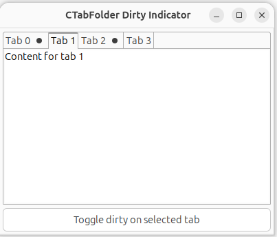
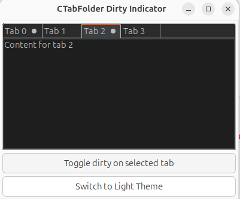
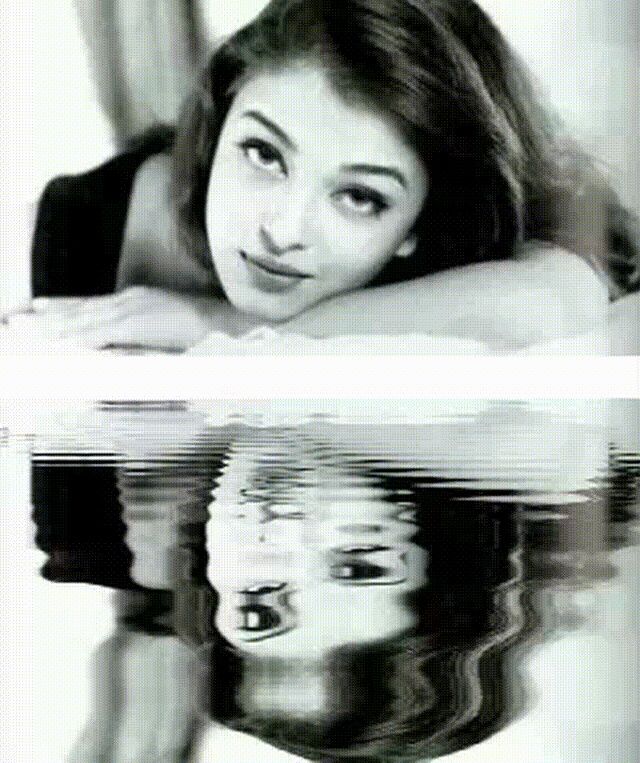
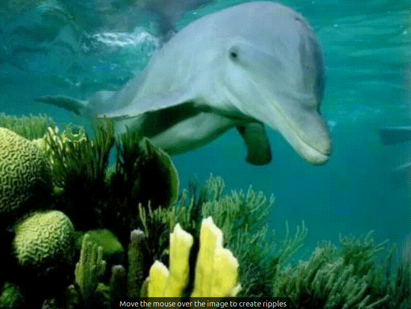
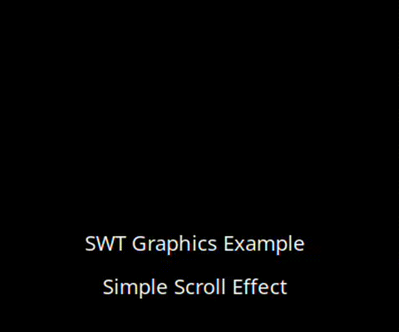

# Platform and Equinox API - 4.40

A special thanks to everyone who [contributed to Eclipse-Platform](acknowledgements.md#eclipse-platform) or [contributed to Equinox](acknowledgements.md#equinox) in this release!

<!--
---
## Platform Changes
-->

---
## SWT Changes

### Bullet-style Dirty Indicator for CTabFolder Tabs
<!-- https://github.com/eclipse-platform/eclipse.platform.swt/pull/3141 -->

Contributors

- [Michael Schneider](https://github.com/schneidermic0)
- [Lars Vogel](https://github.com/vogella)

`CTabFolder` now supports an opt-in dirty indicator that shows a filled bullet dot (●) at the close button location for tabs with unsaved changes.
This is intended as an alternative to the `*` prefix dirty indicator currently used by the IDE.
On hover, the bullet transforms into the close button, matching VS Code behavior.

New API:
- `CTabFolder.setDirtyIndicatorStyle(boolean)` — enables/disables the bullet-on-close-button style
- `CTabFolder.getDirtyIndicatorStyle()` — returns whether the dirty indicator style is enabled
- `CTabItem.setShowDirty(boolean)` — marks an item as having unsaved changes
- `CTabItem.getShowDirty()` — returns whether the item is marked as dirty

The feature is disabled by default to preserve backward compatibility.

### New Animated Effects in SWT GraphicsExample
<!-- https://github.com/eclipse-platform/eclipse.platform.swt/issues/3189 -->

Contributors

- [Laurent Caron](https://github.com/lcaron)
- [Lars Vogel](https://github.com/vogella)

The SWT `GraphicsExample` snippet has been extended
with a large collection of animated demo tabs in the new `Misc` category.
These effects were migrated from the SWT-OldSchoolEffect project
with permission from the original author, [Laurent Caron](https://github.com/lcaron),
and serve as useful tests and demonstrations
for SWT's `Canvas`, `GC`, and `Image` rendering.

Newly available effects include the following:
- Starfield
- Ripple
- Blob
- Burning Sea
- Copper Bars
- Explosion
- Fire
- Mandelbrot
- Moiré
- Plasma
- Raster Bars
- Shade Bobs
- Twister
- Wave
- Dancing
- Bump Mapping
- Flat Text
- Lens
- Block Effect
- Twirl
- Sine Wave
- Sky
- Unlimited Balls
- Warp

### Consistent Scaling of Images across GC#drawImage() Methods
<!-- https://github.com/eclipse-platform/eclipse.platform.swt/pull/3201 -->
<!-- https://github.com/eclipse-platform/eclipse.platform.swt/pull/3246 -->

Contributors

- [Patrick Ziegler](https://github.com/ptziegler)
- [Heiko Klare](https://github.com/HeikoKlare)

Over the last few releases,
image scaling in `GC#drawImage()` has been progressively improved
to always pick the best-available image source for the required scale.
This includes high-resolution raster variants (e.g., `@2x`) and on-demand SVG rasterization.

This release completes that work:

- All `GC#drawImage()` overloads now apply high-quality scaling
  consistently across all platforms.
- Any `Transform` active on the `GC` is now taken into account
  when choosing the image source and scaling method,
  preventing blurry output when a non-identity transform is in use.

You get sharper image rendering in custom-drawn widgets
on HiDPI displays or when using zoom features,
regardless of which `drawImage()` variant or platform is used.

