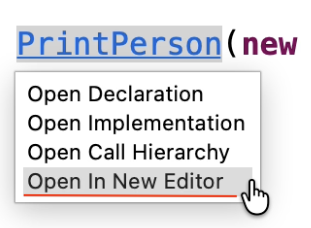
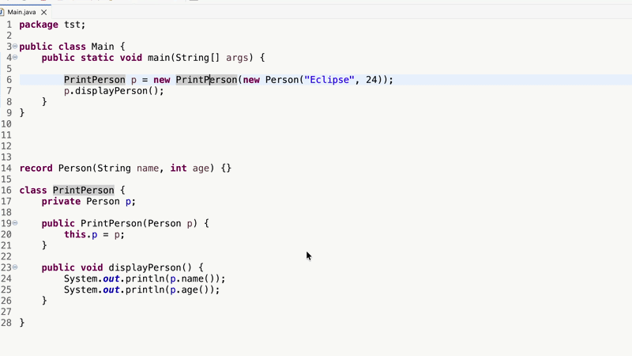
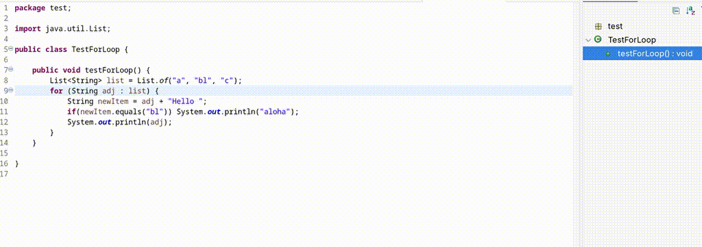
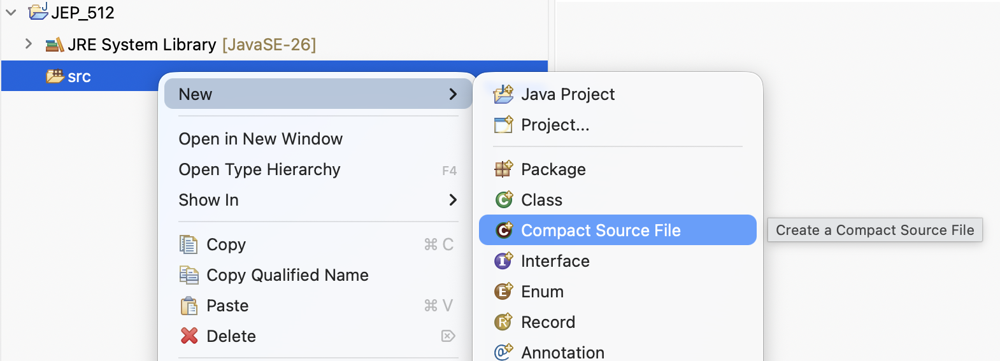
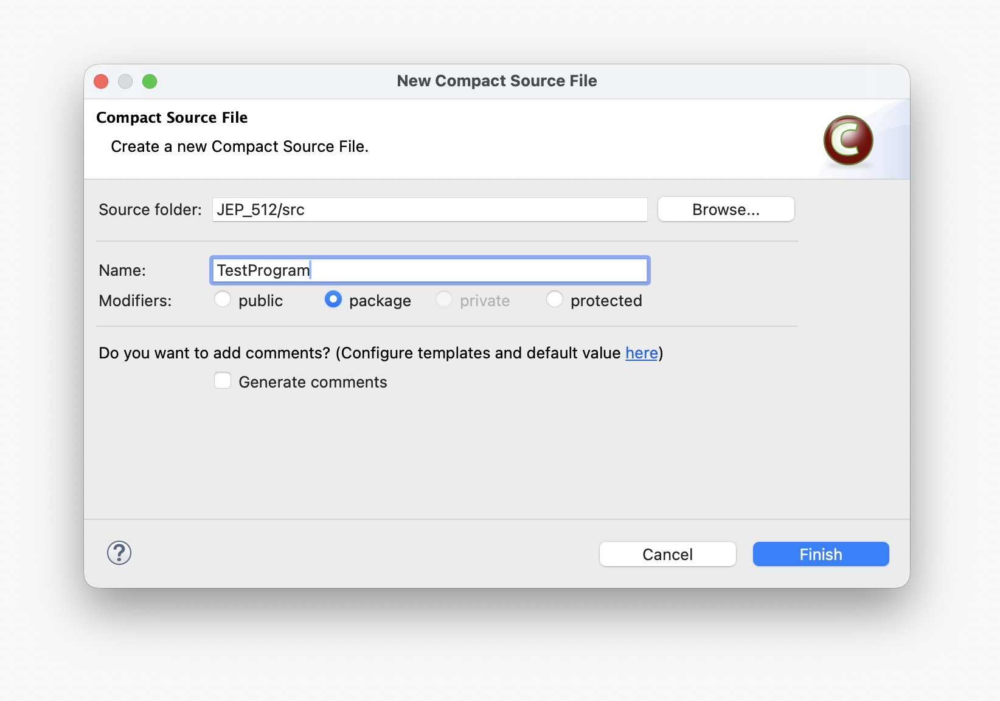
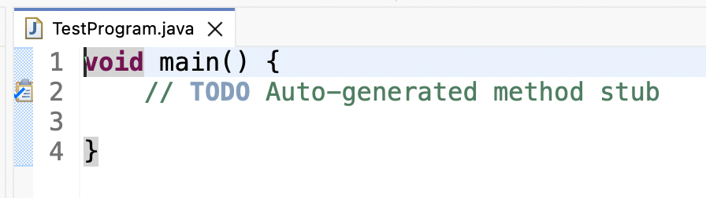

# Java Development Tools - 4.41

A special thanks to everyone who [contributed to JDT](acknowledgements.md#java-development-tools) in this release!

<!--
---
## Java&trade; XX Support 
-->

<!--
---
## JUnit
-->


## Java Editor

### Open Types and Methods in a New Editor from Hyperlinks

<details>
<summary>Contributors</summary>

- [Sougandh S](https://github.com/SougandhS)
</details>

The Java editor now provides an `Open in New Editor` option in the hyperlink popup for types and methods.



When navigating to a declaration, implementation, or method within the same editor, users can now choose to open the target in a separate editor tab directly from the hyperlink menu. 



This makes it easier to inspect implementations, compare code, and work with multiple locations in parallel without losing your current position.

### Enhanced For-loop to ForEach Quick Assist

<details>
<summary>Contributors</summary>

- [Ivan Gualandri](https://github.com/inuyasha82)
- [Carsten Hammer](https://github.com/carstenartur)
</details>

With this new quick assist, on an enhanced for-loop such as the following:

```java
for (String adj : list) {
    System.out.println(adj);
}
```

if the list item is an `Iterable` object, a new option is available: `Convert Enhanced 'for' loop to 'forEach'`. 
This converts the loop above, with a `forEach` statement:

```java
list.forEach(adj -> {
    System.out.println(adj);
});
```
Below is an animation of the new quick assist:




## Java Views and Dialogs

### [JEP 512] Create Compact Source Files from the New Java Wizard

<details>
<summary>Contributors</summary>

- [Sougandh S](https://github.com/SougandhS)
</details>

The Java wizard now provides a compact source file template for creating compact source files introduced in Java 25 (__[JEP 512](https://openjdk.org/jeps/512)__).



The wizard generates an implicit class source file with a top-level `void main()` method, making it easy to get started with compact programs without manually creating the required structure.



Compact source files are always created in the __default package__ and are available for __Java 25__ (or later) projects.



__Note__: If the `Compact Source File` option is not available in the Java wizard, try resetting the current perspective (`Window > Perspective > Reset Perspective`) to refresh the wizard contributions.

<!--
---
## Java Compiler
-->

<!--
---
## Java Formatter
-->

<!--
---
## Debug
-->

<!--
### JDT Developers
--> 
