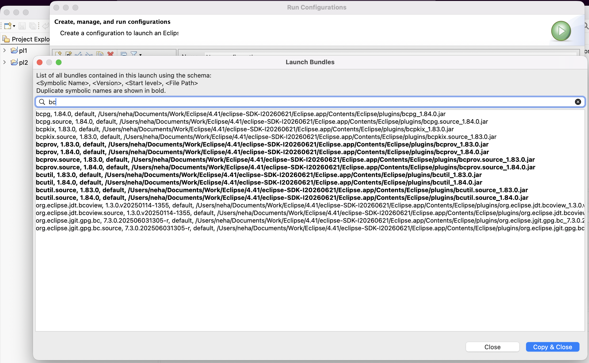
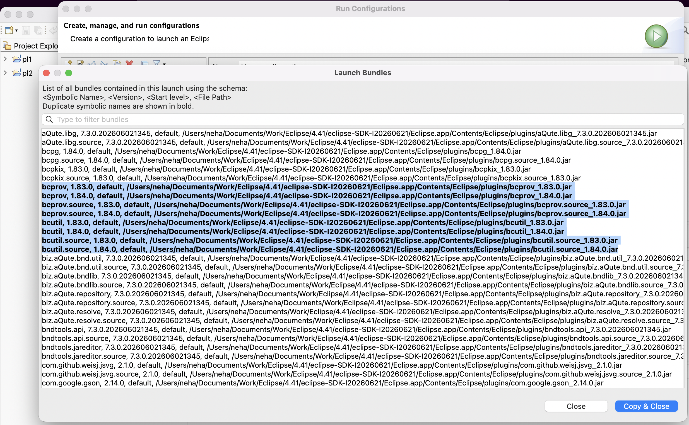
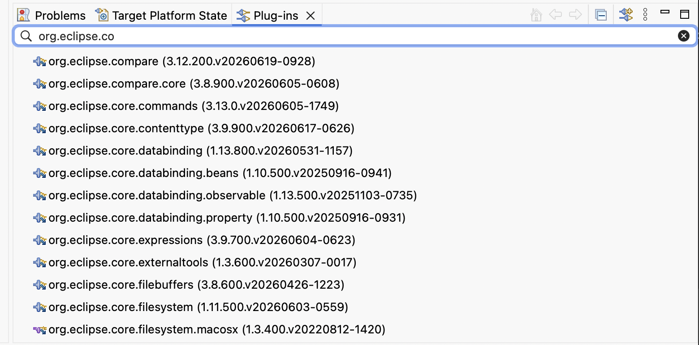

# Plug-in Development Environment - 4.41

A special thanks to everyone who [contributed to PDE](acknowledgements.md#plug-in-development-environment) in this release!

<!--
## Editors
-->

<!--
## API Tools
-->

<!--
---
## PDE Compiler 
-->

## Editors

### Empty Package Removed from Manifest
<!-- https://github.com/eclipse-pde/eclipse.pde/pull/2136 -->
<!-- https://github.com/eclipse-pde/eclipse.pde/pull/2292 -->

Contributors

- [Neha Burnwal ](https://github.com/nburnwal09)

When a class is moved and the source package becomes empty, or when all classes in a package are deleted, the package is now automatically removed from the `Export-Package` header in `MANIFEST.MF` if it was previously exported.
This prevents the manifest from listing packages that no longer contain any resources and ensures that empty packages are cleaned up automatically.

## Views and Dialogs

### Enable OSGi Console Option in Launch Configurations
<!-- https://github.com/eclipse-pde/eclipse.pde/pull/2274 -->

Contributors

- [Elsa Zacharia](https://github.com/elsazac)

The launch configurations dialog now provides a new `Enable OSGi Console` option.
When selected, the required `-console` argument is added automatically to the program arguments.
This removes the need to manually edit program arguments and helps preserve the setting when launch configurations are recreated.

### Enhancements to Show Launch Bundles Dialog
<!-- https://github.com/eclipse-pde/eclipse.pde/pull/2395 -->
<!-- https://github.com/eclipse-pde/eclipse.pde/issues/2371 -->

Contributors

- [Neha Burnwal](https://github.com/nburnwal09)

The **Show Launch Bundles** dialog in the Eclipse launch configuration has been improved with three enhancements:

- Bundles are now sorted **alphabetically**, making it easier to navigate the list.
- A **search box** has been added to quickly filter bundles by name.
- Bundles that share the same symbolic name are now **highlighted**, making duplicates easier to identify.

### Find Support Added in Plug-ins View
<!-- https://github.com/eclipse-pde/eclipse.pde/pull/2343 -->

Contributors

- [Neha Burnwal ](https://github.com/nburnwal09)

The `Plug-ins` view now includes a search box that allows you to filter plug-ins by name.
You can type directly into the search box or use `Ctrl+F` (or `Cmd+F` on macOS) to focus it.
This makes it easier to locate specific plug-ins in large workspaces.

