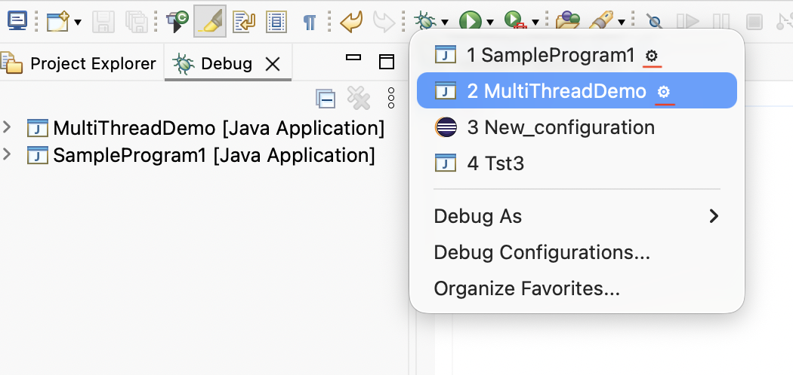
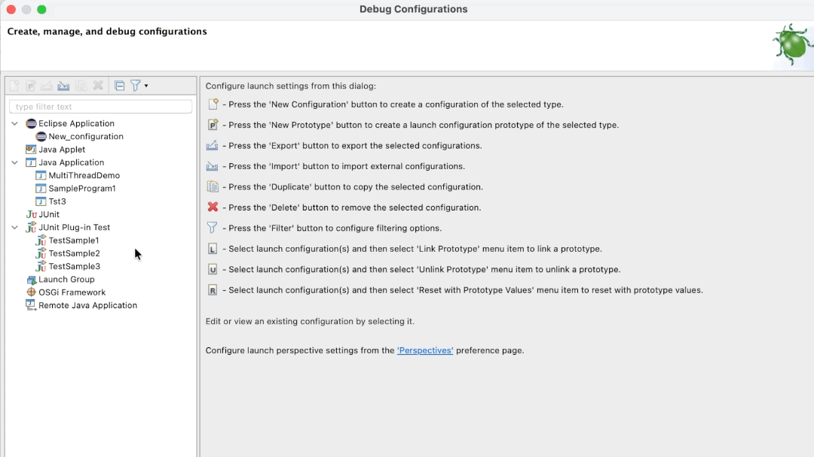
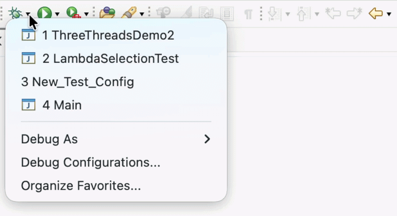

# Platform and Equinox - 4.41 

A special thanks to everyone who [contributed to Eclipse-Platform](acknowledgements.md#eclipse-platform) or [contributed to Equinox](acknowledgements.md#equinox) in this release!

<!--
---
## Views, Dialogs and Toolbar
-->

<!--
---
## Text Editors
-->

<!--
---
## Preferences
-->

<!--
---
## Themes and Styling
-->

<!--
---
## Views, Dialogs and Toolbar
-->

---
## General Updates

### Active Launch Indicators in Run and Debug History

Contributors

- [Sougandh S](https://github.com/SougandhS)

The `Run History` and `Debug History` menus now provide a visual indication of active launches.
When an entry has one or more non-terminated launches associated with it, a gear icon (⚙) is displayed next to the entry.
This makes it easier to identify configurations that are already running and helps avoid unintentionally launching the same configuration again.

### Quick Group Launch from Selected Configurations

Contributors

- [Sougandh S](https://github.com/SougandhS)

The `Launch Configurations Dialog` now provides a `Quick Group Launch` action for selected launch configurations.
Previously, creating a launch group required creating a new `Launch Group` configuration and manually adding each launch configuration as a group member. 
With this enhancement, Eclipse can create a launch group directly from the selected configurations, automatically adding them as group members.
This provides a faster way to launch multiple configurations together while still allowing the generated `Launch Group` to be customized later if needed.

### Single Sign-On Enabled by Default for Edge/WebView2 Browser

Contributors

- [Heiko Klare](https://github.com/HeikoKlare)
- [Sebastian Ratz](https://github.com/sratz)

The SWT `Edge`/`WebView2` browser integration now enables Single Sign-On (SSO) with Azure Active Directory (AAD) resources by default,
using the logged-in Windows account.
This also enables SSO with websites using Microsoft accounts associated with the Windows login,
aligning with the previous behavior of the Internet Explorer engine.
To opt out, set the system property `org.eclipse.swt.browser.EdgeAllowSingleSignOnUsingOSPrimaryAccount` to `false`.

### Last Execution Time in Launch History

Contributors

- [Sougandh S](https://github.com/SougandhS)

The launch history menus now display the relative termination time of previously launched configurations in their tooltips.

Instead of showing only the configuration name, the tooltip now provides additional context such as __*Last executed a moment ago*__, __*Last executed 5 mins ago*__, or __*Last executed 1 hour ago*__. 
This makes it easier to identify recently used configurations and quickly relaunch the desired one.

The additional context is particularly useful when `favorite configurations` are pinned to the top of the history menus, where the displayed order may not reflect recent usage.

