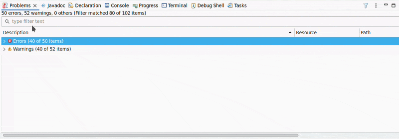
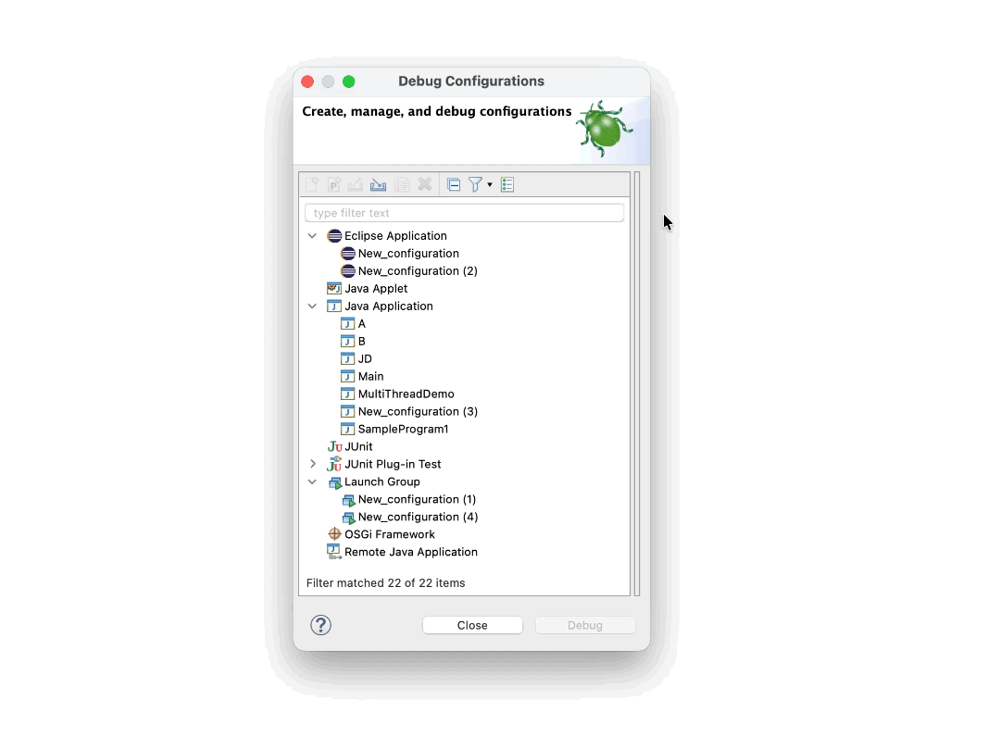
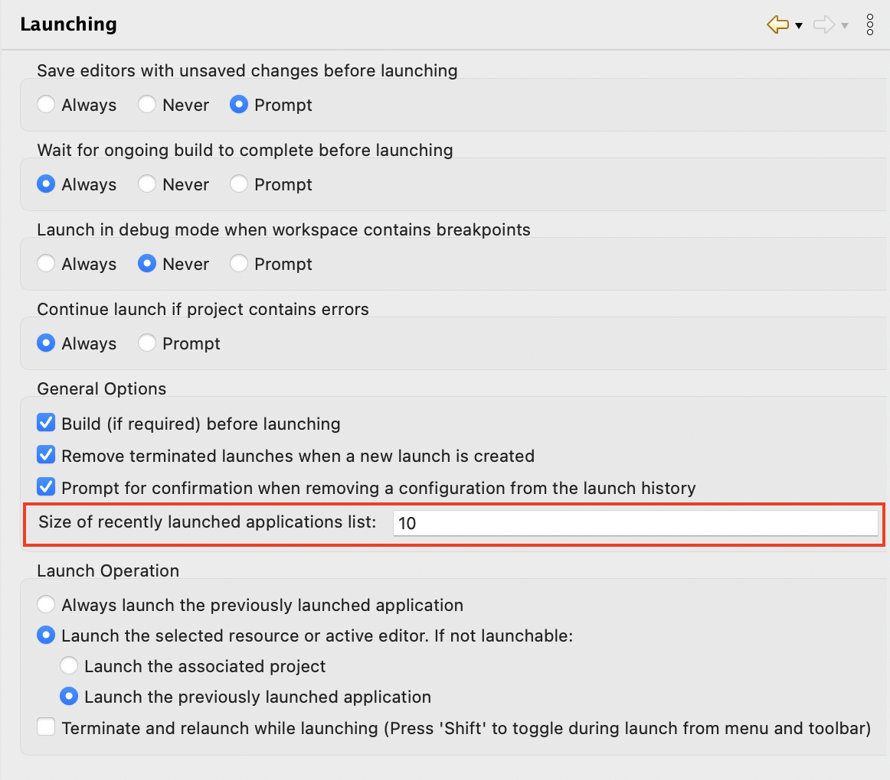

# Platform and Equinox - 4.41

A special thanks to everyone who [contributed to Eclipse-Platform](acknowledgements.md#eclipse-platform) or [contributed to Equinox](acknowledgements.md#equinox) in this release!

## Views, Dialogs and Toolbar

### Zoom In and Out in the Console View

Contributors

- [Raghunandana M](https://github.com/raghucssit)
- [Loskutov Andrey](https://github.com/iloveeclipse)

The `Console` view now supports zooming the font of the console currently shown.

Use `Ctrl++` / `Ctrl+-` (`Cmd++` / `Cmd+-` on macOS) while the `Console` view is focused to increase or decrease the font size.
The corresponding `Zoom In Console Font` and `Zoom Out Console Font` commands can also be bound to other keys in `Preferences > General > Keys`.

The zoom level is tracked per console type, so, for example, zooming a `Process Console` does not affect the `Java Stack Trace Console` or other console types, and it is applied to consoles of the same type that are opened later.
The chosen zoom level is remembered across restarts, and changing the console font in the preferences resets the zoom to that new font size.

### Text Filter for Problems, Tasks, Bookmarks and Markers Views

Contributors

- [Raghunandana M](https://github.com/raghucssit)
- [Loskutov Andrey](https://github.com/iloveeclipse)

The `Problems`, `Tasks`, `Bookmarks`, and `Markers` views now provide a search box that lets you quickly narrow down the shown markers by typing a pattern.
The search box matches against the values shown in all visible columns, e.g., the description, resource, path, and location, so markers can be found without having to know in advance which column they will match.

The visibility of the search box can be toggled on and off using the `Show Text Filter` entry in the view menu, and its state is remembered per view instance.
Whether the search box is shown by default for views that have not been customized yet can be configured via the new `Initially show text filter in marker views` preference in `Preferences > General`.

### Reorder Terminal Tabs by Drag and Drop
<!-- https://github.com/eclipse-platform/eclipse.platform/pull/2681 -->

Contributors

- [Lars Vogel](https://github.com/vogella)

Dragging a tab inside the `Terminal` view now moves it to the drop position,
matching the drag-to-reorder behavior you already know from editor and view tabs.
The running terminal stays attached while it is moved.

---
## Text Editors

### Customizable Key Bindings for the Find/Replace Overlay
<!-- https://github.com/eclipse-platform/eclipse.platform.ui/issues/2015 -->

Contributors

- [Heiko Klare](https://github.com/HeikoKlare)

You can now customize the keyboard shortcuts of the find/replace overlay,
which is shown on top of the editor when pressing `Ctrl+F`.
All its operations, such as searching for the next match or toggling the `Regular Expression` option,
are listed in `Preferences > General > Keys` when filtering for `Find and Replace`,
so that you can rebind them just like the shortcuts of any other operation.
The default key bindings are unchanged.

To achieve this, the operations of the overlay are now realized as ordinary Eclipse commands,
which are provided to the key binding framework while the overlay is focused,
instead of the overlay processing key strokes on its own.

### Content Assist for Regular Expressions in the Find/Replace Overlay Available in All Editors
<!-- https://github.com/eclipse-platform/eclipse.platform.ui/issues/2651 -->

Contributors

- [Heiko Klare](https://github.com/HeikoKlare)

Whenever the `Regular Expression` option of the find/replace overlay is enabled,
you can press `Ctrl+Space` in its search and replace input fields to get proposals for regular expression constructs.
This content assist is now available in all editors that support the overlay.
So far, it only worked in editors that do not provide content assist themselves,
so that, for example, no proposals were shown in Java editors.

### Unified Diff in the Compare Editor
<!-- https://github.com/eclipse-platform/eclipse.platform.ui/issues/3771 -->

Contributors

- [Tobias Melcher](https://github.com/tobiasmelcher)
- [Lars Vogel](https://github.com/vogella)

A comparison can now be shown as a unified diff in a single editor pane,
similar to `git diff` or the diff view of a pull request,
instead of the classic side-by-side compare editor.
Enable it with `EXPERIMENTAL: Use Unified Diff instead of 2-way compare when possible`
on the `Preferences > General > Compare/Patch` page.

Once enabled, the compare editor offers a `Show Unified Diff` toolbar action
for every comparison that can be displayed this way,
and the unified diff offers `Open in 2-way Compare Editor` to go back.
Switching reuses the comparison that was already prepared and closes the editor you came from,
so you end up with one editor instead of two.
A file that exists on one side only, or that is gone from the workspace, is shown as a unified diff as well.

Opening no longer blocks the UI thread,
a large comparison is shown before its differences have been computed,
and you can cancel a computation that takes too long.

The unified diff is shown in an editor on the file in your workspace,
so a comparison of two revisions with each other still opens in the classic compare editor.
Unchanged regions cannot be collapsed yet.
The whole file is shown with the differences overlaid.
Both are expected for a future release.

---
## Preferences

### Disable Reopening Terminals After Restart

Contributors

- [Daniel Schmid](https://github.com/danthe1st)

The preference `Terminal > Reopen terminals after restart` has been added to allow disabling the automatic restoration of terminals.
If the checkbox is unchecked, a terminal view kept open when restarting the Eclipse IDE will no longer reopen all active terminals in that view.

---
## Themes and Styling

### Unsaved Changes Indicator on Tabs Is Now the Default
<!-- https://github.com/eclipse-platform/eclipse.platform.ui/pull/4070 -->

Contributors

- [Lars Vogel](https://github.com/vogella)

The bullet-style dirty indicator introduced in 4.40 is now enabled by default,
so a view or editor with unsaved changes shows a filled bullet on its close button instead of a leading asterisk.
You can turn it off again with `Indicate unsaved changes by overlaying the close button`
in `Preferences > General > Appearance`.

<!--
---
## Views, Dialogs and Toolbar
-->

---
## General Updates

### Faster Native File System Access on Linux x86_64

Contributors

- [Loskutov Andrey](https://github.com/iloveeclipse)

The code responsible for retrieving file system data has been improved for x86_64 Linux systems.
The Refresh (`F5`) operation in `Project Explorer` or `Package Explorer` on NFS-mounted file systems is now faster by an order of magnitude (seconds instead of minutes).
If this change causes regressions, it can be disabled by setting the system property `-Declipse.filesystem.useFastLinuxNatives=false`.

### Active Launch Indicators in Run and Debug History

Contributors

- [Sougandh S](https://github.com/SougandhS)

The `Run History` and `Debug History` menus now provide a visual indication of active launches.
When an entry has one or more non-terminated launches associated with it, a gear icon (⚙) is displayed next to the entry.
This makes it easier to identify configurations that are already running and helps avoid unintentionally launching the same configuration again.

### Quick Group Launch from Selected Configurations

Contributors

- [Sougandh S](https://github.com/SougandhS)

The `Launch Configurations` dialog now provides a `Quick Group Launch` action for selected launch configurations.
Previously, creating a launch group required creating a new `Launch Group` configuration and manually adding each launch configuration as a group member.
With this enhancement, Eclipse can create a launch group directly from the selected configurations, automatically adding them as group members.
This provides a faster way to launch multiple configurations together while still allowing the generated `Launch Group` to be customized later if needed.

### Single Sign-On Enabled by Default for Edge/WebView2 Browser

Contributors

- [Heiko Klare](https://github.com/HeikoKlare)
- [Sebastian Ratz](https://github.com/sratz)

The SWT `Edge`/`WebView2` browser integration now enables Single Sign-On (SSO) with Azure Active Directory (AAD) resources by default,
using the logged-in Windows account.
This also enables SSO with websites using Microsoft accounts associated with the Windows login,
aligning with the previous behavior of the Internet Explorer engine.
To opt out, set the system property `org.eclipse.swt.browser.EdgeAllowSingleSignOnUsingOSPrimaryAccount` to `false`.

### Last Execution Time in Launch History

Contributors

- [Sougandh S](https://github.com/SougandhS)

The launch history menus now display the relative termination time of previously launched configurations in their tooltips.

Instead of showing only the configuration name, the tooltip now provides additional context such as __*Last executed a moment ago*__, __*Last executed 5 mins ago*__, or __*Last executed 1 hour ago*__.
This makes it easier to identify recently used configurations and quickly relaunch the desired one.

The additional context is particularly useful when `favorite configurations` are pinned to the top of the history menus, where the displayed order may not reflect recent usage.

### Faster and Size-Consistent Drawing of Scaled Images on Windows

Contributors

- [Heiko Klare](https://github.com/HeikoKlare)

Drawing images at continuously changing sizes using one of the `GC.drawImage()` operations is significantly faster on Windows again.

Since the 2025-12 release, every `GC.drawImage()` call that scaled an image to a size not used before had to prepare the image for that new size,
even if the very same image content was already available from the previous call.
This slowed down applications that repeatedly draw an image at changing sizes, such as an image viewer with a zoom slider or a view whose content scales with the window size.
Zooming or resizing could stall visibly, with individual drawing operations taking up to ten times longer than before.

Images are now prepared only when content of a different resolution is actually needed, and the prepared content is retained for subsequent drawing operations.
Zooming and resizing images is thus as smooth as before, while images are still rendered as sharply as possible on HiDPI monitors.

In addition, images are now drawn at consistent sizes on monitors with a zoom other than 100%, independent of which `GC.drawImage()` overload is used.
Previously, the overload that supports cropping could render an image a few pixels off compared to the other overloads, which was particularly visible for images whose width and height differ substantially.

### Sort Launch Configurations by Most Recent Launch

Contributors

- [Sougandh S](https://github.com/SougandhS)

The `Launch Configurations` dialog now provides a toolbar option to toggle between the default alphabetical sorting
and sorting by most recently launched configurations within each type group.

This makes it easier to quickly find configurations that were recently used, especially when many configurations have similar names.

The number of recent configurations considered is controlled by the existing `Size of recently launched applications list` preference.

## Debugger

### Resume Other Threads During Debugging

Contributors

- [Sougandh S](https://github.com/SougandhS)

The debugger now provides a `Resume Other Threads` action for multithreaded debugging.

When a suspended thread is selected, this action resumes all other suspended threads in the same debug target while keeping the selected thread suspended.
This allows users to continue execution of background threads while inspecting the current thread.

The action is available from the `Debug view` context menu and can also be invoked using the `Shift+F8` keyboard shortcut.

