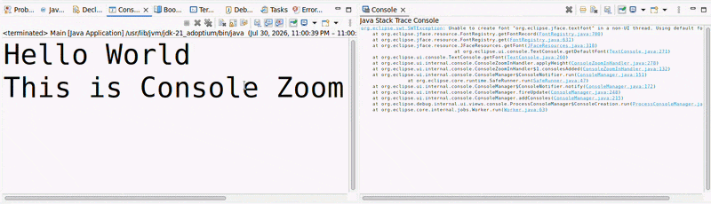
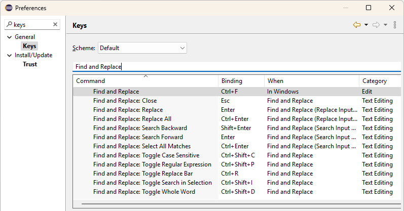
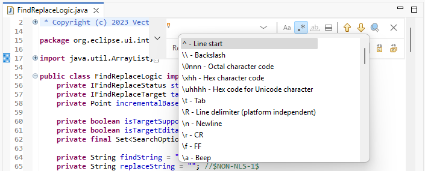
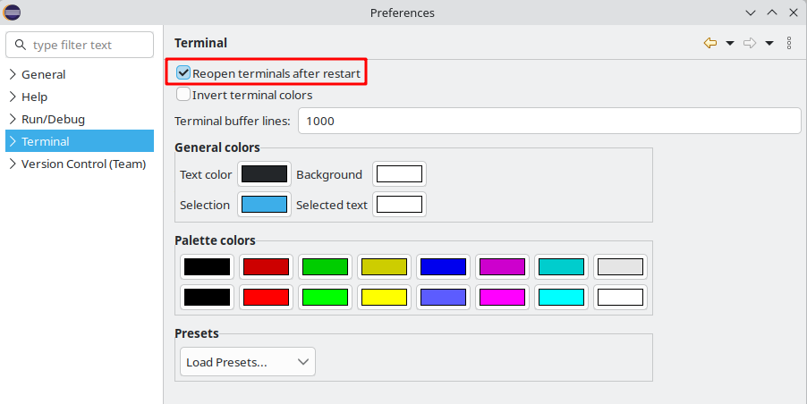
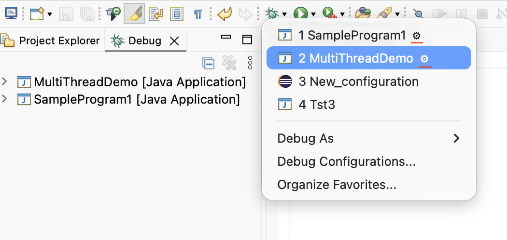
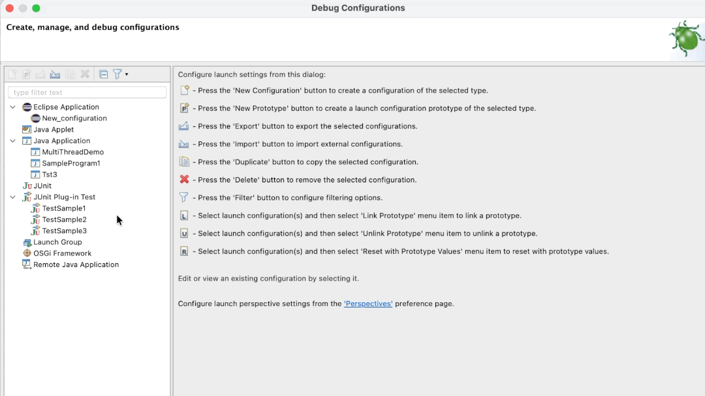
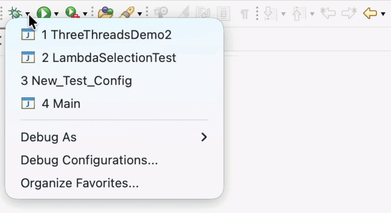
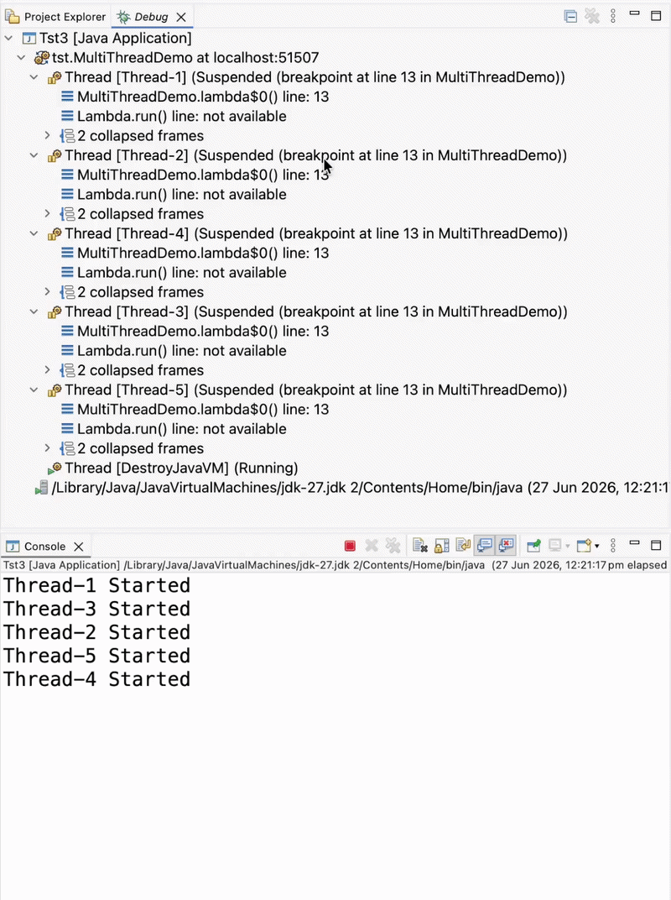

# Platform and Equinox - 4.41

A special thanks to everyone who [contributed to Eclipse-Platform](acknowledgements.md#eclipse-platform) or [contributed to Equinox](acknowledgements.md#equinox) in this release!

## Views, Dialogs and Toolbar

### Zoom In and Out in the Console View

Contributors

- [Raghunandana M](https://github.com/raghucssit)
- [Loskutov Andrey](https://github.com/iloveeclipse)

The `Console` view now supports zooming the font of the console currently shown.

Use `Ctrl++` / `Ctrl+-` (`Cmd++` / `Cmd+-` on macOS) while the `Console` view is focused to increase or decrease the font size.
The corresponding `Zoom In Console Font` and `Zoom Out Console Font` commands can also be bound to other keys in `Preferences > General > Keys`.

The zoom level is tracked per console type, so, for example, zooming a `Process Console` does not affect the `Java Stack Trace Console` or other console types, and it is applied to consoles of the same type that are opened later on.
The chosen zoom level is remembered across restarts, and changing the console font in the preferences resets the zoom to that new font size.

---
## Text Editors

### Customizable Key Bindings for the Find/Replace Overlay
<!-- https://github.com/eclipse-platform/eclipse.platform.ui/issues/2015 -->

Contributors

- [Heiko Klare](https://github.com/HeikoKlare)

You can now customize the keyboard shortcuts of the find/replace overlay,
which is shown on top of the editor when pressing `Ctrl+F`.
All its operations, such as searching for the next match or toggling the `Regular Expression` option,
are listed in `Preferences > General > Keys` when filtering for `Find and Replace`,
so that you can rebind them just like the shortcuts of any other operation.
The default key bindings are unchanged.

To achieve this, the operations of the overlay are now realized as ordinary Eclipse commands,
which are provided to the key binding framework while the overlay is focused,
instead of the overlay processing key strokes on its own.

### Content Assist for Regular Expressions in the Find/Replace Overlay Available in All Editors
<!-- https://github.com/eclipse-platform/eclipse.platform.ui/issues/2651 -->

Contributors

- [Heiko Klare](https://github.com/HeikoKlare)

Whenever the `Regular Expression` option of the find/replace overlay is enabled,
you can press `Ctrl+Space` in its search and replace input fields to get proposals for regular expression constructs.
This content assist is now available in all editors that support the overlay.
So far, it only worked in editors that do not provide content assist themselves,
so that, for example, no proposals were shown in Java editors.

---
## Preferences

### Disable Reopening Terminals After Restart

Contributors

- [Daniel Schmid](https://github.com/danthe1st)

The preference `Terminal > Reopen terminals after restart` has been added to allow disabling the automatic restoration of terminals.
If the checkbox is unchecked, a terminal view kept open when restarting the Eclipse IDE will no longer reopen all active terminals in that view.

<!--
---
## Themes and Styling
-->

<!--
---
## Views, Dialogs and Toolbar
-->

---
## General Updates

### Faster Native File System Access on Linux x86_64

Contributors

- [Loskutov Andrey](https://github.com/iloveeclipse)

The code responsible for retrieving file system data has been improved for x86_64 Linux systems.
The Refresh (`F5`) operation in `Project Explorer` or `Package Explorer` on NFS-mounted file systems is now faster by an order of magnitude (seconds instead of minutes).
If this change causes regressions, it can be disabled by setting the system property `-Declipse.filesystem.useFastLinuxNatives=false`.

### Active Launch Indicators in Run and Debug History

Contributors

- [Sougandh S](https://github.com/SougandhS)

The `Run History` and `Debug History` menus now provide a visual indication of active launches.
When an entry has one or more non-terminated launches associated with it, a gear icon (⚙) is displayed next to the entry.
This makes it easier to identify configurations that are already running and helps avoid unintentionally launching the same configuration again.

### Quick Group Launch from Selected Configurations

Contributors

- [Sougandh S](https://github.com/SougandhS)

The `Launch Configurations Dialog` now provides a `Quick Group Launch` action for selected launch configurations.
Previously, creating a launch group required creating a new `Launch Group` configuration and manually adding each launch configuration as a group member.
With this enhancement, Eclipse can create a launch group directly from the selected configurations, automatically adding them as group members.
This provides a faster way to launch multiple configurations together while still allowing the generated `Launch Group` to be customized later if needed.

### Single Sign-On Enabled by Default for Edge/WebView2 Browser

Contributors

- [Heiko Klare](https://github.com/HeikoKlare)
- [Sebastian Ratz](https://github.com/sratz)

The SWT `Edge`/`WebView2` browser integration now enables Single Sign-On (SSO) with Azure Active Directory (AAD) resources by default,
using the logged-in Windows account.
This also enables SSO with websites using Microsoft accounts associated with the Windows login,
aligning with the previous behavior of the Internet Explorer engine.
To opt out, set the system property `org.eclipse.swt.browser.EdgeAllowSingleSignOnUsingOSPrimaryAccount` to `false`.

### Last Execution Time in Launch History

Contributors

- [Sougandh S](https://github.com/SougandhS)

The launch history menus now display the relative termination time of previously launched configurations in their tooltips.

Instead of showing only the configuration name, the tooltip now provides additional context such as __*Last executed a moment ago*__, __*Last executed 5 mins ago*__, or __*Last executed 1 hour ago*__.
This makes it easier to identify recently used configurations and quickly relaunch the desired one.

The additional context is particularly useful when `favorite configurations` are pinned to the top of the history menus, where the displayed order may not reflect recent usage.

## Debugger

### Resume Other Threads During Debugging

Contributors

- [Sougandh S](https://github.com/SougandhS)

The debugger now provides a `Resume Other Threads` action for multithreaded debugging.

When a suspended thread is selected, this action resumes all other suspended threads in the same debug target while keeping the selected thread suspended.
This allows users to continue execution of background threads while inspecting the current thread.

The action is available from the `Debug view` context menu and can also be invoked using the `Shift+F8` keyboard shortcut.

