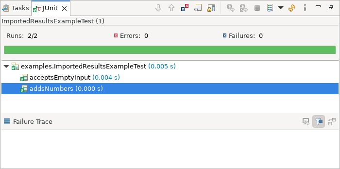

# Java Development Tools - 4.42

A special thanks to everyone who [contributed to JDT](acknowledgements.md#java-development-tools) in this release!

<!--
---
## Java&trade; XX Support 
-->

---
## JUnit

### Reload Imported JUnit Test Results
<!-- https://github.com/eclipse-jdt/eclipse.jdt.ui/pull/3145 -->

Contributors

- [Carsten Hammer](https://github.com/carstenartur)

You can now refresh results imported from a local XML file without importing it again.
After your external test run updates that same file, select the imported run in the `JUnit` view.
Click `Reload Test Run`, the refresh icon in the view's toolbar.
Its tooltip is `Reload the imported test results from their source file`:

The updated results replace the existing run at the same history position instead of adding a duplicate:

Reloading reads the file; it does not rerun tests or monitor subsequent file changes.
The command is enabled only for runs imported from a local file.
If the file cannot be read or contains invalid XML, Eclipse reports an error and keeps the previous results.

### JUnit Test Run History Survives Restarts

Contributors

- [Carsten Hammer](https://github.com/carstenartur)

The `JUnit` view now preserves finished and stopped test runs when you close Eclipse normally and reopen the same workspace.
Recent runs reappear in the existing history,
up to the configured `Maximum count of remembered test runs`.
You can inspect previous results and failure traces after a restart without running the tests again.

Select a restored run to load its complete test tree and failure details on demand.
When the original saved launch configuration still exists,
you can also use `Rerun Test` and `Rerun Test - Failures First` after the restart.

<!--
---
## Java Editor
-->

<!--
---
## Java Views and Dialogs
-->

<!--
---
## Java Compiler
-->

<!--
---
## Java Formatter
-->

<!--
---
## Debug
-->

<!--
### JDT Developers
--> 
