# Java Development Tools - 4.42

A special thanks to everyone who [contributed to JDT](acknowledgements.md#java-development-tools) in this release!

<!--
---
## Java&trade; XX Support 
-->

---
## JUnit

### Exclude and Re-include Enum Test Values
<!-- https://github.com/eclipse-jdt/eclipse.jdt.ui/pull/3136 -->

Contributors

- [Carsten Hammer](https://github.com/carstenartur)

You can now change which enum values an `@EnumSource` parameterized test uses directly from the `JUnit` view.
After running the test, right-click an individual invocation and select `Exclude Enum Value`.
Eclipse updates the annotation in your Java source; rerun the test to apply the change.

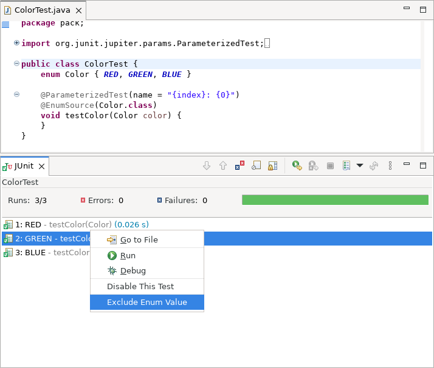

In this example, excluding `GREEN` creates an `EXCLUDE` filter.
The next run contains only `RED` and `BLUE`; `GREEN` is not counted as a skipped test.
To restore values from an `EXCLUDE` filter, right-click the parameterized method or one of its invocations
and open `Re-include Excluded Enum Values`.
Select `Re-include 'GREEN'` or `Re-include All Enum Values`, then rerun.

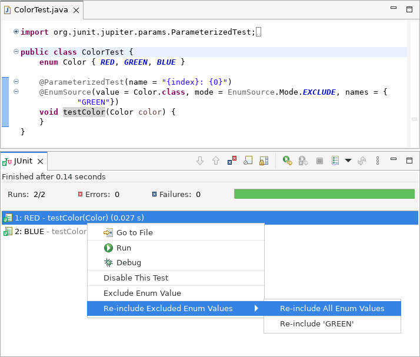

An explicit `INCLUDE` list is narrowed in place without changing its mode.
At least one enum value must remain.
The exclusion action is unavailable when Eclipse cannot safely identify the selected value,
for example with multiple argument sources or regular-expression filters.

### Disabled Parameterized Tests in the JUnit View
<!-- https://github.com/eclipse-jdt/eclipse.jdt.ui/pull/3144 -->

Contributors

- [Carsten Hammer](https://github.com/carstenartur)

Disabled parameterized JUnit Jupiter tests are now shown correctly in the `JUnit` view.
When a parameterized method is annotated with `@Disabled`,
Eclipse displays it with the disabled-test icon and counts it once in the total and skipped counts instead of omitting it.

In the example below, the ordinary test and the disabled parameterized method give `Runs: 2/2 (1 skipped)`,
even though the parameter source declares two values.

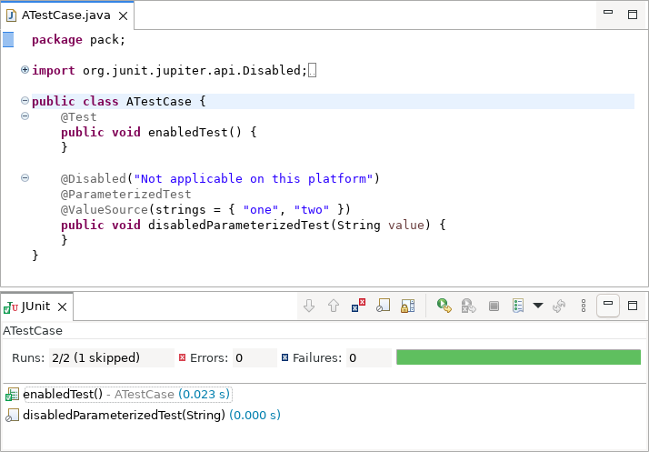

Disabled parameterized tests also appear in the flat layout and when `Show Skipped Tests Only` is enabled.
Their skipped state and counters are preserved when you export and re-import the test run.
This behavior is supported by both the JUnit 5 and JUnit 6 runners.

### Reload Imported JUnit Test Results
<!-- https://github.com/eclipse-jdt/eclipse.jdt.ui/pull/3145 -->

Contributors

- [Carsten Hammer](https://github.com/carstenartur)

You can now refresh results imported from a local XML file without importing it again.
After your external test run updates that same file, select the imported run in the `JUnit` view.
Click `Reload Test Run`, the refresh icon in the view's toolbar.
Its tooltip is `Reload the imported test results from their source file`:

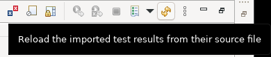

The updated results replace the existing run at the same history position instead of adding a duplicate:

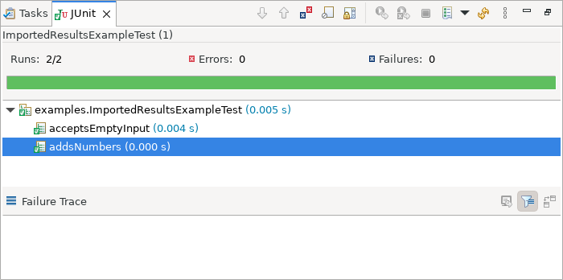

Reloading reads the file; it does not rerun tests or monitor subsequent file changes.
The command is enabled only for runs imported from a local file.
If the file cannot be read or contains invalid XML, Eclipse reports an error and keeps the previous results.

### JUnit Test Run History Survives Restarts

Contributors

- [Carsten Hammer](https://github.com/carstenartur)

The `JUnit` view now preserves finished and stopped test runs when you close Eclipse normally and reopen the same workspace.
Recent runs reappear in the existing history,
up to the configured `Maximum count of remembered test runs`.
You can inspect previous results and failure traces after a restart without running the tests again.

Select a restored run to load its complete test tree and failure details on demand.
When the original saved launch configuration still exists,
you can also use `Rerun Test` and `Rerun Test - Failures First` after the restart.

### More Accurate JUnit Execution Times
<!-- https://github.com/eclipse-jdt/eclipse.jdt.ui/pull/3163 -->

Contributors

- [Carsten Hammer](https://github.com/carstenartur)

You can now see more accurate execution times in the `JUnit` view.
Individual test durations are measured in the test JVM using a monotonic clock,
avoiding communication delays and system-clock adjustments.

Open the view menu (three dots at the top right).
Select `Show Execution Time` for elapsed time and `Show Execution Time Details` for CPU diagnostics.
The options are independent and only affect the display, not recording.
The details option is off by default.

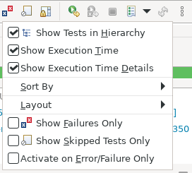

With both options selected, compare CPU-intensive work with a test that mostly waits:

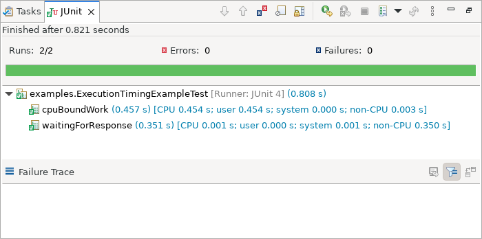

CPU, user-mode and system values cover the measured test-execution thread, not worker threads started by the test.
`non-CPU` is elapsed time minus that thread's CPU time, not a separate measurement of waiting time.

CPU details are shown only when recorded data is available; recording requires support from the test JVM.
Recorded details are retained in the JUnit history across restarts and can be viewed without a running test JVM.

---
## Java Editor

### Add Refactor to Change Signature for Record ParameterizedTest
<!-- https://github.com/eclipse-jdt/eclipse.jdt.ui/pull/3121 -->

Contributors

- [Ivan Gualandri](https://github.com/inuyasha82)

Add a new refactoring that lets you change a record's signature.
It works similar to method signature refactoring.

The animation below shows how this works:
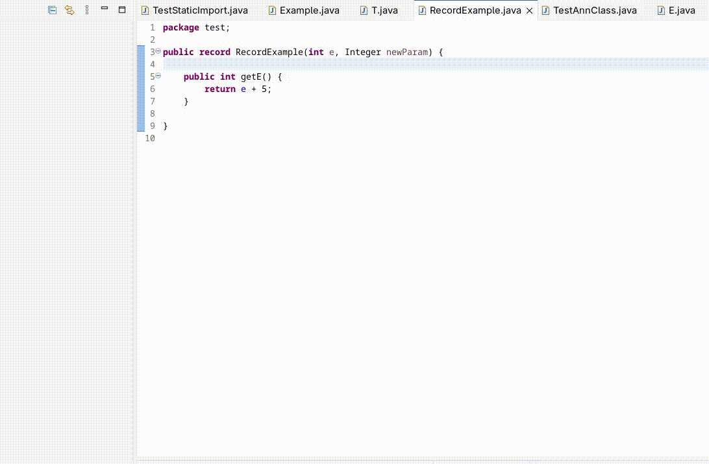

The refactoring also updates all the references in the code, not only in the declaration itself.
It can be initiated either from the record declaration, or from any record instantiation anywhere else in the project.

Parameter removal and reordering is still supported.

### Toggle Between `System.out` and `IO` with Quick Assist

Contributors

- [Sougandh S](https://github.com/SougandhS)

The Java editor now provides a quick assist to convert `System.out.print` and `System.out.println` calls to `IO.print` and `IO.println`, and vice versa.

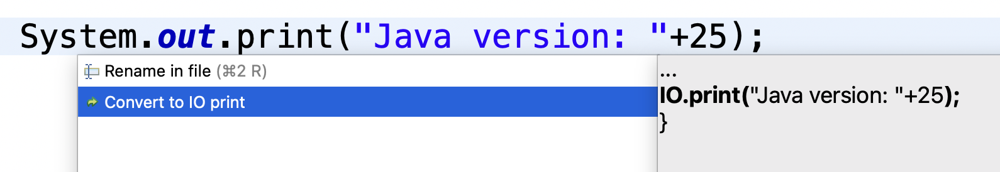
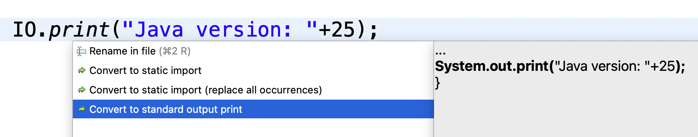

This makes it easier to switch between the traditional `System.out` APIs and the simplified `IO` APIs introduced for Java 25 compact source files.

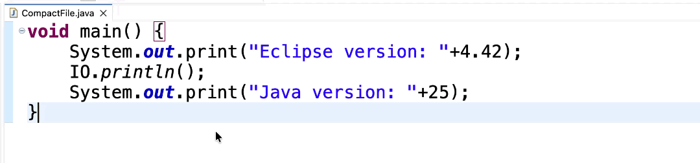

<!--
---
## Java Views and Dialogs
-->

<!--
---
## Java Compiler
-->

<!--
---
## Java Formatter
-->

<!--
---
## Debug
-->

<!--
### JDT Developers
--> 
