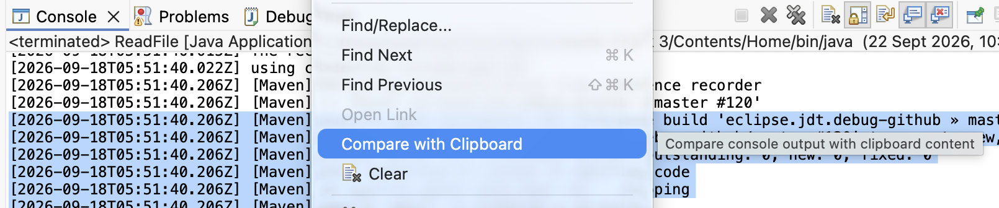
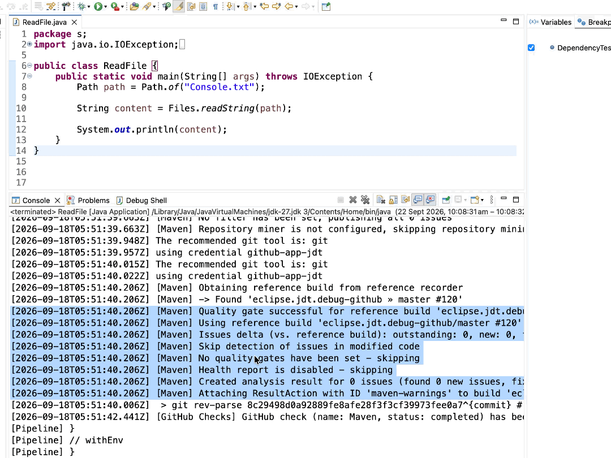

# Platform and Equinox - 4.42 

A special thanks to everyone who [contributed to Eclipse-Platform](acknowledgements.md#eclipse-platform) or [contributed to Equinox](acknowledgements.md#equinox) in this release!

## Views, Dialogs and Toolbar

### Compare Console Output with Clipboard

Contributors

- [Sougandh S](https://github.com/SougandhS)

The `Console` view now provides a `Compare with Clipboard` action to compare console output directly with text currently available in the clipboard using the `Compare Editor`.

This makes it easier to identify differences between console output and expected or reference content without manually copying the output into a separate editor or comparison tool.

The action is available when the `org.eclipse.compare` and` org.eclipse.compare.structuremergeviewer` bundles are present. 
If these optional dependencies are not available, the action is not provided.

---

<!--
---
## Text Editors
-->

<!--
---
## Preferences
-->

<!--
---
## Themes and Styling
-->

<!--
---
## Views, Dialogs and Toolbar
-->

<!--
---
## General Updates
-->
